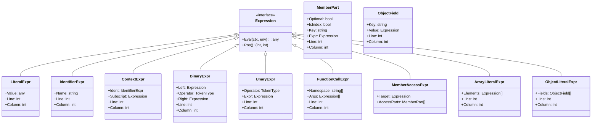

# Logical Query Language DSL Specification

This document defines a minimal core grammar and a comprehensive set of namespaced library functions for constructing logical queries over JSON‑like data. The DSL is designed to be concise, strongly typed at runtime, and highly extensible. Every implementation of this DSL **MUST** follow the detailed rules and syntax described herein. No detail is left unspecified, and explicit conversion or error conditions are required for every operation.

---

## 1. Introduction

### 1.1 Scope and Goals

1. **Target Use Case:**  
   The DSL is intended to filter or query JSON‑like documents. Its design emphasizes:
   - **Clarity:** The syntax and semantics are unambiguous.
   - **Runtime Type Safety:** All operations are strongly typed, with explicit type conversion functions provided.
   - **Deterministic Behavior:** Every operator and function has well‑defined input types, return types, and error conditions.

2. **Core Principle:**  
   - **Primitive Operations:** The DSL natively supports numbers, strings, booleans, and `null`.  
   - **Complex Data Types:** Data types such as time, arrays, and objects are either handled via library functions or by using explicit inline literal syntax (e.g., using `{ ... }` for objects and `[ ... ]` for arrays) to avoid any ambiguity.
   - **Explicit Conversion:** No implicit conversion is allowed between numeric types (int and float) or between other types. Every conversion between types (including numeric to string, or float to int) **MUST** be done via explicit functions provided in the type library.

3. **Extensibility:**  
   - Additional operators, function libraries, or DSL constructs **MUST** be introduced in a namespaced manner (e.g., `customLibrary.myFunction(...)`).  
   - **Pluggable Libraries:** Implementations **MUST** allow users to add their own libraries under distinct namespaces without affecting the core DSL.

4. **Cross‑Language Consistency (Time and Numeric Types):**  
   - All implementations (Go, Java, PHP, JavaScript, C#, Ruby, C++, etc.) **MUST** treat time and numeric values uniformly.  
   - **Time Values:** Internally, every Time value **MUST** be stored as a 64‑bit integer (`epochMillis`), representing the number of milliseconds since the Unix epoch (1970‑01‑01T00:00:00Z). Conversions between this internal representation and any textual or numeric forms **MUST** be performed only through the `time` library.
   - **Numeric Values:** Two distinct numeric types are supported:  
     - **int:** Literal examples such as `123`, `0`, `-42` are interpreted as 64‑bit integers (int64).  
     - **float:** Literal examples such as `45.67`, `-0.5`, `1e10`, `3.14E-2`, `-2E+3` are interpreted as 64‑bit floating‑point numbers (float64).  
   - **No Implicit Conversions:** Arithmetic operators do not perform any implicit conversion between int and float. If an operation involves mixed numeric types, explicit conversion functions (see the Type Library) **MUST** be used.

---

## 2. Terminology, Conventions, and Error Handling

### 2.1 Data Types

#### 2.1.1 Primitive Types

1. **Numbers:**  
   - **int:**  
     - Literals like `123`, `0`, or `-42` are interpreted as integers.
     - Internally, they **MUST** be stored as 64‑bit integers (int64).  
     - A leading `+` sign is allowed but not required.
   - **float:**  
     - Literals like `45.67`, `-0.5`, `1e10`, `3.14E-2`, or `-2E+3` are interpreted as floating‑point numbers.
     - Internally, they **MUST** be stored as 64‑bit floating‑point numbers (float64).
   - **Rules:**
     - Any numeric literal fitting into the appropriate 64‑bit type **MUST** be accepted.
     - **Important Clarification on Negative Numeric Literals and Unary Minus:**  
       A minus sign (`-`) may appear before a numeric literal in any valid expression context (e.g., function arguments, within parentheses, or after a comparison operator). When a minus sign immediately precedes a numeric literal, the DSL lexer **MUST** treat it as a single literal token (e.g., `-42` or `-0.5`).  
       **However,** when a minus sign is used before an expression that is not a literal (for example, in an expression such as `-(a + b)`), it **MUST** be parsed as a unary minus operator. This operator requires that its operand evaluate to a numeric type; if not, a semantic error **MUST** be produced.
     - Arithmetic operators (`+`, `-`, `*`, `/`) are defined only for numeric values.  
       **Note:** No implicit conversion between int and float is performed; mixed‑type operations require explicit conversion via the type library functions.

2. **String:**  
   - String literals **MUST** be enclosed in matching quotes—either single (`'`) or double (`"`).  
   - Typical JSON‑like escape sequences (e.g., `\"`, `\'`, `\\`, and others) **SHOULD** be supported.  
   - Inline object literal keys that are not valid identifiers **MUST** be enclosed in quotes.

3. **Boolean:**  
   - The only allowed boolean literals are the lowercase tokens `true` and `false`.  
   - **Any token resembling a boolean literal with incorrect casing (for example, `TRUE`) is not recognized as a boolean literal. Instead, it is interpreted as a bare identifier.** Since bare identifiers are disallowed outside of valid contexts (such as context references, library namespaces, or object literal keys), their appearance in isolation **MUST** trigger a syntax error.
     
4. **Null:**  
   - Represented solely as the lowercase literal `null`.

5. **Relational Operators on Primitive Types:**
   - `<`, `>`, `<=`, `>=` are allowed only for numeric or string data.  
   - `==` and `!=` are defined for numeric, string, boolean, or null values.
   - Using `<` or `>` with booleans or `null` **MUST** produce a semantic error.
   - **Time values:**  
     - Time values **MUST** be handled exclusively via the `time` library and are treated as opaque.  
     - **Direct use of relational operators on Time values is forbidden.** If either operand of a relational operator is of Time type, the DSL **MUST** trigger a semantic error instructing the user to use the appropriate time library function (e.g., `time.isBefore` or `time.isAfter`).

6. **Numeric Literal Overflow:**
   - Every numeric literal MUST be checked to ensure it fits within a 64‑bit integer (for int literals) or a 64‑bit floating‑point number (for float literals). If a numeric literal exceeds the range of the designated 64‑bit type, the DSL engine MUST raise a lexical error with a message such as “Numeric literal overflow” indicating the line and column of the offending literal.

#### 2.1.2 Complex Types

1. **Objects:**  
   - **Representation and Syntax:**  
     Object literals are written in a JSON‑like syntax using curly braces. However, the DSL permits object literal keys without quotes provided they match the allowed identifier format.  
     - **Unquoted Keys:** Keys may be provided as bare identifiers (e.g., `{ key: 1 }`) if they conform to the identifier rules (letters, digits, underscores, not starting with a digit).  
     - **Quoted Keys:** Keys that include special characters or do not match the identifier pattern **MUST** be enclosed in quotes (e.g., `{ "key-with-hyphen": 1 }`).
   - **Duplicate Keys:**  
     Duplicate keys in an object literal are **NOT** allowed. If a duplicate key is encountered, a semantic error **MUST** be produced.
   - **No Trailing Commas:**  
     Trailing commas after the final key/value pair are **NOT** supported. For example, `{ key: 1, }` is invalid.
   - **Sources:**  
     They may be provided via the evaluation context (e.g., `$user.profile`), by library functions, or constructed inline using object literal syntax.
   - **Invalid Operations:**  
     Direct arithmetic or relational operations (e.g., `<`, `>`) on objects **MUST** yield a semantic error.

2. **Arrays:**  
   - **Representation and Syntax:**  
     Array literals are written in a JSON‑like syntax using square brackets.  
   - **Element Separation:**  
     Elements in an array must be valid expressions separated by commas.  
     - **No Empty Values:** Empty values such as in `[1,,2]` are **NOT** supported.
     - **No Trailing Commas:** A trailing comma after the last element (e.g., `[1, 2,]`) is not allowed.
   - **Sources:**  
     Arrays may be sourced from the context (e.g., `$order.items`), produced by library calls, or constructed inline.
   - **Invalid Operations:**  
     Direct arithmetic or relational operations on arrays **MUST** produce a semantic error.

3. **Time:**  
   - Time values **MUST** be handled exclusively via the `time` library.
   - They are treated as opaque types and **MUST NOT** be implicitly converted to strings or numeric values.
   - Internally, each Time value **MUST** be represented as a 64‑bit integer (`epochMillis`) that counts the number of milliseconds elapsed since the Unix epoch (1970‑01‑01T00:00:00Z).
   - All time‑related operations (arithmetic, comparisons, parsing, formatting) **MUST** use the functions defined in the `time` library.
   - **Note:** Direct use of relational operators (`<`, `>`, etc.) on Time values is disallowed. Instead, comparisons **MUST** be performed using the time library functions (e.g., `time.isBefore`, `time.isAfter`).

#### 2.1.3 Null or Missing Fields

- JSON data may include `null` values or may omit keys entirely.
- Direct arithmetic or relational operations on `null` (e.g., `null + 5`) **MUST** yield a semantic error.
- A reference to a missing field (e.g., `$user.isActive` when `$user` does not exist) **MUST** trigger a runtime error unless optional access is explicitly used (using `?.` or `?[ ]`) or the expression is wrapped with a function such as `cond.coalesce(...)`.
- A type mismatch (e.g., accessing a field on a value that is numeric rather than an object) **MUST** trigger a runtime error.
- **Implementation Clarification:** There is a difference between a field that is present but set to `null` and a field that is entirely missing. If the field is present but `null`, its value evaluates as `null`. If the field is missing, it triggers a runtime error (unless optional chaining or a function like `cond.coalesce` is used).

---

### 2.2 Case Sensitivity

- **Operators:**  
  The logical operators `AND`, `OR`, `NOT` (and their symbolic forms `&&`, `||`, `!`) **MUST** be case‑sensitive.
- **Literals:**  
  Only the lowercase forms of `true`, `false`, and `null` are recognized as valid boolean and null literals. Any mis‑casing of boolean literals (e.g., `TRUE`) is not recognized as a boolean literal; instead, such tokens are interpreted as bare identifiers and will trigger a syntax error when used outside of valid contexts.
- **Identifiers:**  
  All identifiers are case‑sensitive.
- **Context References:**  
  A context reference **MUST** begin with `$` (e.g., `$user`, `$userName`, or `$["userName"]`). Subsequent member access uses dot notation (e.g., `$user.address.street`) or bracket notation (e.g., `$user["address"]["street"]`).

---

### 2.3 Whitespace, Multi‑line Expressions, and Comments

- **Whitespace:**  
  Spaces, tabs, and newlines are all ignored between tokens.
- **Multi‑line Expressions:**  
  DSL expressions may span multiple lines. Line breaks are treated as whitespace and do not affect the parsing structure.
- **Comments:**  
  Any line starting with `#` (ignoring preceding whitespace) is treated as a comment and ignored until the end of that line.

---

### 2.4 Error Types

Errors in the DSL are classified into four distinct categories:

1. **Lexical Errors (Parse‑time):**  
   Occur when the input contains invalid characters, malformed numeric literals (e.g., `12..3`), unclosed strings, or incorrectly cased literals for null (and—now for booleans, mis‑cased tokens are not specially treated but instead are processed as bare identifiers).
   
2. **Syntax Errors (Parse‑time):**  
   Occur when tokens are arranged in an order that does not conform to the grammar (e.g., misplaced operators, bare identifiers used where not allowed, or missing closing tokens).

3. **Semantic Errors (Primarily Parse‑time, sometimes Evaluation‑time):**  
   Occur when type rules or operator rules are violated (for example, applying `<` on booleans or using a function with the wrong number of arguments if it can be detected at parse‑time). Some semantic errors can only be detected at runtime when the types of evaluated data are known.

4. **Runtime Errors (Evaluation‑time):**  
   Occur during evaluation when context data is missing, an array index is out‑of‑bounds, or when there is a type mismatch.

---

## 3. Core Features

1. **Boolean Logic:**  
   - Supported operators are `AND`, `OR`, and `NOT` (or their symbolic forms `&&`, `||`, `!`).
   - Short‑circuit evaluation **MUST** be performed: `AND` short‑circuits on the first false value, and `OR` on the first true value.

2. **Relational and Equality Operators:**  
   - **Relational Operators:** `<`, `<=`, `>`, `>=` are valid only for numeric or string types.
   - **Equality Operators:** `==` and `!=` are valid for numeric, string, boolean, or null values.
   - **Type Constraints:** Using relational operators on unsupported types (including Time types) **MUST** trigger a semantic error.

3. **Arithmetic Operators:**  
   - Supported arithmetic operators are `+`, `-`, `*`, and `/`, and are defined only for numeric types (int and float).  
   - **No Implicit Conversion:** When an operation involves mixed numeric types, explicit conversion via the type library **MUST** be used.
   - **String Concatenation:** The `+` operator is not defined for string concatenation. String concatenation **MUST** be performed via the `string.concat(...)` function.
   - **Unary Minus Operator:** In addition to its use as a subtraction operator, the `-` symbol is now also defined as a unary operator for negating expressions. When used in unary position (except when immediately attached to a numeric literal, in which case it is parsed as part of the literal), it **MUST** operate only on expressions that evaluate to a numeric type; otherwise, a semantic error **MUST** be raised.

4. **Field and Optional Access:**  
   - **Standard Field Access:** Access members using dot notation (e.g., `$object.field`) or bracket notation (e.g., `$object["field"]`).  
   - **Optional Chaining:** If there is a possibility of a field being missing or a member access being invalid, the optional chaining operators (`?.` or `?[ ]`) **MUST** be used. When optional chaining is applied and the referenced value is missing or not an object/array, the result **MUST** be `null` rather than throwing a runtime error.
   - **Deeply Nested Optional Chaining:** In expressions with nested optional chaining (for example, `$order?.items?[0]?.price`), if any intermediate member is missing or evaluates to `null`, the entire chain **MUST** short‑circuit to `null`.
   - **Implementation Clarification:** For array access with `?[ ]`, if the index is out of bounds, the result **MUST** also be `null` rather than an error.

5. **Inline Literals:**  
   - **Array Literals:** Written using square brackets (e.g., `[1, 2, (3+4)]`).  
     - **Updated Syntax for Arrays:**  
       - Elements in an array literal **MUST** be valid expressions separated by commas.  
       - **Empty values (such as `[1,,2]`) are not supported.**  
       - **Trailing commas are not allowed.** For example, `[1, 2,]` is invalid.
   - **Object Literals:** Written using curly braces with key/value pairs (e.g., `{ key: 1, anotherKey: (2+3) }`).  
     - **Updated Syntax for Objects:**  
       - Object literal keys may be provided either as quoted strings or as unquoted identifiers. Unquoted keys **MUST** match the allowed identifier pattern (letters, digits, underscores, not starting with a digit).  
       - **Keys with special characters or that do not match the identifier pattern **MUST** be quoted.**  
       - **Duplicate keys are prohibited.** If a duplicate key is encountered, a semantic error **MUST** be raised.  
       - **Trailing commas are not supported.** For example, `{ key: 1, }` is invalid.
   - The literal `null` is the only representation for the null value.

6. **Modular Namespaced Libraries:**  
   - Standard functionality is provided by built‑in libraries (e.g., `time`, `math`, `string`, `regex`, `array`, `cond`, and `type`).  
   - All library functions **MUST** be invoked using their namespace (e.g., `time.now()`, `math.abs(-5)`).  
   - Additional libraries **MUST** be added in a namespaced fashion so as not to interfere with the core DSL.

---

## 4. Lexical Structure

### 4.1 Token Types

The DSL tokenizer **MUST** recognize the following token types. Each token type is defined with examples, a description, the errors that may be triggered if the token is malformed, and its bytecode representation:

| **Token Type**          | **Examples**                              | **Description**                                                                                      | **Potential Errors**                                                            | **Encoding (Hex)**  |
|-------------------------|-------------------------------------------|------------------------------------------------------------------------------------------------------|---------------------------------------------------------------------------------|---------------------|
| **EOF**                 | *N/A*                                     | End of input marker.                                                                                 | –                                                                               | `0x00`              |
| **Illegal**             | Unrecognized characters                   | Represents an unrecognized or illegal token.                                                       | Triggers a lexical error.                                                       | `0x01`              |
| **Ident**               | `userName`, `item_42`, `城市`              | An identifier consisting of letters, digits, or underscores. **MUST NOT** begin with a digit.         | Lexical error if starting with a digit or containing invalid characters.        | `0x02` (followed by 1‑byte length and literal bytes) |
| **Number**              | `123`, `-45.67`, `+1e10`, `3.14E-2`         | A numeric literal. Integers are those without a decimal point or exponent; others are floats.        | Malformed numeric literals trigger a lexical error.                           | `0x03` (followed by 1‑byte length and literal bytes) |
| **String**              | `"hello"`, `'world'`                       | A quoted string literal supporting escape sequences.                                               | Unclosed strings trigger a lexical error.                                       | `0x04` (followed by 1‑byte length and literal bytes) |
| **Bool**                | `true`, `false`                           | Boolean literal (only lowercase allowed).                                                          | Mis‑cased tokens are treated as bare identifiers, triggering a syntax error.      | `0x05` (fixed literal: either “true” or “false”)       |
| **Null**                | `null`                                    | The null literal.                                                                                    | Incorrect casing triggers a lexical error.                                      | `0x06` (fixed literal “null”)        |
| **Plus**                | `+`                                       | Addition operator, defined for numeric types only.                                                 | Applying to non‑numeric types triggers a semantic error.                        | `0x07`              |
| **Minus**               | `-`                                       | Subtraction operator and unary minus.                                                              | Unary minus on non‑numeric triggers a semantic error.                           | `0x08`              |
| **Multiply**            | `*`                                       | Multiplication operator for numeric types.                                                         | –                                                                               | `0x09`              |
| **Divide**              | `/`                                       | Division operator for numeric types.                                                               | Division by zero triggers a runtime error.                                      | `0x0A`              |
| **Lt**                  | `<`                                       | Less‑than operator for numeric and string types.                                                   | Using with unsupported types triggers a semantic error.                        | `0x0B`              |
| **Gt**                  | `>`                                       | Greater‑than operator for numeric and string types.                                                | –                                                                               | `0x0C`              |
| **Lte**                 | `<=`                                      | Less‑than-or‑equal operator for numeric and string types.                                          | –                                                                               | `0x0D`              |
| **Gte**                 | `>=`                                      | Greater‑than-or‑equal operator for numeric and string types.                                       | –                                                                               | `0x0E`              |
| **Eq**                  | `==`                                      | Equality operator for numeric, string, boolean, or null values.                                     | –                                                                               | `0x0F`              |
| **Neq**                 | `!=`                                      | Inequality operator for numeric, string, boolean, or null values.                                   | –                                                                               | `0x10`              |
| **And**                 | `AND`, `&&`                               | Logical AND operator; left‑associative with short‑circuit evaluation.                               | –                                                                               | `0x11`              |
| **Or**                  | `OR`, `||`                                | Logical OR operator; left‑associative with short‑circuit evaluation.                                | –                                                                               | `0x12`              |
| **Not**                 | `NOT`, `!`                                | Logical NOT operator.                                                                              | Non‑boolean operand triggers a semantic error.                                  | `0x13`              |
| **LParen**              | `(`                                       | Left parenthesis.                                                                                  | Mismatched parentheses trigger a syntax error.                                  | `0x14`              |
| **RParen**              | `)`                                       | Right parenthesis.                                                                                 | –                                                                               | `0x15`              |
| **LeftBracket**         | `[`                                       | Left square bracket for arrays.                                                                    | Mismatched brackets trigger a syntax error.                                     | `0x16`              |
| **RightBracket**        | `]`                                       | Right square bracket.                                                                              | –                                                                               | `0x17`              |
| **LeftCurly**           | `{`                                       | Left curly brace for object literals.                                                              | –                                                                               | `0x18`              |
| **RightCurly**          | `}`                                       | Right curly brace.                                                                                 | –                                                                               | `0x19`              |
| **Comma**               | `,`                                       | Comma used to separate elements in arrays or object fields.                                        | –                                                                               | `0x1A`              |
| **Colon**               | `:`                                       | Colon separating keys and values in object literals.                                               | –                                                                               | `0x1B`              |
| **Dot**                 | `.`                                       | Dot operator for member access.                                                                    | Misuse triggers a syntax or semantic error.                                     | `0x1C`              |
| **QuestionDot**         | `?.`                                      | Optional chaining via dot notation.                                                                | –                                                                               | `0x1E`              |
| **QuestionBracket**     | `?[`                                      | Optional chaining via bracket notation.                                                            | –                                                                               | `0x1F`              |
| **Dollar**              | `$`                                       | Introduces a context reference.                                                                    | –                                                                               | `0x20`              |

**Important Note on Bare Identifiers:**  
Bare usage of an identifier (e.g., `username`) as a standalone expression **without** a `$` prefix, library namespace, or function call context is **disallowed**. Identifiers **MUST** appear either as:
- Part of a context reference (e.g., `$user` or `$user.name`),
- Part of a library invocation namespace (e.g., `math.abs(…)`, `time.parse(…)`),
- An unquoted key in an object literal (e.g., `{ key: "value" }`).

Standalone bare identifiers, such as `username` on its own, **MUST** result in an error (typically a syntax error).

---

### 4.2 Lexical Errors

- **Unknown Characters:**  
  Any character not recognized as part of the DSL’s valid set **MUST** be reported as an illegal token.
  
- **Malformed Numeric Literals:**  
  For example, a literal such as `12..3` or a literal missing digits in its exponent **MUST** trigger a lexical error.
  
- **Unclosed String Literals:**  
  A string that is started but not terminated with a matching quote **MUST** trigger a lexical error.  
  **Clarification:** This **MUST** be classified strictly as a lexical error, and the parser must not reinterpret it as a syntax error in any circumstance.

- **Invalid Boolean or Null Literals:**  
  For boolean literals, any casing other than lowercase (e.g., `TRUE`) **MUST NOT** be specially recognized as booleans. Instead, such tokens are treated as bare identifiers, and if used in a context where a literal is required, they will trigger a syntax error.  
  For null, only the lowercase literal `null` is allowed; incorrect casing (e.g., `NULL`) **MUST** trigger a lexical error.

---

### 5. Grammar

The following production rules (written in an extended BNF style) define the DSL’s syntax. Every rule is explicit, and operator precedence and associativity are fully determined by the grammar.

> **Note on Bare Identifiers in the Grammar:**  
> Standalone bare identifiers (i.e., those not prefixed by `$` or not part of a namespaced function call or object literal key) are disallowed. This rule is enforced in the lexical analysis and reflected in the production rules for context references and function calls.

#### 5.1 High‑Level Expression

```
<Expression> ::= <OrExpression>
```

#### 5.2 Boolean Logic

**OR Expression:**
```
<OrExpression> ::= <AndExpression>
                 { ("OR" | "||") <AndExpression> }
```
- *Associativity & Evaluation:* The OR operator is left‑associative. Short‑circuit evaluation **MUST** be performed (evaluation stops at the first operand that is true).

**AND Expression:**
```
<AndExpression> ::= <EqualityExpression>
                  { ("AND" | "&&") <EqualityExpression> }
```
- *Associativity & Evaluation:* The AND operator is left‑associative. Short‑circuit evaluation **MUST** be performed (evaluation stops at the first operand that is false).

#### 5.3 Equality and Relational Expressions

```
<EqualityExpression> ::= <RelationalExpression>
                       { ("==" | "!=") <RelationalExpression> }
```

```
<RelationalExpression> ::= <AdditiveExpression>
                         { ( ">" | "<" | ">=" | "<=" ) <AdditiveExpression> }
```
- *Constraints:*  
  - `==` and `!=` are defined for numeric, string, boolean, and null values.  
  - `<`, `>`, `>=`, and `<=` are defined only for numeric and string types.  
  - Use of relational operators on unsupported types (including Time values) **MUST** trigger a semantic error.

#### 5.4 Arithmetic Expressions

```
<AdditiveExpression> ::= <MultiplicativeExpression>
                       { ("+" | "-") <MultiplicativeExpression> }
```

```
<MultiplicativeExpression> ::= <UnaryExpression>
                             { ("*" | "/") <UnaryExpression> }
```
- *Note:* Arithmetic operators apply only to numeric values (int and float). No implicit conversion is performed; mixed‑type operations **MUST** use explicit conversion functions.  
- Negative numeric literals (e.g., `-42`) are parsed as a single token. When a minus (`-`) is encountered before a non‑literal expression, it is parsed as a unary operator (see Section 5.5).

#### 5.5 Unary Operators

```
<UnaryExpression> ::= { <UnaryOperator> } <MemberAccessChain>
```

```
<UnaryOperator> ::= "NOT" | "!" | "-"
```
- *Semantics:*  
  - The `NOT` (or `!`) operator is for boolean negation only; applying it to a non‑boolean **MUST** trigger a semantic error.
  - The unary minus (`-`) operator negates its operand and **MUST** be applied only to numeric expressions; otherwise, a semantic error **MUST** be raised.
- *Implementation Clarification:* A minus immediately attached to a numeric literal (e.g., `-42`) is part of that literal token; elsewhere, it functions as a unary operator.

#### 5.6 Member Access and Primary Expressions

```
<MemberAccessChain> ::=
    <PrimaryExpression>
    { ( "." <Identifier>
      | "?." <Identifier>
      | "[" <Expression> "]"
      | "?[" <Expression> "]"
      )
    }
```

```
<PrimaryExpression> ::=
      "(" <Expression> ")"
    | <NamespacedFunctionCall>
    | <ArrayLiteral>
    | <ObjectLiteral>
    | <Literal>
    | <ContextRef>
```

**Literals:**
```
<Literal> ::= <Number>
           | <String>
           | <Bool>
           | "null"
```

**Context Reference:**
```
<ContextRef> ::= "$" <Identifier>
              | "$"
              | "$" "[" <Expression> "]"
```
- *Details:* A standalone `$` represents the root of the context. When accessing a field, the `$` is followed immediately by an identifier (or a quoted string inside brackets).

**Namespaced Function Call:**
```
<NamespacedFunctionCall> ::= <NamespaceParts> "(" [ <ArgumentList> ] ")"
```

```
<NamespaceParts> ::= <Identifier> "." <Identifier>

```

```
<ArgumentList> ::= <Expression> { "," <Expression> }
```
- *Examples:*  
  - `time.parse("2025-01-01T12:00:00Z", "iso8601")`  
  - `myLib.subspace.func(123)`
- *Chaining:* A function call result may be further accessed via dot or bracket notation (e.g., `array.find($obj, "name", "Ryan").age`).

**Array Literal:**
```
<ArrayLiteral> ::= "[" [ <Expression> { "," <Expression> } ] "]"
```
- *Result:* Produces an array value.  
- *Updated Constraints:*  
  - Whitespace is ignored.  
  - Every comma **MUST** be followed by a valid `<Expression>` (i.e. empty expressions such as in `[1,,2]` are not allowed).  
  - **Trailing commas are not allowed.**

**Object Literal:**
```
<ObjectLiteral> ::= "{" [ <ObjectField> { "," <ObjectField> } ] "}"
```

```
<ObjectField> ::= ( <Identifier> | <String> ) ":" <Expression>
```
- *Result:* Produces an object value.  
- *Updated Constraints:*  
  - Keys may be unquoted if they conform to the allowed identifier pattern (letters, digits, underscores, not starting with a digit); otherwise, they **MUST** be quoted.
  - **Duplicate keys are prohibited.** (This is enforced as a semantic check during parsing.)
  - **Trailing commas are not allowed.**

---

## 6. Standard Libraries

Each standard library function is defined with its method signature, return type, error conditions, and example usages. Every library function **MUST** be invoked with its namespace.

> **Note:** Additional namespaced libraries may be added without affecting the core DSL.

### 6.1 Time Library

The `time` library provides functions to handle date/time values. Direct relational comparisons (e.g., `<` or `>`) on Time objects are disallowed; all operations on Time values **MUST** be performed via the library functions.

**Internal Representation of Time Values:**  
Time objects **MUST** be stored internally as a 64‑bit integer (`epochMillis`) representing milliseconds elapsed since 1970‑01‑01T00:00:00Z. Conversions between this internal form and textual or numeric representations **MUST** be performed only via explicit DSL library calls.

#### 6.1.1 `time.now()`
- **Signature:** `time.now()`
- **Return Type:** Time  
- **Arguments:** None  
- **Potential Errors:**  
  - Implementation‑specific errors (e.g., if the system clock is unavailable) may be raised, but no DSL‑level error is defined.
- **Behavior:**  
  Returns the current system time as a Time object (internally stored as epochMillis).

**Example:**
```sql
time.now()
```

---

#### 6.1.2 `time.parse(inputString, format[, formatDetails])`
- **Signature:** `time.parse(string, string [, string])`
- **Return Type:** Time  
- **Arguments:**  
  - `inputString`: A string representing the time.
  - `format`: A string indicating the expected format.
  - `formatDetails` (optional): Required if `format` is `"custom"`.
- **Potential Errors:**  
  - **Semantic/Runtime Error** if `format` is invalid or if `inputString` does not match the expected format.
- **Supported Formats:**
  1. **`"iso8601"`:**  
     - Expects a canonical ISO8601 extended format:  
       `YYYY-MM-DDTHH:mm:ss.sssZ` (e.g., `"2025-01-01T12:00:00.000Z"`).  
       Optional fractional seconds or timezone offsets may be provided; the internal representation is normalized to epochMillis.
  2. **`"dateOnly"`:**  
     - Expects a date in `YYYY-MM-DD` format (e.g., `"2025-01-01"`). The time is assumed to be midnight UTC.
  3. **`"epochMillis"`:**  
     - Expects a numeric string representing the milliseconds since the Unix epoch (e.g., `"1675939293000"`).  
     - The numeric string **MUST** be parsed into a 64‑bit integer.
  4. **`"rfc2822"`:**  
     - Expects a string such as `"Wed, 13 Feb 2025 10:00:00 -0000"`.
  5. **`"custom"`:**  
     - When using `"custom"`, a third argument `formatDetails` **MUST** be provided.  
     - The `formatDetails` parameter follows patterns similar to Java’s `SimpleDateFormat` or C#’s `DateTime.ParseExact` (e.g., using placeholders like `yyyy`, `MM`, `dd`, `HH`, etc.).  
     - A mismatch between `inputString` and the pattern **MUST** result in a semantic or runtime error.

**Example (Custom Format):**
```sql
time.parse("2025-02-13 10:00:00", "custom", "yyyy-MM-dd HH:mm:ss")
```

---

#### 6.1.3 `time.add(timeVal, durationVal)`
- **Signature:** `time.add(Time, numeric)`
- **Return Type:** Time  
- **Arguments:**  
  - `timeVal`: A Time object.
  - `durationVal`: A numeric value representing a duration in milliseconds.
- **Potential Errors:**  
  - **Runtime Error** if `timeVal` is not a Time object or if `durationVal` is not a valid numeric duration.
  
**Example:**
```sql
time.add(time.parse("2025-01-01", "dateOnly"), 86400000)
```
_Adds one day (86,400,000 milliseconds) to the parsed time._

---

#### 6.1.4 `time.subtract(timeVal, durationVal)`
- **Signature:** `time.subtract(Time, numeric)`
- **Return Type:** Time  
- **Arguments:**  
  - Same as for `time.add`.
- **Potential Errors:**  
  - Same as for `time.add`.

**Example:**
```sql
time.subtract(time.parse("2025-01-02", "dateOnly"), 86400000)
```
_Subtracts one day from the parsed time._

---

#### 6.1.5 `time.diff(timeVal1, timeVal2)`
- **Signature:** `time.diff(Time, Time)`
- **Return Type:** numeric (duration in milliseconds)  
- **Potential Errors:**  
  - **Runtime Error** if either argument is not a Time object.
  
**Example:**
```sql
time.diff(time.parse("2025-02-01", "dateOnly"), time.parse("2025-02-13", "dateOnly"))
```
_Returns a duration (in milliseconds) which may be positive or negative._

---

#### 6.1.6 `time.isBefore(timeValA, timeValB)`
- **Signature:** `time.isBefore(Time, Time)`
- **Return Type:** boolean  
- **Potential Errors:**  
  - **Runtime Error** if either argument is not a Time object.
- **Requirement:**  
  Comparisons **MUST** use the internal epochMillis so that different textual representations (e.g., `Z` versus `+00:00`) yield consistent results.

---

#### 6.1.7 `time.isAfter(timeValA, timeValB)`
- **Signature:** `time.isAfter(Time, Time)`
- **Return Type:** boolean  
- **Potential Errors:**  
  - Same as for `time.isBefore`.
- **Requirement:**  
  The comparison must be performed using the normalized internal representation.

---

#### 6.1.8 `time.isEqual(timeValA, timeValB)`
- **Signature:** `time.isEqual(Time, Time)`
- **Return Type:** boolean  
- **Potential Errors:**  
  - Same as for `time.isBefore`.
- **Requirement:**  
  Times must be normalized so that equivalent moments (even if formatted differently) are considered equal.

---

#### 6.1.9 `time.format(timeVal, formatString)`
- **Signature:** `time.format(Time, string)`
- **Return Type:** string  
- **Arguments:**  
  - `timeVal`: A Time object.
  - `formatString`: A format pattern that specifies the output representation.
- **Potential Errors:**  
  - **Runtime Error** if `timeVal` is not a Time object.
  - **Semantic/Runtime Error** if `formatString` is invalid or unsupported.
- **Behavior:**  
  When no alternative format is specified, the output **MUST** conform to the canonical ISO8601 extended format (e.g., `"YYYY-MM-DDTHH:mm:ss.sssZ"`). The conversion from epochMillis to text **MUST** be done solely using this function.

**Example:**
```sql
time.format(time.parse("2025-01-01T12:00:00Z", "iso8601"), "yyyy/MM/dd HH:mm")
```

---

#### 6.1.10 `time.toEpochMillis(timeVal)`
- **Signature:** `time.toEpochMillis(Time)`
- **Return Type:** numeric  
- **Potential Errors:**  
  - **Runtime Error** if `timeVal` is not a Time object.
- **Behavior:**  
  Returns the internal 64‑bit integer (`epochMillis`) representing the Time object.

**Example:**
```sql
time.toEpochMillis(time.parse("2025-01-01", "dateOnly"))
```

---

#### 6.1.11 Additional Time Functions  
Functions such as `time.getYear(timeVal)`, `time.getMonth(timeVal)`, etc., **MUST** be provided to extract components of a Time object.  
- **Return Type:** numeric  
- **Potential Errors:**  
  - **Runtime Error** if `timeVal` is not a Time object.
- **Implementation Requirement:**  
  Detailed specifications (signatures, error conditions, and examples) for functions like `time.getYear()`, `time.getMonth()`, `time.getDay()`, etc., **MUST** be provided either in an appendix or as part of the extended library documentation. In the absence of such detail in this core document, implementations **MUST** follow the established pattern of the other time functions.

---

#### 6.1.12 `time.startOfDay(timeVal)` and `time.endOfDay(timeVal)`
- **Signature:** `time.startOfDay(Time)` / `time.endOfDay(Time)`
- **Return Type:** Time  
- **Potential Errors:**  
  - **Runtime Error** if `timeVal` is not a Time object.

---

#### 6.1.13 `time.withZone(timeVal, zoneName)`
- **Signature:** `time.withZone(Time, string)`
- **Return Type:** Time  
- **Arguments:**  
  - `zoneName`: A string representing the target time zone.
- **Potential Errors:**  
  - **Runtime Error** if `timeVal` is not a Time object or if `zoneName` is invalid.
- **Behavior:**  
  Returns a new Time object representing the same instant as `timeVal` but adjusted for the given time zone. The internal epochMillis remains unchanged; only the formatted representation is affected.

---

#### 6.1.14 Time Object Serialization

- Time objects **MUST** be treated as opaque types and **MUST NOT** be automatically converted to strings or numbers.
- Serialization or conversion **MUST** occur only via explicit functions such as:
  - `time.format(timeVal, formatString)`
  - `time.toEpochMillis(timeVal)`
- When a Time object is returned (e.g., from `time.now()`), the host environment:
  1. **MUST** preserve the Time object as a distinct type.
  2. **MUST** use DSL functions to produce any textual or numeric representation.
  3. **SHOULD** serialize Time objects using the recognized ISO8601 extended format (using `Z` when the offset is zero).

---

### 6.2 Math Library

#### 6.2.1 Basic Numeric Functions

1. **`math.abs(x)`**  
   - **Signature:** `math.abs(numeric)`
   - **Return Type:** numeric  
   - **Potential Errors:**  
     - **Runtime Error** if `x` is not numeric.
     
   **Example:**
   ```sql
   math.abs(-42)
   ```
   _Returns `42`._

2. **`math.floor(x)`**  
   - **Signature:** `math.floor(numeric)`
   - **Return Type:** numeric  
   - **Potential Errors:**  
     - **Runtime Error** if `x` is not numeric.

3. **`math.sqrt(x)`**  
   - **Signature:** `math.sqrt(numeric)`
   - **Return Type:** numeric  
   - **Potential Errors:**  
     - **Runtime Error** if `x` is not numeric or if `x < 0` (unless imaginary numbers are explicitly supported).

4. **`math.pow(x, y)`**  
   - **Signature:** `math.pow(numeric, numeric)`
   - **Return Type:** numeric  
   - **Potential Errors:**  
     - **Runtime Error** if either `x` or `y` is not numeric.

5. **`math.round(x)`**
- **Signature:** `math.round(numeric)`
- **Return Type:** numeric
- **Potential Errors:**
  - **Runtime Error** if `x` is not numeric.
- **Behavior:**
  1. Rounds `x` to the nearest integer.
  2. If `x` is exactly halfway between two integers (e.g., 2.5 or -3.5), round **away from zero**. 
     - For a positive halfway value (e.g., 2.5), round up (→ 3).
     - For a negative halfway value (e.g., -3.5), round down (→ -4).

6. **`math.ceil(x)`**  
   - **Signature:** `math.ceil(numeric)`
   - **Return Type:** numeric  
   - **Potential Errors:**  
     - **Runtime Error** if `x` is not numeric.
   - **Behavior:**  
     Rounds `x` upward to the next integer (e.g., `3.1` becomes `4`; `3.0` remains `3`).

---

#### 6.2.2 Aggregation Functions

1. **`math.sum(arr[, subfield, defaultVal])`**  
   - **Signature:** `math.sum(array, [string, numeric])`
   - **Return Type:** numeric  
   - **Potential Errors:**  
     - **Runtime Error** if the first argument is not an array.
     - **Runtime Error** if elements are not numeric (or if objects are missing the specified subfield) and no `defaultVal` is provided.
     - **Runtime Error** if `defaultVal` is provided but is not numeric.

2. **`math.min(arr[, subfield, defaultVal])`**  
   - **Signature:** `math.min(array, [string, numeric])`
   - **Return Type:** numeric  
   - **Potential Errors:**  
     - Same as for `math.sum`.

3. **`math.max(arr[, subfield, defaultVal])`**  
   - **Signature:** `math.max(array, [string, numeric])`
   - **Return Type:** numeric  
   - **Potential Errors:**  
     - Same as for `math.sum`.

4. **`math.avg(arr[, subfield, defaultVal])`**  
   - **Signature:** `math.avg(array, [string, numeric])`
   - **Return Type:** numeric  
   - **Potential Errors:**  
     - **Runtime Error** if the first argument is not an array or if the array is empty without a valid `defaultVal`.
     - **Runtime Error** if the array elements are not numeric (or not valid for averaging).

---

### 6.3 String Library

1. **`string.toLower(s)`**  
   - **Signature:** `string.toLower(string)`
   - **Return Type:** string  
   - **Potential Errors:**  
     - **Runtime Error** if `s` is not a string.

2. **`string.toUpper(s)`**  
   - **Signature:** `string.toUpper(string)`
   - **Return Type:** string  
   - **Potential Errors:**  
     - **Runtime Error** if `s` is not a string.

3. **`string.trim(s)`**  
   - **Signature:** `string.trim(string)`
   - **Return Type:** string  
   - **Potential Errors:**  
     - **Runtime Error** if `s` is not a string.

4. **`string.startsWith(s, prefix)`, `string.endsWith(s, suffix)`, `string.contains(s, substring)`**  
   - **Signature:** Each takes two string arguments.
   - **Return Type:** boolean  
   - **Potential Errors:**  
     - **Runtime Error** if any argument is not a string.

5. **`string.replace(s, old, new[, limit])`**  
   - **Signature:** `string.replace(string, string, string [, numeric])`
   - **Return Type:** string  
   - **Potential Errors:**  
     - **Runtime Error** if `s`, `old`, or `new` is not a string.
     - **Runtime Error** if `limit` (when provided) is not numeric or is negative.
   - **Behavior:**  
     Replaces all occurrences of `old` with `new`. Capturing group references (e.g., `$1`) **MUST** be supported.

6. **`string.split(s, delim)`**  
   - **Signature:** `string.split(string, string)`
   - **Return Type:** array of strings  
   - **Potential Errors:**  
     - **Runtime Error** if `s` or `delim` is not a string.

7. **`string.join(arrOfStrings, sep)`**  
   - **Signature:** `string.join(array, string)`
   - **Return Type:** string  
   - **Potential Errors:**  
     - **Runtime Error** if `arrOfStrings` is not an array of strings or if `sep` is not a string.

8. **`string.substring(s, startIndex, length)`**  
   - **Signature:** `string.substring(string, numeric, numeric)`
   - **Return Type:** string  
   - **Potential Errors:**  
     - **Runtime Error** if `s` is not a string or if `startIndex`/`length` are not numeric or out‑of‑bounds.

9. **`string.indexOf(s, sub[, fromIndex])`**  
   - **Signature:** `string.indexOf(string, string [, numeric])`
   - **Return Type:** numeric  
   - **Potential Errors:**  
     - **Runtime Error** if `s` or `sub` is not a string, or if `fromIndex` (when provided) is not numeric.

10. **`string.concat(str1, str2, ... )`**  
    - **Signature:** `string.concat(string, string, ...)`
    - **Return Type:** string  
    - **Potential Errors:**  
      - **Runtime Error** if any argument is not a string.
    - **Behavior:**  
      Concatenates the input strings in the given order and returns a single combined string. This function **MUST** be used for all string concatenation needs, as the `+` operator is not defined for strings.

    **Example:**
    ```sql
    string.concat("Hello", " ", "World")
    # => "Hello World"
    ```

---

### 6.4 Regex Library

The `regex` library provides functions for pattern matching and text transformations. Implementations **MUST** use a consistent regular expression syntax (ECMAScript‑like or PCRE‑like) with the following rules:

- **Regex Syntax:**  
  The `pattern` argument supports anchors (`^` and `$`), capture groups (parentheses), character classes (`[...]`), word boundaries (`\b`), etc.
- **Flags:**  
  Any flags (such as case‑insensitivity) **MUST** be embedded in the pattern (e.g., using `(?i)` for case‑insensitive matching). If inline flags are not natively supported, the behavior **MUST** be emulated.
- **Partial vs. Full Match:**  
  `regex.match(pattern, s)` returns `true` if the pattern matches any substring of `s`, unless anchors enforce full‑string matching.

#### 6.4.1 `regex.match(pattern, s)`
- **Signature:** `regex.match(string, string)`
- **Return Type:** boolean  
- **Potential Errors:**  
  - **Runtime Error** if either argument is not a string or if the regex pattern is invalid.
- **Behavior:**  
  Returns `true` if any substring of `s` matches `pattern`; otherwise, returns `false`.

**Example:**
```sql
regex.match("^[A-Z]{3}-\\d+$", "ABC-123")
```

---

#### 6.4.2 `regex.replace(s, pattern, replacement)`
- **Signature:** `regex.replace(string, string, string)`
- **Return Type:** string  
- **Potential Errors:**  
  - **Runtime Error** if any argument is not a string or if the regex is invalid.
- **Behavior:**  
  Replaces all occurrences of the pattern in `s` with `replacement`, supporting capturing groups (e.g., `$1`).

**Example:**
```sql
regex.replace("abc-123", "(\\d+)", "[$1]")
```
_Returns `"abc-[123]"._

---

#### 6.4.3 `regex.find(pattern, s)`
- **Signature:** `regex.find(string, string)`
- **Return Type:** string  
- **Potential Errors:**  
  - **Runtime Error** if either argument is not a string or if the regex is invalid.
- **Behavior:**  
  Returns the first substring of `s` that matches `pattern`. If no match is found, returns an empty string (`""`).

**Example:**
```sql
regex.find("\\d+", "abc-123-xyz")
```
_Returns `"123"`._

---

### 6.5 Array Library

1. **`array.contains(collection, value)`**  
   - **Signature:** `array.contains(array, any)`
   - **Return Type:** boolean  
   - **Potential Errors:**  
     - **Runtime Error** if `collection` is not an array.
   - **Behavior:**  
     Returns `true` if `value` is found in `collection`, otherwise `false`.

2. **`array.find(collection, subfield, matchVal[, defaultObj])`**  
   - **Signature:** `array.find(array, string, any [, object])`
   - **Return Type:** object  
   - **Potential Errors:**  
     - **Runtime Error** if `collection` is not an array.
     - **Runtime Error** if no matching element is found and no `defaultObj` is provided.
   - **Behavior:**  
     Iterates over the array, returning the first object whose `subfield` equals `matchVal`.  
     If no match is found, returns `defaultObj` when provided; otherwise, raises a runtime error.

3. **`array.first(arr[, defaultVal])`** and **`array.last(arr[, defaultVal])`**  
   - **Signature:** `array.first(array [, any])` and `array.last(array [, any])`
   - **Return Type:** the type of the array element  
   - **Potential Errors:**  
     - **Runtime Error** if `arr` is not an array.
     - **Runtime Error** if the array is empty and no `defaultVal` is provided.
   - **Behavior:**  
     - `array.first` returns the first element of the array.  
     - `array.last` returns the last element of the array.  
     If the array is empty, returns `defaultVal` if provided; otherwise, raises a runtime error.

4. **`array.extract(collection, subfield[, defaultVal])`**  
   - **Signature:** `array.extract(array, string [, any])`
   - **Return Type:** array  
   - **Potential Errors:**  
     - **Runtime Error** if `collection` is not an array.
     - **Runtime Error** if a specified subfield is missing in any element and no `defaultVal` is provided.
   - **Behavior:**  
     Creates a new array consisting of the values from each element’s `subfield`.  
     If `subfield` is missing in any element, returns `defaultVal` for that element (if provided); otherwise, raises a runtime error.

5. **`array.sort(arr[, ascending])`**  
   - **Signature:** `array.sort(array [, boolean])`
   - **Return Type:** array (sorted)  
   - **Potential Errors:**  
     - **Runtime Error** if `arr` is not an array.
     - **Runtime Error** if elements are not mutually comparable or if `ascending` (when provided) is not a boolean.
   - **Behavior:**  
     Sorts and returns a new array. Defaults to ascending order if `ascending` is not provided.  
     Sorting **MUST** be documented regarding stability (a stable sort is recommended).  
     Mixed-type arrays (e.g., containing both numeric and string values) **MUST** trigger a runtime error.

6. **`array.filter(collection[, subfield[, matchVal]])`**  
   - **Signature:** `array.filter(array [, string [, any]])`
   - **Return Type:** array  
   - **Potential Errors:**  
     - **Runtime Error** if `collection` is not an array.
     - **Runtime Error** if `subfield` is provided but not a string.
   - **Behavior:**  
     - **No `subfield` argument:**  
       Returns a new array containing all elements of `collection` that are not `null`.  
     - **`subfield` provided, but no `matchVal`:**  
       Returns a new array of elements whose `subfield` is present and not `null`.  
     - **`subfield` and `matchVal` both provided:**  
       Returns a new array of elements whose `subfield` strictly equals `matchVal`.

7. **`array.flatten(arr)`**  
   - **Signature:** `array.flatten(array)`
   - **Return Type:** array  
   - **Potential Errors:**  
     - **Runtime Error** if `arr` is not an array.
   - **Behavior:**  
     Flattens **one level** of any sub‑arrays into a single array. For example, `[1, [2, 3], 4]` becomes `[1, 2, 3, 4]`.

---

### 6.6 Cond Library

1. **`cond.ifExpr(condition, thenVal, elseVal)`**  
   - **Signature:** `cond.ifExpr(boolean, any, any)`
   - **Return Type:** a type matching either `thenVal` or `elseVal`  
   - **Potential Errors:**  
     - **Runtime Error** if `condition` is not boolean.

2. **`cond.coalesce(expr1, expr2, ...)`**  
   - **Signature:** `cond.coalesce(any, any, ...)`
   - **Return Type:** the type of the first non‑null argument  
   - **Potential Errors:**  
     - **Runtime Error** if all provided expressions evaluate to `null` (or if a missing field is encountered without optional chaining).

3. **`cond.isFieldPresent(object, fieldPath)`**  
   - **Signature:** `cond.isFieldPresent(object, string)`
   - **Return Type:** boolean  
   - **Potential Errors:**  
     - **Runtime Error** if `object` is not an object or if `fieldPath` is not a string.

---

### 6.7 Type Library

The type library provides functions to inspect and convert types. In addition to predicate functions, conversion functions **MUST** be provided.

1. **Type Predicates:**
   - `type.isNumber(x)`, `type.isString(x)`, `type.isBoolean(x)`, `type.isArray(x)`, `type.isObject(x)`, `type.isNull(x)`  
   - **Return Type:** boolean  
   - **Potential Errors:**  
     - None.

2. **Conversion Functions:**
   - **`type.string(x)`**  
     - **Signature:** `type.string(any)`
     - **Return Type:** string  
     - **Potential Errors:**  
       - **Runtime Error** if `x` is not convertible to a string by the DSL rules.
     - **Behavior:**  
       Converts any input type to its string representation. If `x` is null, it returns `""`.

   - **`type.int(x)`**  
     - **Signature:** `type.int(any)`
     - **Return Type:** int  
     - **Potential Errors:**  
       - **Runtime Error** if `x` is not an int, float, or a string representing a valid number.
     - **Behavior:**  
       Converts any input type to its integer representation. If `x` is null, it returns `0`. If the input cannot be coerced to an integer (e.g. invalid strings), a runtime error is produced.

   - **`type.float(x)`**  
     - **Signature:** `type.float(any)`
     - **Return Type:** float  
     - **Potential Errors:**  
       - **Runtime Error** if `x` is not an int, float, or a string representing a valid number.
     - **Behavior:**  
       Converts any input type to its float representation. If `x` is null, it returns `0.0`. If the input cannot be coerced to a float (e.g. invalid strings), a runtime error is produced.

   - **`type.intArray(value)`**
     - **Signature:** `type.intArray(any) -> [int64]`
     - **Return Type:** An array of 64‑bit integers.
     - **Potential Errors:**
         - A runtime error **MUST** be raised if the input value is not an array.
         - A runtime error **MUST** be raised if any element of the array cannot be explicitly converted to an integer.
     - **Behavior:**  
       Each element of the input array **MUST** be explicitly converted to an integer using the DSL’s conversion rules (e.g. via `type.int`). This function enables safe processing of arrays that may contain mixed numeric types by ensuring a uniform integer result.
     - **Example:**
       ```sql
       type.intArray(["1", 2, 3.0])
       # => [1, 2, 3]
       ```

   - **`type.floatArray(value)`**
       - **Signature:** `type.floatArray(any) -> [float64]`
       - **Return Type:** An array of 64‑bit floating‑point numbers.
       - **Potential Errors:**
           - A runtime error **MUST** be raised if the input value is not an array.
           - A runtime error **MUST** be raised if any element of the array is not convertible to a float.
       - **Behavior:**  
         Each element of the input array **MUST** be explicitly converted to a float using the DSL’s conversion rules. This function ensures that the resulting array is uniformly of float type.
       - **Example:**
         ```sql
         type.floatArray(["1.0", 2, 3])
         # => [1.0, 2.0, 3.0]
         ```

   - **`type.stringArray(value)`**
       - **Signature:** `type.stringArray(any) -> [string]`
       - **Return Type:** An array of strings.
       - **Potential Errors:**
           - A runtime error **MUST** be raised if the input value is not an array.
       - **Behavior:**  
         Each element of the input array **MUST** be converted to its string representation. If an element is not already a string, it **MUST** be converted using the DSL’s conversion method (for example, via `fmt.Sprintf("%v", …)`).
       - **Example:**
         ```sql
         type.stringArray([1, "two", 3.0])
         # => ["1", "two", "3"]
         ```
       
- **Note on Conversion Functions:**  
- If a `null` value is provided as input to any conversion function, the DSL **MUST** return the definitive "zero value" for that target type (e.g., `0` for ints, `0.0` for floats, and `""` for strings).

---

## 7. Operator Precedence

Operators are assigned a fixed precedence (from highest to lowest), and all operators are left‑associative unless explicitly noted:

1. **Parentheses:** `( ... )`
2. **Member Access:** Dot (`.`), optional chaining (`?.`), bracket access (`[ ]`), and optional bracket access (`?[ ]`)
3. **Unary Operators:** `NOT`, `!`, and unary `-`
4. **Multiplicative Operators:** `*`, `/`
5. **Additive Operators:** `+`, `-` (binary)
6. **Relational Operators:** `<`, `>`, `<=`, `>=`
7. **Equality Operators:** `==`, `!=`
8. **Logical AND:** `AND`, `&&`
9. **Logical OR:** `OR`, `||`

**Example:**  
The expression `myLib.func(...).field` indicates that the function call is evaluated first, and then its result is accessed via the `.field` member access operator. In contrast, a function call without a subsequent member access is evaluated solely as a function call.

---

## 8. Examples

### 8.1 Valid DSL Expressions

1. **Exponent and Negative Numerics:**  
   ```sql
   $sensor.reading < 2.5e3 AND $offset == -1
   ```

2. **Primitive Comparison:**  
   ```sql
   $user.age >= 18 && $user.country == "US"
   ```

3. **Lexicographic String Comparison:**  
   ```sql
   $user.lastName < "Smith"
   ```

4. **Null Check:**  
   ```sql
   $user.middleName == null
   ```
   _Note: If `middleName` is missing, a runtime error is produced unless optional chaining is used:_
   ```sql
   $user?.middleName == null
   ```

5. **Time Comparison Using Library Functions:**  
   ```sql
   time.isBefore(time.parse("2025-01-01T00:00:00Z", "iso8601"), time.now())
   ```

6. **Regex Matching:**  
   ```sql
   regex.match("^[A-Z]{3}-\\d+$", $ticket.code)
   ```

7. **Array Membership Check:**  
   ```sql
   array.contains([100, 200, 300], $user.id)
   ```

8. **Math Aggregation:**  
   ```sql
   math.sum($order.items, "price", 0)
   ```

9. **Conditional Expression:**  
   ```sql
   cond.ifExpr($user.age >= 18 && $user.country == "US", "adult", "blocked")
   ```

10. **Inline Array Literal with Arithmetic:**  
    ```sql
    math.sum([1, 2, (3+4)])
    # => 10
    ```

11. **Inline Object Literal with Member Access:**  
    ```sql
    {
      "key": 1,
      sub: (2+3)
    }.sub == 5
    ```

12. **Bracket Notation for Key Access:**  
    ```sql
    $user["isActive"] == true
    # or:
    $["user"]["isActive"] == true
    ```

13. **Bracket Notation for Numeric Array Access:**  
    ```sql
    $order["items"][0].price
    ```

14. **Optional Chaining Examples:**  
    ```sql
    cond.coalesce($user?.isActive, false)
    ```
    ```sql
    cond.coalesce($order?.items?[0]?.price, 0)
    ```

15. **String Concatenation Using `string.concat`:**  
    ```sql
    string.concat("Hello", " ", $user.name)
    ```

16. **Unary Minus Operator Example:**  
    ```sql
    -($a + $b)
    ```
    _Here, the unary minus operator negates the result of the expression `$a + $b`._

---

### 8.2 Erroneous DSL Expressions

1. **Lexical Error (Unclosed String):**
   ```sql
   $user.name == "Alice
   ```

2. **Syntax Error (Misplaced Operator):**
   ```sql
   AND $user.age > 10
   ```

3. **Semantic Error (Using `<` on a Boolean):**
   ```sql
   $user.isActive < false
   ```

4. **Runtime Error (Missing Field):**
   ```sql
   $user.isActive == true
   # If $user or isActive is missing, a runtime error is produced.
   ```

5. **Runtime Error (Invalid Array Index):**
   ```sql
   $user.friends[-1].name
   # Negative index results in a runtime error (unless optional chaining is used, which still returns null).
   ```

6. **Semantic Error (Arithmetic on Non‑numeric Types):**
   ```sql
   "Hello" + "World"
   ```
   _Here, string concatenation with `+` is disallowed. Instead, use `string.concat("Hello", "World")`. This triggers a semantic error, for example:_  
   ```
   SemanticError: '+' operator used on non‑numeric type string
   ```

7. **Syntax Error (Bare Identifier Usage for Boolean):**
   ```sql
   $user.isActive == True
   ```
   _Since `True` is not a valid lowercase boolean literal, it is treated as a bare identifier, which is disallowed outside of valid contexts and triggers a syntax error._
   ```
   SyntaxError: Bare identifier 'True' is not allowed at line 1, column 16
   ```

---
## 9. Error Reporting Format (Updated)

All errors produced by the DSL engine MUST include at least the following fields:

- **errorType:** One of the following (or a library-specific error type):  
  `LexicalError`, `SyntaxError`, `SemanticError`, `RuntimeError`, `TypeError`, `DivideByZeroError`, `ReferenceError`, `UnknownIdentifierError`, `UnknownOperatorError`, `FunctionCallError`, `ParameterError`, or `ArrayOutOfBoundsError`.

- **message:** A descriptive message explaining the error.
- **line:** The source line number where the error was detected.
- **column:** The column number in the source where the error was detected.
- **snippet:** A snippet of the source code showing the relevant line with an arrow (`^`) under the offending token.

### Format

Each error message MUST be formatted as follows:

```
<ErrorType>: <message> at line <line>, column <column>
    <source line>
    <pointer line with a caret (^) indicating the error location>
```

For example, a **LexicalError** due to an unclosed string literal should be reported as:

```
LexicalError: Unclosed string literal at line 1, column 16
    $user.name == "Alice
                ^
```

Similarly, a **SyntaxError** for an expected closing parenthesis might appear as:

```
SyntaxError: Expected RPAREN at line 1, column 8
    ($a + $b
           ^
```

A **SemanticError** such as applying the '+' operator to non‑numeric types should be reported as:

```
SemanticError: '+' operator used on non‑numeric type at line 1, column 4
    $a + "hello"
         ^
```

Other error types follow the same pattern. For example:

- **TypeError:**  
  `TypeError: <description> at line <line>, column <column>`

- **DivideByZeroError:**  
  `DivideByZeroError: <description> at line <line>, column <column>`

- **ReferenceError:**  
  `ReferenceError: <description> at line <line>, column <column>`

- **UnknownIdentifierError:**  
  `UnknownIdentifierError: <description> at line <line>, column <column>`

- **UnknownOperatorError:**  
  `UnknownOperatorError: <description> at line <line>, column <column>`

- **FunctionCallError:**  
  `FunctionCallError: <description> at line <line>, column <column>`

- **ParameterError:**  
  `ParameterError: <description> at line <line>, column <column>`

- **ArrayOutOfBoundsError:**  
  `ArrayOutOfBoundsError: <description> at line <line>, column <column>`

### Implementation Details

- The engine uses a consistent format by employing Go’s `fmt.Sprintf` with a template such as:  
  `"<ErrorType>: %s at line %d, column %d"`  
  where `%s` is replaced by the error message, and `%d` by the line and column numbers.
  
- A helper function (`GetErrorContext`) splits the source code into lines and produces a “pointer” line where all characters before the error column are replaced by dashes (`-`), ending with a caret (`^`), for example:

  ```
      $user.name == "Alice
                  ^
  ```

- If ANSI colors are enabled (via environment settings), the snippet and error message parts may be colorized accordingly.

---

## 10. DSL Evaluation Library

The DSL evaluation library defines how expressions are parsed, stored, and evaluated against a given context.

### 10.1 Parsing and Reuse

- A single parse operation **MUST** yield an Abstract Syntax Tree (AST) or an error.
- The resulting AST **MUST** be reusable for multiple evaluations with different context objects.
- The AST **MUST** be immutable after parsing to support safe reuse in multithreaded environments.

### 10.2 Typed Evaluation Methods

Implementations **MUST** provide evaluation functions that return a value of a specified type and raise a runtime error when there is a type mismatch, out‑of‑bounds access, or missing field. Examples include:
- `EvaluateBoolean(expr, context) -> bool`
- `EvaluateString(expr, context) -> string`
- `EvaluateObject(expr, context) -> map[string]any`
- `EvaluateNumber(expr, context) -> float64` (or the appropriate numeric type)
- `EvaluateInt(expr, context) -> int`

### 10.3 Context Resolution

- A context reference such as `$user` looks up the key `user` in the provided context object.
- If a referenced key is missing (e.g., `$user` when no such key exists), a runtime error **MUST** occur unless optional access is used.
- Negative array indices or invalid member accesses (e.g., using dot notation on a non‑object) **MUST** trigger runtime errors.

---

## 11. YAML Test Case Format and CLI Runner

To ensure cross‑implementation consistency, the DSL supports a YAML‑based test case format. Each test case **MUST** include the following fields:

1. **description** (string):  
   A human‑readable description of the test case.

2. **context** (object):  
   A JSON‑like object that provides input context data (accessed via $ references in DSL expressions).

3. **expression** (string):  
   The DSL expression to be parsed and evaluated.

4. **expectedError** (string):  
   If an error is expected, this field specifies its type (e.g., "RuntimeError", "LexicalError", "SyntaxError", "SemanticError"). This field **MUST** be omitted if no error is expected.

5. **expectedErrorMessage** (string):  
   If an error is expected, this field specifies the error message text as produced by the error reporting format in Section 9 (excluding the error type). For example, given the error output below:

   ```
   1 | $user.name == "Alice
                         ^
   LexicalError: Unclosed string literal at line 1, column 16
   ```

   the **expectedError** would be `"LexicalError"`, and the **expectedErrorMessage** would be `"Unclosed string literal at line 1, column 16"`. This field **MUST** be omitted if no error is expected.

6. **expectedResult** (any type):  
   The expected result from the evaluation. If an error is expected, this field **MUST** be omitted. For numeric results, the value should be a 64‑bit number (int or float as appropriate); for objects/arrays, provide the JSON‑like structure; for Time values, use DSL functions to produce the correct textual representation.

7. **skip** (boolean):  
   If set to true, the test runner **MUST** skip execution of this test case.

8. **focus** (boolean):  
   If set to true, the test runner **MUST** execute only test cases marked as focused and ignore all others. If one or more test cases have focus set to true, all test cases without focus set to true **MUST** be skipped and counted as skipped in the final summary.

### 11.1 YAML Test Case Example

```yaml
- description: "Simple addition"
  context:
    sensor:
      reading: 100
  expression: "$sensor.reading + 1"
  expectedResult: 101

- description: "Unclosed string literal"
  context: {}
  expression: "$user.name == \"Alice"
  expectedError: "LexicalError"
  expectedErrorMessage: "Unclosed string literal at line 1, column 16"

- description: "Missing field triggers runtime error"
  context: {}
  expression: "$user.isActive"
  expectedError: "RuntimeError"
  expectedErrorMessage: "field 'user' not found at line 1, column 1"

- description: "String comparison"
  context:
    user:
      name: "Alice"
  expression: "$user.name == 'Alice'"
  expectedResult: true
  focus: true

- description: "Regex partial match"
  context:
    ticket:
      code: "ABC-123"
  expression: "regex.match('\\\\d+', $ticket.code)"
  expectedResult: true

- description: "Skipped test example"
  context:
    data:
      value: 10
  expression: "$data.value * 2"
  expectedResult: 20
  skip: true
```

### 11.2 Command‑Line Test Runner

All implementations **MUST** support a uniform command‑line interface for executing YAML test cases using the following syntax:

```
lqltest [$TESTFILE] --fail-fast --verbose
```

Where:
- **$TESTFILE** is an optional argument that specifies the path to the YAML file containing test cases. If not supplied, the test runner **MUST** default to `testcases.yml`.
- **--fail-fast** is an optional flag that, if present, instructs the test runner to stop execution upon the first test failure. If not provided, fail‑fast mode **MUST** default to `false`.
- **--verbose** is an optional flag that controls output verbosity. When verbose is false, only failing test cases **MUST** be printed; the default (verbose true) prints results for all test cases.

Additionally, test runner implementations **MUST** recognize the skip and focus fields:
- If a test case has `skip` set to true, the test runner **MUST** skip its execution and mark it as skipped in the output.
- If one or more test cases have the `focus` field set to true, then only those test cases **MUST** be executed and all other test cases **MUST** be skipped and included in the skipped count.

Finally, the test runner **MUST** exit with a code of 0 if all tests pass, and 1 if it encounters an error or any test fails.

### 11.3 Sample Test Runner Output

#### When No Test Case Is Focused

```
Running DSL Tests from testcases.yml...

[Test #1] Simple addition
    Expression: $sensor.reading + 1
    Context: { sensor: { reading: 100 } }
    Expected Result: 101
    Actual Result: 101
    Status: PASSED

[Test #2] Unclosed string literal
    Expression: $user.name == "Alice
    Expected Error: LexicalError
    Expected Error Message: Unclosed string literal at line 1, column 16
    Actual Error: LexicalError: Unclosed string literal at line 1, column 16
    Status: PASSED

[Test #3] Missing field triggers runtime error
    Expression: $user.isActive
    Context: {}
    Expected Error: RuntimeError
    Expected Error Message: field 'user' not found at line 1, column 1
    Actual Error: RuntimeError: field 'user' not found at line 1, column 1
    Status: PASSED

[Test #4] String comparison
    Expression: $user.name == 'Alice'
    Context: { user: { name: 'Alice' } }
    Expected Result: true
    Actual Result: true
    Status: PASSED

[Test #5] Regex partial match
    Expression: regex.match('\\d+', $ticket.code)
    Context: { ticket: { code: 'ABC-123' } }
    Expected Result: true
    Actual Result: true
    Status: PASSED

[Test #6] Skipped test example
    Expression: $data.value * 2
    Status: SKIPPED
    Reason: Test marked as skip.

==============================================
Test Suite Completed in 0.045 seconds
  PASSED: 5
  SKIPPED: 1
  FAILED: 0
  TOTAL: 6
==============================================
```

#### When One or More Test Cases Have the Focus Field Set to True

```
Running DSL Tests from testcases.yml... (Focus Mode Active)

[FOCUSED][Test #4] String comparison
    Expression: $user.name == 'Alice'
    Context: { user: { name: 'Alice' } }
    Expected Result: true
    Actual Result: true
    Status: PASSED

[Test #1] Simple addition
    Status: SKIPPED (Not focused)

[Test #2] Unclosed string literal
    Status: SKIPPED (Not focused)

[Test #3] Missing field triggers runtime error
    Status: SKIPPED (Not focused)

[Test #5] Regex partial match
    Status: SKIPPED (Not focused)

[Test #6] Skipped test example
    Status: SKIPPED (Test marked as skip)

==============================================
Test Suite Completed in 0.045 seconds
  PASSED: 1
  SKIPPED: 5
  FAILED: 0
  TOTAL: 6
==============================================
```

---

## 12. Error Messages Overview

Errors produced by the DSL **MUST** be categorized as follows:
- **Lexical Errors**
- **Parse Errors**
- **Semantic Errors**
- **Runtime Errors**
- **Library‑specific Errors**

Every error message **MUST** include the error type, a descriptive message, the line and column numbers, and a code snippet indicating the location of the error.

### 12.1 Lexical Errors

#### Unclosed String Literal
- **When:** A string literal is started but not terminated.
- **Example:**
  ```dsl
  $name == "Alice
  ```
- **Error Output:**
  ```
  Unclosed string literal
  ```
  **Clarification:** This MUST always be reported as a lexical error, not reclassified as syntax.

#### Malformed Numeric Literal
- **When:** A numeric literal is malformed (e.g., contains multiple decimal points).
- **Example:**
  ```dsl
  $value == 12..3
  ```
- **Error Output:**
  ```
  Malformed numeric literal
  ```

---

### 12.2 Parse Errors

#### Expected Next Token
- **When:** The parser expects a specific token (such as a closing parenthesis) but encounters something else.
- **Example:**
  ```dsl
  ($a + $b
  ```
- **Error Output (example):**
  ```
  ParseError at line 1, column 8: expected RPAREN but found EOF
  ($a + $b
         ^
  ```

#### Expected Closing Bracket or Parenthesis
- **When:** An array or parenthesized expression is not properly closed.
- **Example:**
  ```dsl
  [1, 2, 3
  ```
- **Error Output (example):**
  ```
  ParseError at line 1, column 8: expected ']' after array literal
  [1, 2, 3
         ^
  ```

---

### 12.3 Semantic Errors

#### Arithmetic Operator on Non‑numeric
- **When:** An arithmetic operator (e.g., `+`) is applied to a non‑numeric operand.
- **Example:**
  ```dsl
  $a + $b   // where $a is "hello"
  ```
- **Error Output:**
  ```
  SemanticError at line 1, column 4: '+' operator used on non‑numeric type
  ```

#### Relational Operator on Unsupported Types
- **When:** Using relational operators (e.g., `<`) on booleans.
- **Example:**
  ```dsl
  $flag < true
  ```
- **Error Output:**
  ```
  SemanticError at line 1, column 7: '<' operator not allowed on boolean type
  ```

#### NOT Operator on Non‑boolean
- **When:** The `NOT` operator is applied to a non‑boolean expression.
- **Example:**
  ```dsl
  NOT 5
  ```
- **Error Output:**
  ```
  SemanticError at line 1, column 1: NOT operator requires a boolean operand
  ```

#### Unary Minus on Non‑numeric
- **When:** The unary minus operator is applied to an expression that does not evaluate to a numeric type.
- **Example:**
  ```dsl
  -("hello")
  ```
- **Error Output:**
  ```
  SemanticError at line 1, column 1: unary '-' operator requires a numeric operand
  ```

#### Bare Identifier Not Allowed
- **When:** A bare identifier (without a `$` prefix or part of a valid context) is used.
- **Example:**
  ```dsl
  username
  ```
- **Error Output:**
  ```
  SyntaxError: Bare identifier 'username' is not allowed outside of context references or object keys at line 1, column 1
  ```

---

### 12.4 Runtime Errors

#### Division by Zero
- **When:** An expression attempts to divide by zero.
- **Example:**
  ```dsl
  $a / $b   // where $b == 0
  ```
- **Error Output:**
  ```
  RuntimeError: division by zero at line 1, column 4
  ```

#### Field Not Found
- **When:** A context reference (e.g., `$user`) is missing.
- **Example:**
  ```dsl
  $user.name  // if $user is missing in the context
  ```
- **Error Output:**
  ```
  RuntimeError: field 'user' not found at line 1, column 1
  ```

#### Attempted Member Access on Null
- **When:** Accessing a member of a `null` value.
- **Example:**
  ```dsl
  $user.name   // when $user is null
  ```
- **Error Output:**
  ```
  RuntimeError: attempted member access on null at line 1, column 6
  ```

#### Array Index Errors
- **When:** An array is indexed with an invalid or non‑numeric index.
- **Example:**
  ```dsl
  $arr['one']
  ```
- **Error Output:**
  ```
  RuntimeError: array index must be numeric at line 1, column 5
  ```
- **Another Example:**
  ```dsl
  $arr[-1]
  ```
- **Error Output:**
  ```
  RuntimeError: Invalid array index -1 at line 1, column 7
  ```

#### Dot Access on Non‑object
- **When:** Using dot notation on a value that is not an object.
- **Example:**
  ```dsl
  $a.b   // where $a is not an object
  ```
- **Error Output:**
  ```
  RuntimeError: dot access on non‑object at line 1, column 3
  ```

---

### 12.5 Library‑specific Errors

#### Time Library Errors

**time.now() with Arguments**
- **Example:**
  ```dsl
  time.now(1)
  ```
- **Error Output:**
  ```
  RuntimeError: time.now() takes no arguments at line 1, column 10
  ```

**time.parse Errors**
- **Missing Arguments:**
  - **Example:**
    ```dsl
    time.parse("2025-01-01")
    ```
  - **Error Output:**
    ```
    RuntimeError: time.parse requires at least 2 arguments at line 1, column 1
    ```
- **Non‑string Arguments:**
  - **Example:**
    ```dsl
    time.parse(123, 456)
    ```
  - **Error Output:**
    ```
    RuntimeError: time.parse: first two arguments must be strings at line 1, column 1
    ```
- **Custom Format Missing Details:**
  - **Example:**
    ```dsl
    time.parse("2025-02-13 10:00:00", "custom")
    ```
  - **Error Output:**
    ```
    RuntimeError: time.parse with 'custom' requires a formatDetails argument at line 1, column 1
    ```
- **Unknown Format:**
  - **Example:**
    ```dsl
    time.parse("2025-01-01", "unknown")
    ```
  - **Error Output:**
    ```
    RuntimeError: time.parse: unknown format at line 1, column 1
    ```

**time.add/subtract with Wrong Types**
- **Example:**
  ```dsl
  time.add("2025-01-01", 86400000)
  ```
- **Error Output:**
  ```
  RuntimeError: time.add: first argument must be Time at line 1, column 1
  ```

_(Similar error conditions apply for `time.subtract`, `time.toEpochMillis`, `time.getYear`, `time.startOfDay`, `time.endOfDay`, and `time.withZone`.)_

#### Math Library Errors

**Wrong Number of Arguments (e.g., math.abs)**
- **Example:**
  ```dsl
  math.abs()
  ```
- **Error Output:**
  ```
  RuntimeError: math.abs requires 1 argument at line 1, column 1
  ```

**Non‑numeric Argument**
- **Example:**
  ```dsl
  math.abs("hello")
  ```
- **Error Output:**
  ```
  RuntimeError: math.abs: argument must be numeric at line 1, column 1
  ```

**Aggregation Errors (e.g., math.sum)**
- **Argument Not Array:**
  - **Example:**
    ```dsl
    math.sum("not an array")
    ```
  - **Error Output:**
    ```
    RuntimeError: Aggregation: argument must be an array at line 1, column 1
    ```
- **Empty Array Without Default:**
  - **Example:**
    ```dsl
    array.first([])
    ```
  - **Error Output:**
    ```
    RuntimeError: array.first: array is empty at line 1, column 1
    ```

#### String Library Errors

**Too Many Arguments**
- **Example:**
  ```dsl
  string.toLower("HELLO", "extra")
  ```
- **Error Output:**
  ```
  RuntimeError: string.toLower requires 1 argument at line 1, column 1
  ```

**Wrong Type**
- **Example:**
  ```dsl
  string.toLower(123)
  ```
- **Error Output:**
  ```
  RuntimeError: string.toLower: argument must be string at line 1, column 1
  ```

**string.concat: Non‑string Arguments**
- **Example:**
  ```dsl
  string.concat("Hello", 123)
  ```
- **Error Output:**
  ```
  RuntimeError: string.concat: argument must be string at line 1, column 1
  ```

_(Similar error messages apply for `toUpper`, `trim`, `startsWith`, `endsWith`, `contains`, `replace`, `split`, `join`, `substring`, and `indexOf`.)_

#### Regex Library Errors

**Wrong Number of Arguments**
- **Example:**
  ```dsl
  regex.match('pattern')
  ```
- **Error Output:**
  ```
  RuntimeError: regex.match requires 2 arguments at line 1, column 1
  ```

**Non‑string Arguments**
- **Example:**
  ```dsl
  regex.match(123, 'abc')
  ```
- **Error Output:**
  ```
  RuntimeError: regex.match: arguments must be strings at line 1, column 1
  ```

#### Array Library Errors

**array.contains: Wrong Number or Type of Arguments**
- **Example:**
  ```dsl
  array.contains(123, 1)
  ```
- **Error Output:**
  ```
  RuntimeError: array.contains requires 2 arguments at line 1, column 1
  ```
- **First Argument Not an Array:**
  - **Example:**
    ```dsl
    array.contains("not an array", 1)
    ```
  - **Error Output:**
    ```
    RuntimeError: array.contains: first argument must be an array at line 1, column 1
    ```

**array.find: Wrong Type**
- **Example:**
  ```dsl
  array.find("not an array", "id", 42)
  ```
- **Error Output:**
  ```
  RuntimeError: array.find: first argument must be an array at line 1, column 1
  ```
- **No Match Without Default:**
  - **Example:**
    ```dsl
    array.find([], "id", 42)
    ```
  - **Error Output:**
    ```
    RuntimeError: array.find: no match found at line 1, column 1
    ```

**array.first/last: Empty Array Without Default**
- **Example:**
  ```dsl
  array.first([])
  ```
- **Error Output:**
  ```
  RuntimeError: array.first: array is empty at line 1, column 1
  ```

**array.extract: Invalid Argument or Missing Field**
- **Example:**
  ```dsl
  array.extract("not an array", "field")
  ```
- **Error Output:**
  ```
  RuntimeError: array.extract: argument must be an array at line 1, column 1
  ```
- **Missing Field in an Element:**
  - **Example:**
    ```dsl
    array.extract([{a:1}], "b")
    ```
  - **Error Output:**
    ```
    RuntimeError: array.extract: field 'b' missing in element at line 1, column 1
    ```

**array.sort: Wrong Type or Mixed Elements**
- **Example (non‑array):**
  ```dsl
  array.sort(123)
  ```
- **Error Output:**
  ```
  RuntimeError: array.sort: first argument must be an array at line 1, column 1
  ```
- **Example (non‑boolean second argument):**
  ```dsl
  array.sort([3,1,2], "asc")
  ```
- **Error Output:**
  ```
  RuntimeError: array.sort: second argument must be boolean at line 1, column 1
  ```
- **Mixed or Non‑comparable Elements:**
  ```dsl
  array.sort([1, "two", 3])
  ```
- **Error Output:**
  ```
  RuntimeError: array.sort: mixed types are not comparable at line 1, column 1
  ```

**array.flatten: Argument Not an Array**
- **Example:**
  ```dsl
  array.flatten("not an array")
  ```
- **Error Output:**
  ```
  RuntimeError: array.flatten: argument must be an array at line 1, column 1
  ```

#### Cond Library Errors

**cond.ifExpr: Wrong Number or Type of Arguments**
- **Example:**
  ```dsl
  cond.ifExpr(1, 'yes', 'no')
  ```
- **Error Output:**
  ```
  RuntimeError: cond.ifExpr requires 3 arguments at line 1, column 1
  ```
- **Example (first argument not boolean):**
  ```dsl
  cond.ifExpr(123, 'yes', 'no')
  ```
- **Error Output:**
  ```
  RuntimeError: cond.ifExpr: first argument must be boolean at line 1, column 1
  ```

**cond.coalesce: All Arguments Null**
- **Example:**
  ```dsl
  cond.coalesce(null, null)
  ```
- **Error Output:**
  ```
  RuntimeError: cond.coalesce: all arguments are null at line 1, column 1
  ```

**cond.isFieldPresent: Wrong Type**
- **Example:**
  ```dsl
  cond.isFieldPresent(123, 'field')
  ```
- **Error Output:**
  ```
  RuntimeError: cond.isFieldPresent: first argument must be an object at line 1, column 1
  ```

#### Type Library Errors

**Wrong Number of Arguments**
- **Example:**
  ```dsl
  type.isNumber(1,2)
  ```
- **Error Output:**
  ```
  RuntimeError: type.isNumber requires 1 argument at line 1, column 1
  ```

**Unknown Function**
- **Example:**
  ```dsl
  type.unknown(123)
  ```
- **Error Output:**
  ```
  RuntimeError: unknown type function 'unknown' at line 1, column 1
  ```

_(Similar errors apply to `type.string(x)`, `type.int(x)`, and `type.float(x)` if invoked with an incorrect type or wrong number of arguments.)_

---

### 12.6 General Runtime Errors

- **Unknown Binary Operator**  
  **Example:**
  ```dsl
  5 $ 3
  ```
  **Error Output:**
  ```
  RuntimeError: unknown binary operator '$' at line 1, column 3
  ```

- **Unknown Unary Operator**  
  **Example:**
  ```dsl
  @5
  ```
  **Error Output:**
  ```
  RuntimeError: unknown unary operator '@' at line 1, column 1
  ```

- **Function Call Missing Namespace**  
  **Example:**
  ```dsl
  (foo)(123)
  ```
  **Error Output:**
  ```
  RuntimeError: function call missing namespace at line 1, column 1
  ```

- **Library Not Found**  
  **Example:**
  ```dsl
  nonexistent.func(1)
  ```
  **Error Output:**
  ```
  RuntimeError: library 'nonexistent' not found at line 1, column 1
  ```

- **Unknown Library Function**  
  **Example:**
  ```dsl
  math.unknown(1)
  ```
  **Error Output:**
  ```
  RuntimeError: unknown math function 'unknown' at line 1, column 1
  ```

---

### 12.7 File and YAML Errors

- **Error Reading File:**  
  If the YAML test file cannot be read:
  ```
  Error reading file: open tests.yaml: no such file or directory
  ```

- **Error Parsing YAML:**  
  If the YAML file is malformed:
  ```
  Error parsing YAML: yaml: line 10: did not find expected key
  ```

---

## 13. Parser Implementation

The DSL parser **MUST** be implemented as a **recursive descent parser** in a top‑down, LL(1) style.

- **Recursive Descent:**  
  A separate parsing function **MUST** be defined for each nonterminal (e.g., `parseExpression`, `parseOrExpression`, `parseAdditiveExpression`, etc.). These functions call each other recursively to build the AST.
  
- **LL(1) Parsing:**  
  The parser **MUST** use a single token of lookahead to decide which production rule to apply. Decisions **MUST** be made using only the current token (and optionally one additional token).
  
- **Operator Precedence Handling:**  
  Separate parsing functions for each level of operator precedence **MUST** be used. Left associativity is implemented by iteratively processing operators at each precedence level.
  
- **Thread Safety and AST Immutability:**  
  Once parsed, the AST **MUST** be immutable and safe for reuse in multithreaded contexts.

Implementations in various languages (Go, Java, PHP, JavaScript, C#, etc.) **MUST** follow this design strategy to ensure consistency.

---

## 14. Component Interfaces and Architecture

This section describes the modular design of the DSL engine, detailing the interfaces and component interactions that underlie the DSL evaluation library. This design abstracts the key components—lexer, parser, AST nodes, environment, and libraries—into distinct interfaces, thereby facilitating testing, extensibility, and cross‑language consistency.

### 14.1 Token and Lexer Interfaces

```go
type TokenType LANGUAGE-DEPENDENT

// Token represents a lexical token with its type, literal value, and source location.
type Token struct {
	Type    TokenType
	Literal string
	Line    int
	Column  int
}

// ILexer abstracts the behavior of the lexer.
// The lexer produces a stream of tokens from an input string.
type ILexer interface {
	// NextToken returns the next token from the input.
	NextToken() Token
}
```

*Note:* The concrete implementation (`*Lexer`) must satisfy this interface.

### 14.2 Parser Interfaces

```go
// IParser abstracts the behavior of a parser that produces an AST.
type IParser interface {
	// ParseExpression parses the input and returns an AST node implementing IExpression.
	ParseExpression() (IExpression, error)
}
```

*Note:* The DSL’s `*Parser` implementation should implement this interface.

### 14.3 AST / Expression Interfaces

```go
// IExpression is implemented by every AST node.
type IExpression interface {
	// Eval computes the value of the expression given a context and an environment.
	Eval(ctx map[string]interface{}, env IEnvironment) (interface{}, error)
	// Pos returns the source location (line and column) of the expression.
	Pos() (line, column int)
}
```

*Note:* All concrete expression types (e.g., LiteralExpr, IdentifierExpr, BinaryExpr, UnaryExpr, FunctionCallExpr, MemberAccessExpr, ArrayLiteralExpr, and ObjectLiteralExpr) must implement this interface.

### 14.4 Environment and Library Interfaces

```go
// IEnvironment abstracts the execution environment for the DSL.
// It holds the available DSL libraries and any other execution state.
type IEnvironment interface {
	// GetLibrary retrieves a library by name.
	GetLibrary(name string) (ILibrary, bool)
}

// ILibrary defines the interface for a DSL library.
// Each library provides domain-specific functions accessible from DSL expressions.
type ILibrary interface {
	// Call invokes the library function by its name with the given arguments.
	Call(functionName string, args []interface{}, line, column int) (interface{}, error)
}
```

*Note:* The concrete `Environment` type must implement `IEnvironment`, and each DSL library (such as TimeLib, MathLib, etc.) must implement the `ILibrary` interface.

### 14.5 Integration Diagram




### 14.6 Expression Types

Below is a complete list of the concrete expression types used in the DSL along with their data structure definitions in Go. Each of these types implements the common evaluation interface (e.g., `Expression` or `IExpression`) and forms the nodes of the AST.

---

### Literal Expression

Represents literal values such as numbers, strings, booleans, or `null`.

```go
type LiteralExpr struct {
    Value interface{} // the literal value (number, string, bool, or nil)
    Line  int         // source line number
    Column int        // source column number
}
```

---

### Identifier Expression

Represents an identifier, such as a variable or field name.

```go
type IdentifierExpr struct {
    Name string // the identifier name
    Line int    // source line number
    Column int  // source column number
}
```

---

### Context Expression

Represents a context reference using the `$` syntax. It can include either a direct identifier or a subscript expression.

```go
type ContextExpr struct {
    Ident     *IdentifierExpr // the identifier following the '$'
    Subscript Expression      // an alternative subscript expression, if any
    Line      int             // source line number
    Column    int             // source column number
}
```

---

### Binary Expression

Represents a binary operation (e.g., arithmetic, relational, or logical) with a left operand, an operator, and a right operand.

```go
type BinaryExpr struct {
    Left     Expression  // left-hand side expression
    Operator TokenType   // the operator (e.g., TOKEN_PLUS, TOKEN_EQ, etc.)
    Right    Expression  // right-hand side expression
    Line     int         // source line number (operator location)
    Column   int         // source column number (operator location)
}
```

---

### Unary Expression

Represents a unary operation (such as logical negation or numeric negation) applied to a single expression.

```go
type UnaryExpr struct {
    Operator TokenType  // the unary operator (e.g., TOKEN_NOT or TOKEN_MINUS)
    Expr     Expression // the operand expression
    Line     int        // source line number (operator location)
    Column   int        // source column number (operator location)
}
```

---

### Function Call Expression

Represents a function call that includes a namespace (potentially multiple identifiers) and a list of argument expressions.

```go
type FunctionCallExpr struct {
    Namespace []string    // the namespace and function name parts (e.g., ["time", "parse"])
    Args      []Expression // list of argument expressions
    Line      int          // source line number (function call location)
    Column    int          // source column number (function call location)
}
```

---

### Member Access Expression

Represents accessing a member (or property) of an object or array.

```go
type MemberAccessExpr struct {
    Target      Expression   // the target expression to access (object/array)
    AccessParts []MemberPart // one or more access parts (property or index accesses)
}
```

**MemberPart** – Represents a single step in a member access chain. It indicates whether the access is optional, whether it uses an index (bracket notation) or a key (dot notation), and the corresponding key or expression.

```go
type MemberPart struct {
    Optional bool        // true if optional access is used (e.g., '?.' or '?[')
    IsIndex  bool        // true if the access is via bracket notation (index access)
    Key      string      // key name (if not an index)
    Expr     Expression  // expression to evaluate for index (if IsIndex is true)
    Line     int         // source line number (access location)
    Column   int         // source column number (access location)
}
```

---

### Array Literal Expression

Represents an inline array literal consisting of a list of expressions.

```go
type ArrayLiteralExpr struct {
    Elements []Expression // the elements of the array
    Line     int          // source line number (start of the array literal)
    Column   int          // source column number (start of the array literal)
}
```

---

### Object Literal Expression

Represents an inline object literal containing key/value pairs.

```go
type ObjectLiteralExpr struct {
    Fields []ObjectField // list of key/value pairs
    Line   int           // source line number (start of the object literal)
    Column int           // source column number (start of the object literal)
}
```

**ObjectField** – Represents a single field within an object literal.

```go
type ObjectField struct {
    Key    string      // the field name (identifier or string)
    Value  Expression  // the value expression for the field
    Line   int         // source line number (field key location)
    Column int         // source column number (field key location)
}
```

---

## 15. DSL Implementation Test Cases

---

## 1. Lexical Tests

### Unclosed String Literal
- **Description:** A string literal is not terminated.
- **Context:** `{}`
- **Expression:**  
  ```sql
  $user.name == "Alice
  ```
- **Expected Error:** `LexicalError`
- **Expected Error Message:** `Unclosed string literal at line 1, column 16`

```yaml
- description: "Lexical Test: Unclosed String Literal"
  context: {}
  expression: "$user.name == \"Alice"
  expectedError: "LexicalError"
  expectedErrorMessage: "Unclosed string literal at line 1, column 16"
```

### Malformed Numeric Literal
- **Description:** A numeric literal contains invalid syntax (e.g. multiple decimal points).
- **Context:** `{}`
- **Expression:**  
  ```sql
  $order.total == 12..3
  ```
- **Expected Error:** `LexicalError`
- **Expected Error Message:** `Malformed numeric literal at line 1, column 21`

```yaml
- description: "Lexical Test: Malformed Numeric Literal"
  context: {}
  expression: "$order.total == 12..3"
  expectedError: "LexicalError"
  expectedErrorMessage: "Malformed numeric literal at line 1, column 21"
```

### Invalid Boolean Literal Casing
- **Description:** A boolean literal is not in lowercase.
- **Context:** `{}`
- **Expression:**  
  ```sql
  $user.isActive == True
  ```
- **Expected Error:** `SyntaxError`
- **Expected Error Message:** `Bare identifier 'True' is not allowed at line 1, column 16`

```yaml
- description: "Syntax Test: Invalid Boolean Literal Casing"
  context: {}
  expression: "$user.isActive == True"
  expectedError: "SyntaxError"
  expectedErrorMessage: "Bare identifier 'True' is not allowed at line 1, column 16"
```

---

## 2. Syntax Tests

### Misplaced Operator
- **Description:** An operator appears in an invalid position.
- **Context:** `{}`
- **Expression:**  
  ```sql
  AND $user.age > 10
  ```
- **Expected Error:** `SyntaxError`
- **Expected Error Message:** `Unexpected operator 'AND' at line 1, column 1`

```yaml
- description: "Syntax Test: Misplaced Operator"
  context: {}
  expression: "AND $user.age > 10"
  expectedError: "SyntaxError"
  expectedErrorMessage: "Unexpected operator 'AND' at line 1, column 1"
```

### Mismatched Parenthesis
- **Description:** A parenthesized expression is not closed.
- **Context:** `{}`
- **Expression:**  
  ```sql
  ($a + $b
  ```
- **Expected Error:** `SyntaxError`
- **Expected Error Message:** `Expected RPAREN but found EOF at line 1, column 8`

```yaml
- description: "Syntax Test: Mismatched Parenthesis"
  context: {}
  expression: "($a + $b"
  expectedError: "SyntaxError"
  expectedErrorMessage: "Expected RPAREN but found EOF at line 1, column 8"
```

### Mismatched Brackets
- **Description:** Extra closing parenthesis or bracket is present.
- **Context:** `{}`
- **Expression:**  
  ```sql
  [1, 2, 3))
  ```
- **Expected Error:** `SyntaxError`
- **Expected Error Message:** `Mismatched closing parenthesis at line 1, column 8`

```yaml
- description: "Syntax Test: Mismatched Brackets"
  context: {}
  expression: "[1, 2, 3))"
  expectedError: "SyntaxError"
  expectedErrorMessage: "Mismatched closing parenthesis at line 1, column 8"
```

---

## 3. Semantic Tests

### Arithmetic on Non‑Numeric
- **Description:** Using the `+` operator on non‑numeric values.
- **Context:**  
  ```json
  { "user": { "name": "Alice" } }
  ```
- **Expression:**  
  ```sql
  $user.name + "Bob"
  ```
- **Expected Error:** `SemanticError`
- **Expected Error Message:** ` '+' operator used on non‑numeric type at line 1, column 12`

```yaml
- description: "Semantic Test: Arithmetic on Non‑Numeric"
  context:
    user:
      name: "Alice"
  expression: "$user.name + \"Bob\""
  expectedError: "SemanticError"
  expectedErrorMessage: "'+' operator used on non‑numeric type at line 1, column 12"
```

### Relational Operator on Boolean
- **Description:** Using `<` with boolean values.
- **Context:**  
  ```json
  { "user": { "isActive": true } }
  ```
- **Expression:**  
  ```sql
  $user.isActive < false
  ```
- **Expected Error:** `SemanticError`
- **Expected Error Message:** `'<'' operator not allowed on boolean type at line 1, column 14`

```yaml
- description: "Semantic Test: Relational Operator on Boolean"
  context:
    user:
      isActive: true
  expression: "$user.isActive < false"
  expectedError: "SemanticError"
  expectedErrorMessage: "'<' operator not allowed on boolean type at line 1, column 14"
```

### NOT Operator on Non‑Boolean
- **Description:** Applying the NOT operator to a non‑boolean operand.
- **Context:** `{}`
- **Expression:**  
  ```sql
  NOT 5
  ```
- **Expected Error:** `SemanticError`
- **Expected Error Message:** `NOT operator requires a boolean operand at line 1, column 1`

```yaml
- description: "Semantic Test: NOT Operator on Non‑Boolean"
  context: {}
  expression: "NOT 5"
  expectedError: "SemanticError"
  expectedErrorMessage: "NOT operator requires a boolean operand at line 1, column 1"
```

### Unary Minus on Non‑Numeric
- **Description:** Applying the unary minus operator to a non‑numeric operand.
- **Context:** `{}`
- **Expression:**  
  ```sql
  -("hello")
  ```
- **Expected Error:** `SemanticError`
- **Expected Error Message:** `unary '-' operator requires a numeric operand at line 1, column 1`

```yaml
- description: "Semantic Test: Unary Minus on Non‑Numeric"
  context: {}
  expression: "-(\"hello\")"
  expectedError: "SemanticError"
  expectedErrorMessage: "unary '-' operator requires a numeric operand at line 1, column 1"
```

### Bare Identifier Not Allowed
- **Description:** A bare identifier (without a `$` or namespace) is used.
- **Context:** `{}`
- **Expression:**  
  ```sql
  username
  ```
- **Expected Error:** `SyntaxError`
- **Expected Error Message:** `Bare identifier 'username' is not allowed outside of context references or object keys`

```yaml
- description: "Semantic Test: Bare Identifier Not Allowed"
  context: {}
  expression: "username"
  expectedError: "SyntaxError"
  expectedErrorMessage: "Bare identifier 'username' is not allowed outside of context references or object keys"
```

---

## 4. Runtime Tests

### Field Not Found
- **Description:** Accessing a missing field in the context.
- **Context:** `{}`
- **Expression:**  
  ```sql
  $user.isActive
  ```
- **Expected Error:** `RuntimeError`
- **Expected Error Message:** `field 'user' not found at line 1, column 1`

```yaml
- description: "Runtime Test: Field Not Found"
  context: {}
  expression: "$user.isActive"
  expectedError: "RuntimeError"
  expectedErrorMessage: "field 'user' not found at line 1, column 1"
```

### Negative Array Index
- **Description:** An array is indexed with a negative number.
- **Context:**  
  ```json
  { "items": [10, 20, 30] }
  ```
- **Expression:**  
  ```sql
  $items[-1]
  ```
- **Expected Error:** `RuntimeError`
- **Expected Error Message:** `Invalid array index -1 at line 1, column 8`

```yaml
- description: "Runtime Test: Negative Array Index"
  context:
    items: [10, 20, 30]
  expression: "$items[-1]"
  expectedError: "RuntimeError"
  expectedErrorMessage: "Invalid array index -1 at line 1, column 8"
```

### Dot Access on Non‑Object
- **Description:** Using dot notation on a value that is not an object.
- **Context:**  
  ```json
  { "user": 123 }
  ```
- **Expression:**  
  ```sql
  $user.name
  ```
- **Expected Error:** `RuntimeError`
- **Expected Error Message:** `dot access on non‑object at line 1, column 3`

```yaml
- description: "Runtime Test: Member Access on Non‑Object"
  context:
    user: 123
  expression: "$user.name"
  expectedError: "RuntimeError"
  expectedErrorMessage: "dot access on non‑object at line 1, column 3"
```

### Array Index Out of Bounds
- **Description:** Accessing an array element with an index that does not exist.
- **Context:**  
  ```json
  { "order": { "items": [ { "price": 10 } ] } }
  ```
- **Expression:**  
  ```sql
  $order.items[1].price
  ```
- **Expected Error:** `RuntimeError`
- **Expected Error Message:** `array index out of bounds at line 1, column 14`

```yaml
- description: "Runtime Test: Array Index Out of Bounds"
  context:
    order:
      items:
        - { price: 10 }
  expression: "$order.items[1].price"
  expectedError: "RuntimeError"
  expectedErrorMessage: "array index out of bounds at line 1, column 14"
```

---

## 5. Core Feature Tests

### Numeric Addition
- **Description:** Simple arithmetic addition.
- **Context:**  
  ```json
  { "sensor": { "reading": 100 } }
  ```
- **Expression:**  
  ```sql
  $sensor.reading + 1
  ```
- **Expected Result:** `101`

```yaml
- description: "Core Test: Numeric Addition"
  context:
    sensor:
      reading: 100
  expression: "$sensor.reading + 1"
  expectedResult: 101
```

### Boolean Logic with AND/OR
- **Description:** Evaluate a boolean expression using `&&` (AND) and `||` (OR).
- **Context:**  
  ```json
  { "user": { "age": 20, "country": "US" } }
  ```
- **Expression:**  
  ```sql
  $user.age >= 18 && $user.country == "US"
  ```
- **Expected Result:** `true`

```yaml
- description: "Core Test: Boolean AND/OR Evaluation"
  context:
    user:
      age: 20
      country: "US"
  expression: "$user.age >= 18 && $user.country == \"US\""
  expectedResult: true
```

### Lexicographic String Comparison
- **Description:** Compare two strings.
- **Context:**  
  ```json
  { "user": { "lastName": "Adams" } }
  ```
- **Expression:**  
  ```sql
  $user.lastName < "Smith"
  ```
- **Expected Result:** `true`

```yaml
- description: "Core Test: Lexicographic String Comparison"
  context:
    user:
      lastName: "Adams"
  expression: "$user.lastName < \"Smith\""
  expectedResult: true
```

### Null Check
- **Description:** Verify that a field set to `null` compares equal to `null`.
- **Context:**  
  ```json
  { "user": { "middleName": null } }
  ```
- **Expression:**  
  ```sql
  $user.middleName == null
  ```
- **Expected Result:** `true`

```yaml
- description: "Core Test: Null Check"
  context:
    user:
      middleName: null
  expression: "$user.middleName == null"
  expectedResult: true
```

### Time Comparison Using Library Function
- **Description:** Compare a parsed time with the current time using `time.isBefore`.
- **Context:** `{}`
- **Expression:**  
  ```sql
  time.isBefore(time.parse("2025-01-01T00:00:00Z", "iso8601"), time.now())
  ```
- **Expected Result:** (Depends on the test setup; use a controlled time if needed)

```yaml
- description: "Core Test: Time Comparison"
  context: {}
  expression: "time.isBefore(time.parse(\"2025-01-01T00:00:00Z\", \"iso8601\"), time.now())"
  expectedResult: true  # Adjust expectedResult based on test setup
```

### Inline Array Literal with Arithmetic
- **Description:** Evaluate an inline array literal that includes arithmetic.
- **Context:** `{}`
- **Expression:**  
  ```sql
  math.sum([1, 2, (3+4)])
  ```
- **Expected Result:** `10`

```yaml
- description: "Core Test: Inline Array Literal with Arithmetic"
  context: {}
  expression: "math.sum([1, 2, (3+4)])"
  expectedResult: 10
```

### Inline Object Literal with Member Access
- **Description:** Create an object literal and access one of its fields.
- **Context:** `{}`
- **Expression:**  
  ```sql
  { "key": 1, sub: (2+3) }.sub == 5
  ```
- **Expected Result:** `true`

```yaml
- description: "Core Test: Inline Object Literal with Member Access"
  context: {}
  expression: "{ \"key\": 1, sub: (2+3) }.sub == 5"
  expectedResult: true
```

### Bracket Notation for Key Access
- **Description:** Use bracket notation to access a key.
- **Context:**  
  ```json
  { "user": { "isActive": true } }
  ```
- **Expression:**  
  ```sql
  $user["isActive"] == true
  ```
- **Expected Result:** `true`

```yaml
- description: "Core Test: Bracket Notation for Key Access"
  context:
    user:
      "isActive": true
  expression: "$user[\"isActive\"] == true"
  expectedResult: true
```

### Unary Minus Operator Example
- **Description:** Demonstrate the unary minus operator negating an arithmetic expression.
- **Context:**  
  ```json
  { "a": 5, "b": 3 }
  ```
- **Expression:**  
  ```sql
  -($a + $b)
  ```
- **Expected Result:** `-8`

```yaml
- description: "Core Test: Unary Minus Operator"
  context:
    a: 5
    b: 3
  expression: "-($a + $b)"
  expectedResult: -8
```

---

## 6. Library Function Tests

### Time Library Tests

#### time.now() and time.toEpochMillis
- **Description:** Verify that `time.now()` returns a Time object by converting it to epochMillis.
- **Context:** `{}`
- **Expression:**  
  ```sql
  time.toEpochMillis(time.now())
  ```
- **Expected Result:** A valid 64‑bit integer (example value provided for controlled tests)

```yaml
- description: "Time Library Test: time.now()"
  context: {}
  expression: "time.toEpochMillis(time.now())"
  expectedResult: 1672531200000  # Example epochMillis; adjust for a controlled environment
```

#### time.parse with ISO8601 Format
- **Description:** Parse an ISO8601 time string.
- **Context:** `{}`
- **Expression:**  
  ```sql
  time.toEpochMillis(time.parse("2025-01-01T12:00:00.000Z", "iso8601"))
  ```
- **Expected Result:** `1735732800000` (example value)

```yaml
- description: "Time Library Test: time.parse ISO8601"
  context: {}
  expression: "time.toEpochMillis(time.parse(\"2025-01-01T12:00:00.000Z\", \"iso8601\"))"
  expectedResult: 1735732800000
```

#### time.add Function
- **Description:** Add a duration (in milliseconds) to a time.
- **Context:** `{}`
- **Expression:**  
  ```sql
  time.toEpochMillis(time.add(time.parse("2025-01-01", "dateOnly"), 86400000))
  ```
- **Expected Result:** EpochMillis corresponding to "2025-01-02" (example value)

```yaml
- description: "Time Library Test: time.add"
  context: {}
  expression: "time.toEpochMillis(time.add(time.parse(\"2025-01-01\", \"dateOnly\"), 86400000))"
  expectedResult: 1735766400000
```

### Math Library Tests

#### math.abs Function
- **Description:** Calculate the absolute value.
- **Context:** `{}`
- **Expression:**  
  ```sql
  math.abs(-42)
  ```
- **Expected Result:** `42`

```yaml
- description: "Math Library Test: math.abs"
  context: {}
  expression: "math.abs(-42)"
  expectedResult: 42
```

#### math.sqrt Function
- **Description:** Compute the square root.
- **Context:** `{}`
- **Expression:**  
  ```sql
  math.sqrt(16)
  ```
- **Expected Result:** `4`

```yaml
- description: "Math Library Test: math.sqrt"
  context: {}
  expression: "math.sqrt(16)"
  expectedResult: 4
```

#### math.sum with Subfield
- **Description:** Sum values from an array of objects.
- **Context:**  
  ```json
  { "order": { "items": [ { "price": 10 }, { "price": 20 } ] } }
  ```
- **Expression:**  
  ```sql
  math.sum($order.items, "price", 0)
  ```
- **Expected Result:** `30`

```yaml
- description: "Math Library Test: math.sum with subfield"
  context:
    order:
      items:
        - { price: 10 }
        - { price: 20 }
  expression: "math.sum($order.items, \"price\", 0)"
  expectedResult: 30
```

### String Library Tests

#### string.concat Function
- **Description:** Concatenate multiple strings.
- **Context:**  
  ```json
  { "user": { "name": "World" } }
  ```
- **Expression:**  
  ```sql
  string.concat("Hello", " ", $user.name)
  ```
- **Expected Result:** `"Hello World"`

```yaml
- description: "String Library Test: string.concat"
  context:
    user:
      name: "World"
  expression: "string.concat(\"Hello\", \" \", $user.name)"
  expectedResult: "Hello World"
```

#### string.toLower Function
- **Description:** Convert a string to lowercase.
- **Context:** `{}`
- **Expression:**  
  ```sql
  string.toLower("HELLO")
  ```
- **Expected Result:** `"hello"`

```yaml
- description: "String Library Test: string.toLower"
  context: {}
  expression: "string.toLower(\"HELLO\")"
  expectedResult: "hello"
```

### Regex Library Tests

#### regex.match Function
- **Description:** Test if a string matches a regex pattern.
- **Context:**  
  ```json
  { "ticket": { "code": "ABC-123" } }
  ```
- **Expression:**  
  ```sql
  regex.match("^[A-Z]{3}-\\d+$", $ticket.code)
  ```
- **Expected Result:** `true`

```yaml
- description: "Regex Library Test: regex.match"
  context:
    ticket:
      code: "ABC-123"
  expression: "regex.match(\"^[A-Z]{3}-\\d+$\", $ticket.code)"
  expectedResult: true
```

#### regex.replace Function
- **Description:** Replace parts of a string using regex.
- **Context:** `{}`
- **Expression:**  
  ```sql
  regex.replace("abc-123", "(\\d+)", "[$1]")
  ```
- **Expected Result:** `"abc-[123]"`

```yaml
- description: "Regex Library Test: regex.replace"
  context: {}
  expression: "regex.replace(\"abc-123\", \"(\\d+)\", \"[$1]\")"
  expectedResult: "abc-[123]"
```

### Array Library Tests

#### array.contains Function
- **Description:** Check if an array contains a specific value.
- **Context:** `{}`
- **Expression:**  
  ```sql
  array.contains([100, 200, 300], 200)
  ```
- **Expected Result:** `true`

```yaml
- description: "Array Library Test: array.contains"
  context: {}
  expression: "array.contains([100, 200, 300], 200)"
  expectedResult: true
```

#### array.first Function
- **Description:** Retrieve the first element of an array.
- **Context:**  
  ```json
  { "data": [1,2,3] }
  ```
- **Expression:**  
  ```sql
  array.first($data)
  ```
- **Expected Result:** `1`

```yaml
- description: "Array Library Test: array.first"
  context:
    data: [1,2,3]
  expression: "array.first($data)"
  expectedResult: 1
```

#### array.sort Function (Ascending)
- **Description:** Sort an array in ascending order.
- **Context:** `{}`
- **Expression:**  
  ```sql
  array.sort([3,1,2], true)
  ```
- **Expected Result:** `[1,2,3]`

```yaml
- description: "Array Library Test: array.sort Ascending"
  context: {}
  expression: "array.sort([3,1,2], true)"
  expectedResult: [1,2,3]
```

### Cond Library Tests

#### cond.ifExpr Function
- **Description:** Evaluate a conditional expression.
- **Context:**  
  ```json
  { "user": { "age": 25 } }
  ```
- **Expression:**  
  ```sql
  cond.ifExpr($user.age >= 18, "adult", "minor")
  ```
- **Expected Result:** `"adult"`

```yaml
- description: "Cond Library Test: cond.ifExpr"
  context:
    user:
      age: 25
  expression: "cond.ifExpr($user.age >= 18, \"adult\", \"minor\")"
  expectedResult: "adult"
```

#### cond.coalesce Function
- **Description:** Return the first non-`null` value.
- **Context:**  
  ```json
  { "user": { "middleName": null } }
  ```
- **Expression:**  
  ```sql
  cond.coalesce($user.middleName, "N/A")
  ```
- **Expected Result:** `"N/A"`

```yaml
- description: "Cond Library Test: cond.coalesce"
  context:
    user:
      middleName: null
  expression: "cond.coalesce($user.middleName, \"N/A\")"
  expectedResult: "N/A"
```

### Type Library Tests

#### type.int Function with a String Argument
- **Description:** Convert a string to an integer.
- **Context:** `{}`
- **Expression:**  
  ```sql
  type.int("42")
  ```
- **Expected Result:** `42`

```yaml
- description: "Type Library Test: type.int with string"
  context: {}
  expression: "type.int(\"42\")"
  expectedResult: 42
```

#### type.string Function with Null
- **Description:** Converting `null` should return the zero value for strings.
- **Context:** `{}`
- **Expression:**  
  ```sql
  type.string(null)
  ```
- **Expected Result:** `""` (empty string)

```yaml
- description: "Type Library Test: type.string with null"
  context: {}
  expression: "type.string(null)"
  expectedResult: ""
```

---

## 7. Combined and Complex Expressions

### Mixed Arithmetic and Boolean Logic
- **Description:** Evaluate an expression that combines arithmetic, relational, and boolean operators.
- **Context:**  
  ```json
  { "sensor": { "reading": 2500 } }
  ```
- **Expression:**  
  ```sql
  $sensor.reading < 2.5e3 AND $sensor.reading > 1000
  ```
- **Expected Result:** `true`

```yaml
- description: "Combined Test: Mixed Arithmetic and Boolean Logic"
  context:
    sensor:
      reading: 2500
  expression: "$sensor.reading < 2.5e3 AND $sensor.reading > 1000"
  expectedResult: true
```

### Function Chaining with Member Access
- **Description:** Chain a function call with member access.
- **Context:**  
  ```json
  { "user": { "name": "Alice" } }
  ```
- **Expression:**  
  ```sql
  string.toUpper(string.concat("Ms. ", $user.name)).startsWith("MS")
  ```
- **Expected Result:** `true`

```yaml
- description: "Combined Test: Function Chaining with Member Access"
  context:
    user:
      name: "Alice"
  expression: "string.toUpper(string.concat(\"Ms. \", $user.name)).startsWith(\"MS\")"
  expectedResult: true
```

---

## 8. Optional Chaining and Context Handling Tests

### Optional Chaining on Missing Field
- **Description:** Using optional chaining (`?.`) to access a missing field should yield `null` (or a coalesced value).
- **Context:**  
  ```json
  { "user": {} }
  ```
- **Expression:**  
  ```sql
  cond.coalesce($user?.middleName, "unknown")
  ```
- **Expected Result:** `"unknown"`

```yaml
- description: "Optional Chaining Test: Missing Field"
  context:
    user: {}
  expression: "cond.coalesce($user?.middleName, \"unknown\")"
  expectedResult: "unknown"
```

### Optional Array Index Out-of‑Bounds
- **Description:** Using optional chaining (`?[ ]`) with an out‑of‑bounds index should return `null`.
- **Context:**  
  ```json
  { "order": { "items": [ { "price": 50 } ] } }
  ```
- **Expression:**  
  ```sql
  cond.coalesce($order?.items?[1]?.price, 0)
  ```
- **Expected Result:** `0`

```yaml
- description: "Optional Chaining Test: Array Index Out-of-Bounds"
  context:
    order:
      items:
        - { price: 50 }
  expression: "cond.coalesce($order?.items?[1]?.price, 0)"
  expectedResult: 0
```

---

## 9. Focus and Skip Behavior

### Focused Test Case Example
- **Description:** This test is marked as focused; if one or more tests are focused, only these should run.
- **Context:**  
  ```json
  { "user": { "name": "Alice" } }
  ```
- **Expression:**  
  ```sql
  $user.name == 'Alice'
  ```
- **Expected Result:** `true`
- **Focus:** `true`

```yaml
- description: "Focused Test: String Comparison"
  context:
    user:
      name: "Alice"
  expression: "$user.name == 'Alice'"
  expectedResult: true
  focus: true
```

### Skipped Test Case Example
- **Description:** This test is marked to be skipped.
- **Context:**  
  ```json
  { "data": { "value": 10 } }
  ```
- **Expression:**  
  ```sql
  $data.value * 2
  ```
- **Expected Result:** `20`
- **Skip:** `true`

```yaml
- description: "Skipped Test: Simple Multiplication"
  context:
    data:
      value: 10
  expression: "$data.value * 2"
  expectedResult: 20
  skip: true
```

## 16. Expression Formatting / Linting Guidelines

### 16.1 Spacing Conventions

1. **Binary Operators** (`+`, `-`, `*`, `/`, `==`, `!=`, `<`, `>`, `<=`, `>=`, `AND`, `OR`, `&&`, `||`):
   - Put exactly **one space** on each side.  
   - **Example:**  
     ```dsl
     $a + 1
     $b == -1
     $user.age >= 18 && $user.country == "US"
     ```

2. **Unary Operators** (`NOT`, `!`, unary `-`):
   - **No space** between the operator and its operand.  
   - **Examples:**  
     ```dsl
     NOT $flag
     !condition
     -(value)
     ```

3. **Parentheses**:
   - No space immediately after `(` or before `)`.  
   - **Examples:**  
     ```dsl
     ($b == -1)
     (x + 1)
     ```

4. **Commas** (function calls, array/object literals):
   - **No space** before the comma, **one space** after.  
   - **Example:**  
     ```dsl
     string.concat("Hello", " ", $user.name)
     array.contains([1, 2, 3], 2)
     ```

5. **Dot and Bracket Access**:
   - No extra spaces around `.` or around `[` and `]`.  
   - **Example:**  
     ```dsl
     $user.address.street
     $order.items[0]
     $order?.items?[0]?.price
     ```

6. **Object and Array Literals**:
   - **Arrays**: `[1, 2, 3]` (no leading/trailing space inside brackets, space after commas).  
   - **Objects**: `{ key: 1, sub: (2 + 3) }` (space around `:` and after commas).  
   - For multiline objects or arrays, indent fields/elements consistently:
     ```dsl
     {
       key: 1,
       sub: (2 + 3)
     }
     ```

### 16.2 Examples of “Linted” Expressions

| **Original**              | **Linted / Standardized**        |
|---------------------------|-----------------------------------|
| `($b== -1 )`              | `($b == -1)`                      |
| `$user.age>=18&&$user.country=="US"` | `$user.age >= 18 && $user.country == "US"` |
| `time.parse ( "2025-01-01","dateOnly" )` | `time.parse("2025-01-01", "dateOnly")` |
| `NOT  $flag`              | `NOT $flag`                       |
| `- ( $val +1 )`           | `-($val + 1)`                     |
| `string.concat("Hi","there","!")` | `string.concat("Hi", "there", "!")` |
| `[1,2, (3+4)]`            | `[1, 2, (3 + 4)]`                 |
| `{key:1,sub:(2+3)}`       | `{ key: 1, sub: (2 + 3) }`         |

**Before**:
```dsl
($b== -1 ) AND NOT  $flag && string.concat("Hello"," world")
```
**After**:
```dsl
($b == -1) AND NOT $flag && string.concat("Hello", " world")
```
- Changes: added space around `==`, commas; removed extra parentheses spacing; single space after `NOT`.

## 17. Bytecode Serialization Format

Implementations **MUST** provide the ability to compile DSL expressions into a compact binary representation (bytecode). This bytecode format is designed for efficient storage, secure transmission, and rapid execution. The following outlines the structure and encoding rules for the bytecode.

### 17.1. Overall Structure

A bytecode file consists of four distinct parts concatenated in order:

1. **Header Magic:**  
   A fixed 4‑byte ASCII sequence (e.g. `"STOK"`) that identifies the file as a LQL bytecode file.

2. **Length Field:**  
   A 4‑byte little‑endian unsigned integer that specifies the length (in bytes) of the token stream that immediately follows.

3. **Token Stream:**  
   A sequence of tokens representing the DSL expression. Each token is encoded as described in Section 2 below.

4. **Optional Signature Block:**  
   If the bytecode is to be signed, an RSA signature is appended after the token stream. This signature is computed over the token stream (excluding the header and length field) using an RSA private key. The signature’s length is fixed by the RSA key size (for example, 256 bytes for a 2048‑bit key).

### 17.2. Token Encoding

Each token in the token stream is encoded using the following rules:

- **Fixed Token Code:**  
  Every token is first represented by a single byte that indicates its token type (the exact hex codes are defined in the token table).

- **Literal Data for Variable Tokens:**  
  Tokens that contain variable text (such as identifiers, numeric literals, and string literals) are followed by:
    - A **1‑byte length field** (with a maximum value of 255), indicating the number of bytes in the literal.
    - The literal’s UTF‑8 encoded byte sequence.

- **Fixed Literals:**  
  Tokens with fixed textual representations (such as punctuation, operators, boolean literals, and `null`) are encoded solely by their token type code; no additional literal data is appended.

### 17.3. Optional Signature Block

For security and integrity verification, the DSL implementation **MAY** support signing of compiled bytecode:

- **Signature Generation:**  
  When compiling with a signing option enabled (e.g. via a `-signed` flag), the compiler **MUST** generate an RSA signature using an RSA private key (loaded from a PEM‑formatted file). The signature is computed over the entire token stream (excluding the header and length field).

- **Signature Inclusion:**  
  The resulting signature is appended immediately after the token stream. The signature’s length is fixed (for example, 256 bytes for a 2048‑bit key).

- **Verification:**  
  At execution time, if the bytecode is signed, the runtime system **MUST** verify the signature using the corresponding RSA public key (provided via a PEM‑formatted file). A failed verification **MUST** cause the engine to abort execution with an appropriate error.

---
