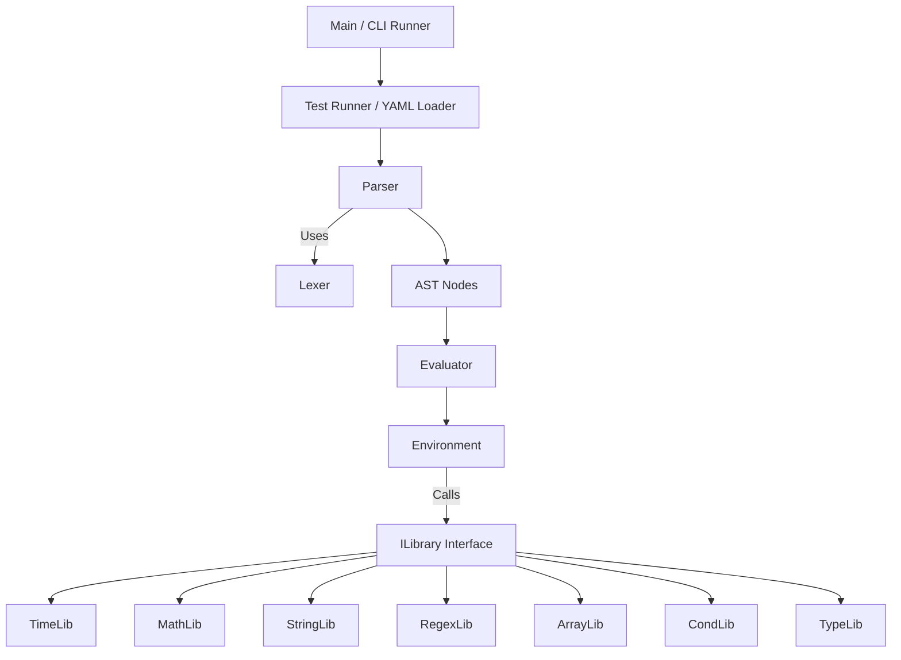

# Logical Query Language DSL Specification

This document defines a minimal core grammar and a comprehensive set of namespaced library functions for constructing logical queries over JSON‑like data. The DSL is designed to be concise, strongly typed at runtime, and highly extensible. Every implementation of this DSL **MUST** follow the detailed rules and syntax described herein. No detail is left unspecified, and explicit conversion or error conditions are required for every operation.

---

## 1. Introduction

### 1.1 Scope and Goals

1. **Target Use Case:**  
   The DSL is intended to filter or query JSON‑like documents. Its design emphasizes:
    - **Clarity:** The syntax and semantics are unambiguous.
    - **Runtime Type Safety:** All operations are strongly typed, with explicit type conversion functions provided.
    - **Deterministic Behavior:** Every operator and function has well‑defined input types, return types, and error conditions.

2. **Core Principle:**
    - **Primitive Operations:** The DSL natively supports numbers, strings, booleans, and `null`.
    - **Complex Data Types:** Data types such as time, arrays, and objects are either handled via library functions or by using explicit inline literal syntax (e.g., using `{ ... }` for objects and `[ ... ]` for arrays) to avoid any ambiguity.
    - **Explicit Conversion:** No implicit conversion is allowed between numeric types (int and float) or between other types. Every conversion between types (including numeric to string, or float to int) **MUST** be done via explicit functions provided in the type library.

3. **Extensibility:**
    - Additional operators, function libraries, or DSL constructs **MUST** be introduced in a namespaced manner (e.g., `customLibrary.myFunction(...)`).
    - **Pluggable Libraries:** The engine supports dynamic registration of additional libraries under distinct namespaces without altering the core DSL.

4. **Cross‑Language Consistency (Time and Numeric Types):**
    - All implementations (Go, Java, PHP, JavaScript, C#, Ruby, C++, etc.) **MUST** treat time and numeric values uniformly.
    - **Time Values:** Internally, every Time value **MUST** be stored as a 64‑bit integer (`epochMillis`), representing the number of milliseconds since 1970‑01‑01T00:00:00Z. Conversions between this internal representation and any textual or numeric forms **MUST** be performed only through the `time` library.
    - **Numeric Values:** Two distinct numeric types are supported:
        - **int:** Literal examples such as `123`, `0`, `-42` are interpreted as 64‑bit integers (int64).
        - **float:** Literal examples such as `45.67`, `-0.5`, `1e10`, `3.14E-2`, `-2E+3` are interpreted as 64‑bit floating‑point numbers (float64).
    - **No Implicit Conversions:** Arithmetic operators do not perform any implicit conversion between int and float. Mixed‑type operations require explicit conversion functions (see the Type Library).

---

## 2. Terminology, Conventions, and Error Handling

### 2.1 Data Types

#### 2.1.1 Primitive Types

1. **Numbers:**
    - **int:**
        - Literals like `123`, `0`, or `-42` are interpreted as integers.
        - Internally, they **MUST** be stored as 64‑bit integers (int64).
        - A leading `+` sign is allowed but not required.
    - **float:**
        - Literals like `45.67`, `-0.5`, `1e10`, `3.14E-2`, or `-2E+3` are interpreted as floating‑point numbers.
        - Internally, they **MUST** be stored as 64‑bit floating‑point numbers (float64).
    - **Rules:**
        - Any numeric literal fitting into the appropriate 64‑bit type **MUST** be accepted.
        - **Important Clarification on Negative Numeric Literals and Unary Minus:**  
          A minus sign (`-`) may appear before a numeric literal in any valid expression context. When immediately preceding a literal (e.g., `-42`), it is treated as part of that literal token. When used before a non‑literal expression (e.g., `-(a + b)`), it is parsed as a unary minus operator and its operand must evaluate to a numeric type; otherwise, a semantic error **MUST** be raised.
        - Arithmetic operators (`+`, `-`, `*`, `/`) apply only to numeric types; no implicit conversion occurs.

2. **String:**
    - String literals **MUST** be enclosed in matching quotes—either single (`'`) or double (`"`).
    - Typical JSON‑like escape sequences (such as `\"`, `\'`, `\\`) are supported.
      > **Internal Detail:** The lexer also accepts Unicode escapes of the form `\uXXXX` (where XXXX are exactly four hexadecimal digits).
    - Object literal keys that are not valid identifiers **MUST** be quoted.

3. **Boolean:**
    - Only the lowercase tokens `true` and `false` are recognized.
    - Tokens with other casing (e.g., `TRUE`) are treated as bare identifiers and will trigger a syntax error if used improperly.

4. **Null:**
    - Represented solely as the lowercase literal `null`. Any other casing (e.g., `NULL`) triggers a lexical error.

5. **Relational Operators on Primitive Types:**
    - `<`, `>`, `<=`, `>=` are defined for numeric and string values.
    - `==` and `!=` are defined for numeric, string, boolean, or null values.
    - Applying `<` or `>` to booleans or `null` **MUST** produce a semantic error.
    - **Time values:**
        - Must be operated on exclusively via the `time` library; direct comparisons using relational operators are disallowed.

6. **Numeric Literal Overflow:**
    - Each numeric literal is checked to ensure it fits within a 64‑bit integer (for ints) or a 64‑bit float (for floats). Overflow triggers a lexical error with an appropriate message and location.

#### 2.1.2 Complex Types

1. **Objects:**
    - Written using curly braces in a JSON‑like syntax.
    - **Unquoted Keys:** Allowed if they conform to the identifier pattern (letters, digits, underscores; not starting with a digit).
    - **Quoted Keys:** Required for keys that contain special characters.
    - **Duplicate Keys:** Not allowed; duplicates trigger a semantic error.
    - **Trailing Commas:** Not permitted.
    - **Invalid Operations:** Direct arithmetic or relational operations on objects yield semantic errors.

2. **Arrays:**
    - Written using square brackets with comma‑separated expressions.
    - **No Empty Values:** Constructs like `[1,,2]` are disallowed.
    - **Trailing Commas:** Not permitted.
    - **Optional Array Indexing:** When using optional chaining with bracket notation (`?[ ]`), an out‑of‑bounds index returns `null` rather than causing a runtime error.

3. **Time:**
    - Handled exclusively via the `time` library.
    - Internally represented as a 64‑bit integer (`epochMillis`).
    - No implicit conversion to strings or numbers is allowed; all conversions must be explicit.
    - Direct use of relational operators on Time values is disallowed.

#### 2.1.3 Null or Missing Fields

- Performing arithmetic or relational operations on `null` triggers a semantic error.
- Accessing a missing field (e.g., `$user.isActive` when `$user` is absent) triggers a runtime error unless optional chaining is used.
- There is a distinction between a field present but set to `null` (evaluates to `null`) and a missing field (which triggers an error unless handled with `cond.coalesce` or optional chaining).

---

### 2.2 Case Sensitivity

- **Operators:** Logical operators (`AND`, `OR`, `NOT`, and their symbolic equivalents) are case‑sensitive.
- **Literals:** Only lowercase forms of `true`, `false`, and `null` are valid.
- **Identifiers:** All identifiers are case‑sensitive.
- **Context References:** Must begin with `$` (e.g., `$user`, `$userName`, or `$["userName"]`).

---

### 2.3 Whitespace, Multi‑line Expressions, and Comments

- Whitespace (spaces, tabs, newlines) is ignored between tokens.
- Expressions may span multiple lines.
- Lines beginning with `#` (ignoring preceding whitespace) are treated as comments.

---

### 2.4 Error Types

Errors are classified into four categories:

1. **Lexical Errors:**  
   Triggered by invalid characters, malformed numeric literals, unclosed strings, or incorrectly cased null (and bare identifiers from mis‑cased booleans).

2. **Syntax Errors:**  
   Occur when tokens are arranged in an order that violates the grammar (e.g., misplaced operators, bare identifiers used improperly, or missing closing tokens).

3. **Semantic Errors:**  
   Result from violations of type rules or operator usage (e.g., applying `<` on booleans, or unary minus on a non‑numeric). Some are detectable only at runtime.

4. **Runtime Errors:**  
   Occur during evaluation when context data is missing, an array index is invalid, or when there is a type mismatch.

---

## 3. Core Features

1. **Boolean Logic:**  
   Supported operators are `AND`, `OR`, and `NOT` (or `&&`, `||`, `!`). Short‑circuit evaluation is required.

2. **Relational and Equality Operators:**
    - Relational: `<`, `<=`, `>`, `>=` (for numeric and string types only).
    - Equality: `==` and `!=` (for numeric, string, boolean, or null values).
    - Using relational operators on unsupported types (including Time) triggers a semantic error.

3. **Arithmetic Operators:**  
   Supported operators: `+`, `-`, `*`, `/` for numeric types only.  
   No implicit conversion between int and float; mixed‑type operations require explicit conversion.  
   The `+` operator is not used for string concatenation (use `string.concat` instead).  
   The unary minus operator (when used separately, as in `-(a+b)`) must operate on numeric expressions.

4. **Field and Optional Access:**
    - Standard field access uses dot notation (`$object.field`) or bracket notation (`$object["field"]`).
    - **Optional Chaining:** Using `?.` or `?[ ]` will yield `null` instead of a runtime error when a member is missing.
    - Deeply nested optional chaining (e.g. `$order?.items?[0]?.price`) short‑circuits to `null` if any part is missing.

5. **Inline Literals:**
    - **Array Literals:** Written with square brackets (e.g., `[1, 2, (3+4)]`).
        - No empty elements (e.g., `[1,,2]`) or trailing commas.
    - **Object Literals:** Written with curly braces (e.g., `{ key: 1, sub: (2+3) }`).
        - Unquoted keys must conform to identifier rules; duplicate keys are not allowed; trailing commas are disallowed.
    - The literal `null` is the only representation for null.

6. **Modular Namespaced Libraries:**  
   Standard libraries (e.g., `time`, `math`, `string`, `regex`, `array`, `cond`, `type`) are invoked via their namespace (e.g., `time.now()`).
   > **Pluggable Library Registration:**  
   > Custom libraries can be dynamically added under unique namespaces without altering the core DSL.

---

## 4. Lexical Structure

### 4.1 Token Types

The tokenizer recognizes the following token types:

| **Token Type**          | **Examples**                              | **Description**                                                                                      | **Potential Errors**                                                            | **Encoding (Hex)**  |
|-------------------------|-------------------------------------------|------------------------------------------------------------------------------------------------------|---------------------------------------------------------------------------------|---------------------|
| **EOF**                 | *N/A*                                     | End of input marker.                                                                                 | –                                                                               | `0x00`              |
| **Illegal**             | Unrecognized characters                   | Represents an unrecognized or illegal token.                                                       | Triggers a lexical error.                                                       | `0x01`              |
| **Ident**               | `userName`, `item_42`, `城市`              | An identifier consisting of letters, digits, or underscores. **MUST NOT** begin with a digit.         | Lexical error if starting with a digit or containing invalid characters.        | `0x02` (followed by 1‑byte length and literal bytes) |
| **Number**              | `123`, `-45.67`, `+1e10`, `3.14E-2`         | A numeric literal. Integers (without decimal/exponent) vs. floats (with decimal/exponent).           | Malformed numeric literals trigger a lexical error.                           | `0x03` (followed by 1‑byte length and literal bytes) |
| **String**              | `"hello"`, `'world'`                       | A quoted string literal supporting escape sequences.                                               | Unclosed strings trigger a lexical error.                                       | `0x04` (followed by 1‑byte length and literal bytes) |
| **Bool**                | `true`, `false`                           | Boolean literal (only lowercase allowed).                                                          | Mis‑cased tokens (e.g., `TRUE`) are treated as bare identifiers, causing syntax errors.      | `0x05` (fixed literal: either “true” or “false”)       |
| **Null**                | `null`                                    | The null literal.                                                                                    | Incorrect casing triggers a lexical error.                                      | `0x06` (fixed literal “null”)        |
| **Plus**                | `+`                                       | Addition operator for numeric types only.                                                          | Applying to non‑numeric types triggers a semantic error.                        | `0x07`              |
| **Minus**               | `-`                                       | Subtraction operator and unary minus.                                                              | Unary minus on non‑numeric triggers a semantic error.                           | `0x08`              |
| **Multiply**            | `*`                                       | Multiplication operator for numeric types.                                                         | –                                                                               | `0x09`              |
| **Divide**              | `/`                                       | Division operator for numeric types.                                                               | Division by zero triggers a runtime error.                                      | `0x0A`              |
| **Lt**                  | `<`                                       | Less‑than operator for numeric and string types.                                                   | Using with unsupported types triggers a semantic error.                        | `0x0B`              |
| **Gt**                  | `>`                                       | Greater‑than operator for numeric and string types.                                                | –                                                                               | `0x0C`              |
| **Lte**                 | `<=`                                      | Less‑than‑or‑equal operator for numeric and string types.                                          | –                                                                               | `0x0D`              |
| **Gte**                 | `>=`                                      | Greater‑than‑or‑equal operator for numeric and string types.                                       | –                                                                               | `0x0E`              |
| **Eq**                  | `==`                                      | Equality operator for numeric, string, boolean, or null values.                                     | –                                                                               | `0x0F`              |
| **Neq**                 | `!=`                                      | Inequality operator for numeric, string, boolean, or null values.                                   | –                                                                               | `0x10`              |
| **And**                 | `AND`, `&&`                               | Logical AND operator; left‑associative with short‑circuit evaluation.                               | –                                                                               | `0x11`              |
| **Or**                  | `OR`, `||`                                | Logical OR operator; left‑associative with short‑circuit evaluation.                                | –                                                                               | `0x12`              |
| **Not**                 | `NOT`, `!`                                | Logical NOT operator.                                                                              | Non‑boolean operand triggers a semantic error.                                  | `0x13`              |
| **LParen**              | `(`                                       | Left parenthesis.                                                                                  | Mismatched parentheses trigger a syntax error.                                  | `0x14`              |
| **RParen**              | `)`                                       | Right parenthesis.                                                                                 | –                                                                               | `0x15`              |
| **LeftBracket**         | `[`                                       | Left square bracket for arrays.                                                                    | Mismatched brackets trigger a syntax error.                                     | `0x16`              |
| **RightBracket**        | `]`                                       | Right square bracket.                                                                              | –                                                                               | `0x17`              |
| **LeftCurly**           | `{`                                       | Left curly brace for object literals.                                                              | –                                                                               | `0x18`              |
| **RightCurly**          | `}`                                       | Right curly brace.                                                                                 | –                                                                               | `0x19`              |
| **Comma**               | `,`                                       | Comma used to separate elements in arrays or object fields.                                        | –                                                                               | `0x1A`              |
| **Colon**               | `:`                                       | Colon separating keys and values in object literals.                                               | –                                                                               | `0x1B`              |
| **Dot**                 | `.`                                       | Dot operator for member access.                                                                    | Misuse triggers a syntax or semantic error.                                     | `0x1C`              |
| **QuestionDot**         | `?.`                                      | Optional chaining via dot notation.                                                                | –                                                                               | `0x1E`              |
| **QuestionBracket**     | `?[`                                      | Optional chaining via bracket notation.                                                            | –                                                                               | `0x1F`              |
| **Dollar**              | `$`                                       | Introduces a context reference.                                                                    | –                                                                               | `0x20`              |

> **Important Note on Bare Identifiers:**  
> Standalone bare identifiers (i.e., those not prefixed with `$`, part of a library call, or used as unquoted object keys) are disallowed and will trigger a syntax error.

---

### 4.2 Lexical Errors

- **Unknown Characters:**  
  Any unrecognized character is reported as an illegal token.

- **Malformed Numeric Literals:**  
  Numeric literals such as `12..3` or those with missing digits in an exponent trigger a lexical error.

- **Unclosed String Literals:**  
  Strings that are not properly terminated trigger a lexical error (this is always classified as a lexical error, not a syntax error).

- **Invalid Boolean or Null Literals:**  
  Boolean literals must be lowercase. Mis‑cased booleans become bare identifiers and trigger syntax errors. Only lowercase `null` is allowed.

---

## 5. Grammar

The DSL grammar (in extended BNF) is defined as follows:

#### 5.1 High‑Level Expression

```
<Expression> ::= <OrExpression>
```

#### 5.2 Boolean Logic

**OR Expression:**
```
<OrExpression> ::= <AndExpression>
                 { ("OR" | "||") <AndExpression> }
```
*Left‑associative; evaluation short‑circuits on true.*

**AND Expression:**
```
<AndExpression> ::= <EqualityExpression>
                  { ("AND" | "&&") <EqualityExpression> }
```
*Left‑associative; evaluation short‑circuits on false.*

#### 5.3 Equality and Relational Expressions

```
<EqualityExpression> ::= <RelationalExpression>
                       { ("==" | "!=") <RelationalExpression> }
```

```
<RelationalExpression> ::= <AdditiveExpression>
                         { ("<" | ">" | "<=" | ">=") <AdditiveExpression> }
```
*Relational operators apply only to numeric or string types; use on other types (including Time) triggers a semantic error.*

#### 5.4 Arithmetic Expressions

```
<AdditiveExpression> ::= <MultiplicativeExpression>
                       { ("+" | "-") <MultiplicativeExpression> }
```

```
<MultiplicativeExpression> ::= <UnaryExpression>
                             { ("*" | "/") <UnaryExpression> }
```
*Only numeric operands are allowed; no implicit conversion between int and float.*

#### 5.5 Unary Operators

```
<UnaryExpression> ::= { <UnaryOperator> } <MemberAccessChain>
```

```
<UnaryOperator> ::= "NOT" | "!" | "-"
```
*`NOT`/`!` require a boolean operand; unary `-` requires a numeric operand. A minus attached to a numeric literal is parsed as part of that literal.*

#### 5.6 Member Access and Primary Expressions

```
<MemberAccessChain> ::=
    <PrimaryExpression>
    { ( "." <Identifier>
      | "?." <Identifier>
      | "[" <Expression> "]"
      | "?[" <Expression> "]"
      )
    }
```

```
<PrimaryExpression> ::=
      "(" <Expression> ")"
    | <NamespacedFunctionCall>
    | <ArrayLiteral>
    | <ObjectLiteral>
    | <Literal>
    | <ContextRef>
```

**Literals:**
```
<Literal> ::= <Number> | <String> | <Bool> | "null"
```

**Context Reference:**
```
<ContextRef> ::= "$" <Identifier> | "$" | "$" "[" <Expression> "]"
```
*A standalone `$` represents the root context.*

**Namespaced Function Call:**
```
<NamespacedFunctionCall> ::= <NamespaceParts> "(" [ <ArgumentList> ] ")"
```

```
<NamespaceParts> ::= <Identifier> "." <Identifier>
```

```
<ArgumentList> ::= <Expression> { "," <Expression> }
```
*Examples: `time.parse("2025-01-01T12:00:00Z", "iso8601")`.*

**Array Literal:**
```
<ArrayLiteral> ::= "[" [ <Expression> { "," <Expression> } ] "]"
```
*No empty elements or trailing commas allowed.*

**Object Literal:**
```
<ObjectLiteral> ::= "{" [ <ObjectField> { "," <ObjectField> } ] "}"
```

```
<ObjectField> ::= ( <Identifier> | <String> ) ":" <Expression>
```
*Duplicate keys and trailing commas are disallowed.*

---

## 6. Standard Libraries

Each standard library function is defined by its signature, return type, potential errors, and examples. Additional internal capabilities (such as pluggable library registration and strict time handling) are now part of this section.

### 6.1 Time Library

Time functions operate on Time objects that are internally represented as 64‑bit integers (`epochMillis`).

#### 6.1.1 `time.now()`
- **Signature:** `time.now()`
- **Return Type:** Time
- **Arguments:** None
- **Example:**
  ```sql
  time.now()
  ```

#### 6.1.2 `time.parse(inputString, format[, formatDetails])`
- **Signature:** `time.parse(string, string [, string])`
- **Return Type:** Time
- **Arguments:**
    - `inputString`: Time as a string.
    - `format`: Format specifier (`"iso8601"`, `"dateOnly"`, `"epochMillis"`, `"rfc2822"`, or `"custom"`).
    - `formatDetails`: Required if `format` is `"custom"`.
- **Example:**
  ```sql
  time.parse("2025-02-13 10:00:00", "custom", "yyyy-MM-dd HH:mm:ss")
  ```

#### 6.1.3 `time.add(timeVal, durationVal)`
- **Signature:** `time.add(Time, numeric)`
- **Example:**
  ```sql
  time.add(time.parse("2025-01-01", "dateOnly"), 86400000)
  ```

#### 6.1.4 `time.subtract(timeVal, durationVal)`
- **Signature:** `time.subtract(Time, numeric)`

#### 6.1.5 `time.diff(timeVal1, timeVal2)`
- **Signature:** `time.diff(Time, Time)`
- **Example:**
  ```sql
  time.diff(time.parse("2025-02-01", "dateOnly"), time.parse("2025-02-13", "dateOnly"))
  ```

#### 6.1.6 `time.isBefore(timeValA, timeValB)`
- **Signature:** `time.isBefore(Time, Time)`

#### 6.1.7 `time.isAfter(timeValA, timeValB)`
- **Signature:** `time.isAfter(Time, Time)`

#### 6.1.8 `time.isEqual(timeValA, timeValB)`
- **Signature:** `time.isEqual(Time, Time)`

#### 6.1.9 `time.format(timeVal, formatString)`
- **Signature:** `time.format(Time, string)`
- **Example:**
  ```sql
  time.format(time.parse("2025-01-01T12:00:00Z", "iso8601"), "yyyy/MM/dd HH:mm")
  ```

#### 6.1.10 `time.toEpochMillis(timeVal)`
- **Signature:** `time.toEpochMillis(Time)`

#### 6.1.11 Additional Time Functions
Functions such as `time.getYear()`, `time.getMonth()`, `time.getDay()`, `time.startOfDay()`, `time.endOfDay()`, and `time.withZone()` **MUST** follow the established patterns.

- **Note:** The internal behavior for time functions includes that all comparisons and conversions operate solely on the normalized epochMillis representation.

---

### 6.2 Math Library

#### 6.2.1 Basic Numeric Functions

1. **`math.abs(x)`**
    - **Example:**
      ```sql
      math.abs(-42)
      ```

2. **`math.floor(x)`**

3. **`math.sqrt(x)`**
    - **Example:**
      ```sql
      math.sqrt(16)
      ```

4. **`math.pow(x, y)`**

5. **`math.round(x)`**

6. **`math.ceil(x)`**

#### 6.2.2 Aggregation Functions

1. **`math.sum(arr[, subfield, defaultVal])`**
2. **`math.min(arr[, subfield, defaultVal])`**
3. **`math.max(arr[, subfield, defaultVal])`**
4. **`math.avg(arr[, subfield, defaultVal])`**

---

### 6.3 String Library

1. **`string.toLower(s)`**
    - **Example:**
      ```sql
      string.toLower("HELLO")
      ```

2. **`string.toUpper(s)`**

3. **`string.trim(s)`**

4. **`string.startsWith(s, prefix)`**, **`string.endsWith(s, suffix)`**, **`string.contains(s, substring)`**

5. **`string.replace(s, old, new[, limit])`**

6. **`string.split(s, delim)`**

7. **`string.join(arrOfStrings, sep)`**

8. **`string.substring(s, startIndex, length)`**

9. **`string.indexOf(s, sub[, fromIndex])`**

10. **`string.concat(str1, str2, ... )`**
    > **Internal Detail:** All string concatenation must use `string.concat` rather than the `+` operator.
    - **Example:**
      ```sql
      string.concat("Hello", " ", $user.name)
      ```

---

### 6.4 Regex Library

1. **`regex.match(pattern, s)`**
    - **Example:**
      ```sql
      regex.match("^[A-Z]{3}-\\d+$", $ticket.code)
      ```
2. **`regex.replace(s, pattern, replacement)`**
    - **Example:**
      ```sql
      regex.replace("abc-123", "(\\d+)", "[$1]")
      ```
3. **`regex.find(pattern, s)`**
    - **Example:**
      ```sql
      regex.find("\\d+", "abc-123-xyz")
      ```

---

### 6.5 Array Library

1. **`array.contains(collection, value)`**
    - **Example:**
      ```sql
      array.contains([100, 200, 300], 200)
      ```

2. **`array.find(collection, subfield, matchVal[, defaultObj])`**

3. **`array.first(arr[, defaultVal])`** and **`array.last(arr[, defaultVal])`**
    - **Example:**
      ```sql
      array.first([1, 2, 3])
      ```

4. **`array.extract(collection, subfield[, defaultVal])`**

5. **`array.sort(arr[, ascending])`**
    - **Example (ascending):**
      ```sql
      array.sort([3,1,2], true)
      ```

6. **`array.filter(collection[, subfield[, matchVal]])`**

7. **`array.flatten(arr)`**
    - **Example:**
      ```sql
      array.flatten([1, [2, 3], 4])
      ```

> **Internal Detail:** When using optional bracket access (`?[ ]`) on arrays, an out‑of‑bounds index returns `null`.

---

### 6.6 Cond Library

1. **`cond.ifExpr(condition, thenVal, elseVal)`**
    - **Example:**
      ```sql
      cond.ifExpr($user.age >= 18, "adult", "minor")
      ```

2. **`cond.coalesce(expr1, expr2, ...)`**
    - **Example:**
      ```sql
      cond.coalesce($user.middleName, "N/A")
      ```

3. **`cond.isFieldPresent(object, fieldPath)`**

---

### 6.7 Type Library

1. **Type Predicates:**
    - `type.isNumber(x)`, `type.isString(x)`, `type.isBoolean(x)`, `type.isArray(x)`, `type.isObject(x)`, `type.isNull(x)`

2. **Conversion Functions:**
    - **`type.string(x)`**
        - Converts any input to its string representation. Returns `""` for `null`.
    - **`type.int(x)`**
        - Converts input to a 64‑bit integer; returns `0` for `null`.
    - **`type.float(x)`**
        - Converts input to a 64‑bit float; returns `0.0` for `null`.
    - **`type.intArray(value)`**, **`type.floatArray(value)`**, **`type.stringArray(value)`**
        - Convert array elements uniformly to the target type.
   > **Internal Detail:** These functions strictly enforce returning the “zero value” when encountering `null`.

---

## 7. Error Reporting Format

All errors produced by the DSL engine MUST include:

- **errorType:** One of: `LexicalError`, `SyntaxError`, `SemanticError`, `RuntimeError`, `TypeError`, `DivideByZeroError`, `ReferenceError`, `UnknownIdentifierError`, `UnknownOperatorError`, `FunctionCallError`, `ParameterError`, or `ArrayOutOfBoundsError`.
- **message:** A descriptive explanation.
- **line:** The source line number.
- **column:** The column number.
- **snippet:** A snippet of the source code showing the line with an arrow (`^`) marking the error.

### Format

```
<ErrorType>: <message> at line <line>, column <column>
    <source line>
    <pointer line with '^'>
```

**Example:**
```
LexicalError: Unclosed string literal at line 1, column 16
    $user.name == "Alice
                ^
```

(If ANSI colors are enabled, parts of the error message and snippet may be colorized.)

---

## 8. DSL Evaluation Library

The evaluation library defines how expressions are parsed, stored, and evaluated against a context.

### 8.1 Parsing and Reuse

- A single parse operation MUST yield an Abstract Syntax Tree (AST) or an error.
- The resulting AST is immutable and safe for reuse across multiple evaluations and threads (see Section 13).

### 8.2 Typed Evaluation Methods

Implementations MUST provide evaluation functions that return values of specific types (e.g., EvaluateBoolean, EvaluateString, EvaluateNumber) and raise runtime errors upon type mismatches, missing fields, or out‑of‑bounds accesses.

### 8.3 Context Resolution

- A context reference like `$user` looks up the key `user` in the provided context.
- Missing fields (when not using optional chaining) trigger runtime errors.
- Invalid member accesses (e.g., using dot notation on a non‑object) trigger runtime errors.

---

## 9. YAML Test Case Format and CLI Runner

Test cases are defined in YAML with the following fields:

1. **description** (string)
2. **context** (object)
3. **expression** (string)
4. **expectedError** (string) – if an error is expected.
5. **expectedErrorMessage** (string) – the expected error message (excluding the error type).
6. **expectedResult** (any) – omitted if an error is expected.
7. **skip** (boolean)
8. **focus** (boolean)

### 9.1 YAML Test Case Example

```yaml
- description: "Simple addition"
  context:
    sensor:
      reading: 100
  expression: "$sensor.reading + 1"
  expectedResult: 101

- description: "Unclosed string literal"
  context: {}
  expression: "$user.name == \"Alice"
  expectedError: "LexicalError"
  expectedErrorMessage: "Unclosed string literal at line 1, column 16"

- description: "Missing field triggers runtime error"
  context: {}
  expression: "$user.isActive"
  expectedError: "RuntimeError"
  expectedErrorMessage: "field 'user' not found at line 1, column 1"

- description: "String comparison"
  context:
    user:
      name: "Alice"
  expression: "$user.name == 'Alice'"
  expectedResult: true
  focus: true

- description: "Regex partial match"
  context:
    ticket:
      code: "ABC-123"
  expression: "regex.match('\\\\d+', $ticket.code)"
  expectedResult: true

- description: "Skipped test example"
  context:
    data:
      value: 10
  expression: "$data.value * 2"
  expectedResult: 20
  skip: true
```

### 9.2 Command‑Line Test Runner

The DSL engine must support a CLI for running YAML test cases:
```
lqltest [$TESTFILE] --fail-fast --verbose
```
- **$TESTFILE:** Optional (default: `testcases.yml`).
- **--fail-fast:** Stops on first failure.
- **--verbose:** Controls output verbosity.

Test cases marked with `skip: true` are skipped. If any test case is marked with `focus: true`, only those tests run; others are skipped.

The test runner must exit with code 0 if all tests pass, and 1 if any test fails.

### 9.3 Sample Test Runner Output

#### Without Focus:
```
Running DSL Tests from testcases.yml...

[Test #1] Simple addition
    Expression: $sensor.reading + 1
    Context: { sensor: { reading: 100 } }
    Expected Result: 101
    Actual Result: 101
    Status: PASSED

...

==============================================
Test Suite Completed in 0.045 seconds
  PASSED: 5
  SKIPPED: 1
  FAILED: 0
  TOTAL: 6
==============================================
```

#### With Focus:
```
Running DSL Tests from testcases.yml... (Focus Mode Active)

[FOCUSED][Test #4] String comparison
    Expression: $user.name == 'Alice'
    Context: { user: { name: 'Alice' } }
    Expected Result: true
    Actual Result: true
    Status: PASSED

...

==============================================
Test Suite Completed in 0.045 seconds
  PASSED: 1
  SKIPPED: 5
  FAILED: 0
  TOTAL: 6
==============================================
```

---

## 10. Expression Formatting / Linting Guidelines

### 10.1 Spacing Conventions

1. **Binary Operators:**  
   One space on each side of operators (e.g., `$a + 1`, `$b == -1`, `$user.age >= 18 && $user.country == "US"`).
2. **Unary Operators:**  
   No space between operator and operand (e.g., `NOT $flag`, `!condition`, `-($value + 1)`).
3. **Parentheses:**  
   No space immediately after `(` or before `)`.
4. **Commas:**  
   No space before and one space after (e.g., `string.concat("Hello", " ", $user.name)`).
5. **Dot and Bracket Access:**  
   No extra spaces (e.g., `$user.address.street`, `$order.items[0]`, `$order?.items?[0]?.price`).
6. **Object and Array Literals:**
    - **Arrays:** `[1, 2, 3]`
    - **Objects:** `{ key: 1, sub: (2 + 3) }`
    - For multiline literals, use consistent indentation.

### 10.2 Linted Examples

| **Original**                   | **Linted**                          |
|--------------------------------|-------------------------------------|
| `($b== -1 )`                  | `($b == -1)`                        |
| `$user.age>=18&&$user.country=="US"` | `$user.age >= 18 && $user.country == "US"` |
| `time.parse ( "2025-01-01","dateOnly" )` | `time.parse("2025-01-01", "dateOnly")` |
| `NOT  $flag`                   | `NOT $flag`                         |
| `- ( $val +1 )`                | `-($val + 1)`                       |
| `string.concat("Hi","there","!")` | `string.concat("Hi", "there", "!")`  |
| `[1,2, (3+4)]`                 | `[1, 2, (3 + 4)]`                   |
| `{key:1,sub:(2+3)}`            | `{ key: 1, sub: (2 + 3) }`           |

**Before:**
```dsl
($b== -1 ) AND NOT  $flag && string.concat("Hello"," world")
```
**After:**
```dsl
($b == -1) AND NOT $flag && string.concat("Hello", " world")
```

---

## 11. Bytecode Serialization Format

The DSL compiler provides the ability to compile expressions into compact binary bytecode for storage and transmission.

### 11.1 Overall Structure

A bytecode file consists of:

1. **Header Magic:**  
   A fixed 4‑byte ASCII sequence (e.g., `"STOK"`).

2. **Length Field:**  
   A 4‑byte little‑endian unsigned integer indicating the length (in bytes) of the token stream.

3. **Token Stream:**  
   A sequence of tokens representing the DSL expression, encoded as described below.

4. **Optional Signature Block:**  
   If signing is enabled (e.g., via a `-signed` flag), an RSA signature (of fixed length, such as 256 bytes for a 2048‑bit key) is appended.
   > **Internal Detail:** Signature verification errors are reported with messages starting with “invalid signature:” if the RSA verification fails.

### 11.2 Token Encoding

- Each token is encoded by a single byte indicating its token type.
- For tokens with variable text (identifiers, numbers, strings), a 1‑byte length field is appended followed by the UTF‑8 encoded literal.
- Tokens with fixed representations (punctuation, operators, booleans, `null`) are encoded solely by their type code.
- > **Internal Detail:** This fixed‑format encoding (one byte per token plus extra length bytes for variable tokens) yields a highly compact binary representation.

---

## 12. Parser Implementation

The DSL parser MUST be implemented as a recursive descent parser in an LL(1) style.

- Each nonterminal (e.g., `parseExpression`, `parseOrExpression`, `parseAdditiveExpression`, etc.) is implemented as a separate function.
- Operator precedence is handled by a series of functions corresponding to each level.
- The resulting AST is immutable and thread‑safe (see Section 8).

---

## 13. Component Interfaces and Architecture

This section describes the modular design of the DSL engine.

### 13.1 Token and Lexer Interfaces

```go
type TokenType LANGUAGE-DEPENDENT

// Token represents a lexical token.
type Token struct {
    Type    TokenType
    Literal string
    Line    int
    Column  int
}

// ILexer abstracts the behavior of the lexer.
type ILexer interface {
    NextToken() Token
}
```

### 13.2 Parser Interfaces

```go
// IParser abstracts a parser that produces an AST.
type IParser interface {
    ParseExpression() (IExpression, error)
}
```

### 13.3 AST / Expression Interfaces

```go
// IExpression is implemented by every AST node.
type IExpression interface {
    Eval(ctx map[string]interface{}, env IEnvironment) (interface{}, error)
    Pos() (line, column int)
}
```
*Concrete expression types (e.g., LiteralExpr, IdentifierExpr, ContextExpr, BinaryExpr, UnaryExpr, FunctionCallExpr, MemberAccessExpr, ArrayLiteralExpr, ObjectLiteralExpr) implement this interface.*

### 13.4 Environment and Library Interfaces

```go
// IEnvironment abstracts the execution environment.
type IEnvironment interface {
    GetLibrary(name string) (ILibrary, bool)
}

// ILibrary defines the interface for a DSL library.
type ILibrary interface {
    Call(functionName string, args []interface{}, line, column int) (interface{}, error)
}
```
> **Internal Detail – Pluggable Namespaced Library Registration:**  
> Custom libraries can be registered dynamically under distinct namespaces without modifying the core engine.

### 13.5 Integration Diagram



---

## 14. AST and Expression Types

The DSL AST is composed of the following concrete types:

### Literal Expression

Represents a literal (number, string, bool, or null).
```go
type LiteralExpr struct {
    Value  interface{}
    Line   int
    Column int
}
```

### Identifier Expression

Represents an identifier.
```go
type IdentifierExpr struct {
    Name   string
    Line   int
    Column int
}
```

### Context Expression

Represents a context reference (e.g., `$user` or `$["user"]`).
```go
type ContextExpr struct {
    Ident     *IdentifierExpr
    Subscript Expression
    Line      int
    Column    int
}
```

### Binary Expression

Represents a binary operation.
```go
type BinaryExpr struct {
    Left     Expression
    Operator TokenType
    Right    Expression
    Line     int
    Column   int
}
```

### Unary Expression

Represents a unary operation.
```go
type UnaryExpr struct {
    Operator TokenType
    Expr     Expression
    Line     int
    Column   int
}
```

### Function Call Expression

Represents a function call with a namespace.
```go
type FunctionCallExpr struct {
    Namespace []string
    Args      []Expression
    Line      int
    Column    int
}
```

### Member Access Expression

Represents member access on an object or array.
```go
type MemberAccessExpr struct {
    Target      Expression
    AccessParts []MemberPart
}
```

#### MemberPart

Represents one member access (dot or bracket).
```go
type MemberPart struct {
    Optional bool
    IsIndex  bool
    Key      string
    Expr     Expression
    Line     int
    Column   int
}
```

### Array Literal Expression

Represents an inline array.
```go
type ArrayLiteralExpr struct {
    Elements []Expression
    Line     int
    Column   int
}
```

### Object Literal Expression

Represents an inline object.
```go
type ObjectLiteralExpr struct {
    Fields map[string]Expression
    Line   int
    Column int
}
```

---

## 15. DSL Implementation Test Cases

Test cases are organized by category: Lexical, Syntax, Semantic, Runtime, Core Feature, Library Function, Combined, and Optional Chaining tests. (Refer to Section 9 for YAML test case format.)

### Lexical Tests

#### Unclosed String Literal
```yaml
- description: "Lexical Test: Unclosed String Literal"
  context: {}
  expression: "$user.name == \"Alice"
  expectedError: "LexicalError"
  expectedErrorMessage: "Unclosed string literal at line 1, column 16"
```

#### Malformed Numeric Literal
```yaml
- description: "Lexical Test: Malformed Numeric Literal"
  context: {}
  expression: "$order.total == 12..3"
  expectedError: "LexicalError"
  expectedErrorMessage: "Malformed numeric literal at line 1, column 21"
```

#### Invalid Boolean Literal Casing
```yaml
- description: "Syntax Test: Invalid Boolean Literal Casing"
  context: {}
  expression: "$user.isActive == True"
  expectedError: "SyntaxError"
  expectedErrorMessage: "Bare identifier 'True' is not allowed at line 1, column 16"
```

### Syntax Tests

#### Misplaced Operator
```yaml
- description: "Syntax Test: Misplaced Operator"
  context: {}
  expression: "AND $user.age > 10"
  expectedError: "SyntaxError"
  expectedErrorMessage: "Unexpected operator 'AND' at line 1, column 1"
```

#### Mismatched Parenthesis
```yaml
- description: "Syntax Test: Mismatched Parenthesis"
  context: {}
  expression: "($a + $b"
  expectedError: "SyntaxError"
  expectedErrorMessage: "Expected RPAREN but found EOF at line 1, column 8"
```

#### Mismatched Brackets
```yaml
- description: "Syntax Test: Mismatched Brackets"
  context: {}
  expression: "[1, 2, 3))"
  expectedError: "SyntaxError"
  expectedErrorMessage: "Mismatched closing parenthesis at line 1, column 8"
```

### Semantic Tests

#### Arithmetic on Non‑Numeric
```yaml
- description: "Semantic Test: Arithmetic on Non‑Numeric"
  context:
    user:
      name: "Alice"
  expression: "$user.name + \"Bob\""
  expectedError: "SemanticError"
  expectedErrorMessage: "'+' operator used on non‑numeric type at line 1, column 12"
```

#### Relational Operator on Boolean
```yaml
- description: "Semantic Test: Relational Operator on Boolean"
  context:
    user:
      isActive: true
  expression: "$user.isActive < false"
  expectedError: "SemanticError"
  expectedErrorMessage: "'<' operator not allowed on boolean type at line 1, column 14"
```

#### NOT Operator on Non‑Boolean
```yaml
- description: "Semantic Test: NOT Operator on Non‑Boolean"
  context: {}
  expression: "NOT 5"
  expectedError: "SemanticError"
  expectedErrorMessage: "NOT operator requires a boolean operand at line 1, column 1"
```

#### Unary Minus on Non‑Numeric
```yaml
- description: "Semantic Test: Unary Minus on Non‑Numeric"
  context: {}
  expression: "-(\"hello\")"
  expectedError: "SemanticError"
  expectedErrorMessage: "unary '-' operator requires a numeric operand at line 1, column 1"
```

#### Bare Identifier Not Allowed
```yaml
- description: "Semantic Test: Bare Identifier Not Allowed"
  context: {}
  expression: "username"
  expectedError: "SyntaxError"
  expectedErrorMessage: "Bare identifier 'username' is not allowed outside of context references or object keys"
```

### Runtime Tests

#### Field Not Found
```yaml
- description: "Runtime Test: Field Not Found"
  context: {}
  expression: "$user.isActive"
  expectedError: "RuntimeError"
  expectedErrorMessage: "field 'user' not found at line 1, column 1"
```

#### Negative Array Index
```yaml
- description: "Runtime Test: Negative Array Index"
  context:
    items: [10, 20, 30]
  expression: "$items[-1]"
  expectedError: "RuntimeError"
  expectedErrorMessage: "Invalid array index -1 at line 1, column 8"
```

#### Dot Access on Non‑Object
```yaml
- description: "Runtime Test: Member Access on Non‑Object"
  context:
    user: 123
  expression: "$user.name"
  expectedError: "RuntimeError"
  expectedErrorMessage: "dot access on non‑object at line 1, column 3"
```

#### Array Index Out of Bounds
```yaml
- description: "Runtime Test: Array Index Out of Bounds"
  context:
    order:
      items:
        - { price: 10 }
  expression: "$order.items[1].price"
  expectedError: "RuntimeError"
  expectedErrorMessage: "array index out of bounds at line 1, column 14"
```

### Core Feature Tests

#### Numeric Addition
```yaml
- description: "Core Test: Numeric Addition"
  context:
    sensor:
      reading: 100
  expression: "$sensor.reading + 1"
  expectedResult: 101
```

#### Boolean AND/OR
```yaml
- description: "Core Test: Boolean AND/OR Evaluation"
  context:
    user:
      age: 20
      country: "US"
  expression: "$user.age >= 18 && $user.country == \"US\""
  expectedResult: true
```

#### Lexicographic String Comparison
```yaml
- description: "Core Test: Lexicographic String Comparison"
  context:
    user:
      lastName: "Adams"
  expression: "$user.lastName < \"Smith\""
  expectedResult: true
```

#### Null Check
```yaml
- description: "Core Test: Null Check"
  context:
    user:
      middleName: null
  expression: "$user.middleName == null"
  expectedResult: true
```

#### Time Comparison Using Library Function
```yaml
- description: "Core Test: Time Comparison"
  context: {}
  expression: "time.isBefore(time.parse(\"2025-01-01T00:00:00Z\", \"iso8601\"), time.now())"
  expectedResult: true  # Adjust based on controlled test conditions
```

#### Inline Array Literal with Arithmetic
```yaml
- description: "Core Test: Inline Array Literal with Arithmetic"
  context: {}
  expression: "math.sum([1, 2, (3+4)])"
  expectedResult: 10
```

#### Inline Object Literal with Member Access
```yaml
- description: "Core Test: Inline Object Literal with Member Access"
  context: {}
  expression: "{ \"key\": 1, sub: (2+3) }.sub == 5"
  expectedResult: true
```

#### Bracket Notation for Key Access
```yaml
- description: "Core Test: Bracket Notation for Key Access"
  context:
    user:
      "isActive": true
  expression: "$user[\"isActive\"] == true"
  expectedResult: true
```

#### Unary Minus Operator Example
```yaml
- description: "Core Test: Unary Minus Operator"
  context:
    a: 5
    b: 3
  expression: "-($a + $b)"
  expectedResult: -8
```

### Library Function Tests

#### Time Library Tests

##### time.now() and time.toEpochMillis
```yaml
- description: "Time Library Test: time.now()"
  context: {}
  expression: "time.toEpochMillis(time.now())"
  expectedResult: 1672531200000  # Example value; adjust for controlled environment
```

##### time.parse with ISO8601 Format
```yaml
- description: "Time Library Test: time.parse ISO8601"
  context: {}
  expression: "time.toEpochMillis(time.parse(\"2025-01-01T12:00:00.000Z\", \"iso8601\"))"
  expectedResult: 1735732800000
```

##### time.add Function
```yaml
- description: "Time Library Test: time.add"
  context: {}
  expression: "time.toEpochMillis(time.add(time.parse(\"2025-01-01\", \"dateOnly\"), 86400000))"
  expectedResult: 1735766400000
```

#### Math Library Tests

##### math.abs Function
```yaml
- description: "Math Library Test: math.abs"
  context: {}
  expression: "math.abs(-42)"
  expectedResult: 42
```

##### math.sqrt Function
```yaml
- description: "Math Library Test: math.sqrt"
  context: {}
  expression: "math.sqrt(16)"
  expectedResult: 4
```

##### math.sum with Subfield
```yaml
- description: "Math Library Test: math.sum with subfield"
  context:
    order:
      items:
        - { price: 10 }
        - { price: 20 }
  expression: "math.sum($order.items, \"price\", 0)"
  expectedResult: 30
```

#### String Library Tests

##### string.concat Function
```yaml
- description: "String Library Test: string.concat"
  context:
    user:
      name: "World"
  expression: "string.concat(\"Hello\", \" \", $user.name)"
  expectedResult: "Hello World"
```

##### string.toLower Function
```yaml
- description: "String Library Test: string.toLower"
  context: {}
  expression: "string.toLower(\"HELLO\")"
  expectedResult: "hello"
```

#### Regex Library Tests

##### regex.match Function
```yaml
- description: "Regex Library Test: regex.match"
  context:
    ticket:
      code: "ABC-123"
  expression: "regex.match(\"^[A-Z]{3}-\\d+$\", $ticket.code)"
  expectedResult: true
```

##### regex.replace Function
```yaml
- description: "Regex Library Test: regex.replace"
  context: {}
  expression: "regex.replace(\"abc-123\", \"(\\d+)\", \"[$1]\")"
  expectedResult: "abc-[123]"
```

#### Array Library Tests

##### array.contains Function
```yaml
- description: "Array Library Test: array.contains"
  context: {}
  expression: "array.contains([100, 200, 300], 200)"
  expectedResult: true
```

##### array.first Function
```yaml
- description: "Array Library Test: array.first"
  context:
    data: [1,2,3]
  expression: "array.first($data)"
  expectedResult: 1
```

##### array.sort Function (Ascending)
```yaml
- description: "Array Library Test: array.sort Ascending"
  context: {}
  expression: "array.sort([3,1,2], true)"
  expectedResult: [1,2,3]
```

#### Cond Library Tests

##### cond.ifExpr Function
```yaml
- description: "Cond Library Test: cond.ifExpr"
  context:
    user:
      age: 25
  expression: "cond.ifExpr($user.age >= 18, \"adult\", \"minor\")"
  expectedResult: "adult"
```

##### cond.coalesce Function
```yaml
- description: "Cond Library Test: cond.coalesce"
  context:
    user:
      middleName: null
  expression: "cond.coalesce($user.middleName, \"N/A\")"
  expectedResult: "N/A"
```

#### Type Library Tests

##### type.int with String Argument
```yaml
- description: "Type Library Test: type.int with string"
  context: {}
  expression: "type.int(\"42\")"
  expectedResult: 42
```

##### type.string with Null
```yaml
- description: "Type Library Test: type.string with null"
  context: {}
  expression: "type.string(null)"
  expectedResult: ""
```

### Combined and Complex Expressions

#### Mixed Arithmetic and Boolean Logic
```yaml
- description: "Combined Test: Mixed Arithmetic and Boolean Logic"
  context:
    sensor:
      reading: 2500
  expression: "$sensor.reading < 2.5e3 AND $sensor.reading > 1000"
  expectedResult: true
```

#### Function Chaining with Member Access
```yaml
- description: "Combined Test: Function Chaining with Member Access"
  context:
    user:
      name: "Alice"
  expression: "string.toUpper(string.concat(\"Ms. \", $user.name)).startsWith(\"MS\")"
  expectedResult: true
```

### Optional Chaining and Context Handling Tests

#### Optional Chaining on Missing Field
```yaml
- description: "Optional Chaining Test: Missing Field"
  context:
    user: {}
  expression: "cond.coalesce($user?.middleName, \"unknown\")"
  expectedResult: "unknown"
```

#### Optional Array Index Out-of‑Bounds
```yaml
- description: "Optional Chaining Test: Array Index Out-of-Bounds"
  context:
    order:
      items:
        - { price: 50 }
  expression: "cond.coalesce($order?.items?[1]?.price, 0)"
  expectedResult: 0
```

### Focus and Skip Behavior

#### Focused Test Case Example
```yaml
- description: "Focused Test: String Comparison"
  context:
    user:
      name: "Alice"
  expression: "$user.name == 'Alice'"
  expectedResult: true
  focus: true
```

#### Skipped Test Case Example
```yaml
- description: "Skipped Test: Simple Multiplication"
  context:
    data:
      value: 10
  expression: "$data.value * 2"
  expectedResult: 20
  skip: true
```

---

## 16. Expression Formatting / Linting Guidelines

### 16.1 Spacing Conventions

1. **Binary Operators:**  
   One space on each side (e.g., `$a + 1`, `$b == -1`, `$user.age >= 18 && $user.country == "US"`).
2. **Unary Operators:**  
   No space between the operator and operand (e.g., `NOT $flag`, `!condition`, `-($val + 1)`).
3. **Parentheses:**  
   No extra space immediately after `(` or before `)`.
4. **Commas:**  
   No space before, one space after (e.g., `string.concat("Hello", " ", $user.name)`).
5. **Dot and Bracket Access:**  
   No extra spaces (e.g., `$user.address.street`, `$order.items[0]`).
6. **Object and Array Literals:**
    - Arrays: `[1, 2, 3]`
    - Objects: `{ key: 1, sub: (2 + 3) }`  
      For multiline literals, use consistent indentation.

### 16.2 Examples of “Linted” Expressions

| **Original**                   | **Linted / Standardized**                |
|--------------------------------|------------------------------------------|
| `($b== -1 )`                  | `($b == -1)`                             |
| `$user.age>=18&&$user.country=="US"` | `$user.age >= 18 && $user.country == "US"` |
| `time.parse ( "2025-01-01","dateOnly" )` | `time.parse("2025-01-01", "dateOnly")`       |
| `NOT  $flag`                   | `NOT $flag`                              |
| `- ( $val +1 )`                | `-($val + 1)`                            |
| `string.concat("Hi","there","!")` | `string.concat("Hi", "there", "!")`         |
| `[1,2, (3+4)]`                 | `[1, 2, (3 + 4)]`                        |
| `{key:1,sub:(2+3)}`            | `{ key: 1, sub: (2 + 3) }`                |

**Before:**
```dsl
($b== -1 ) AND NOT  $flag && string.concat("Hello"," world")
```
**After:**
```dsl
($b == -1) AND NOT $flag && string.concat("Hello", " world")
```

---

## 17. Bytecode Serialization Format

The DSL compiler can compile expressions into a compact binary bytecode format.

### 17.1 Overall Structure

A bytecode file consists of:

1. **Header Magic:**  
   A fixed 4‑byte sequence (e.g., `"STOK"`).

2. **Length Field:**  
   A 4‑byte little‑endian unsigned integer representing the length of the token stream.

3. **Token Stream:**  
   A sequence of tokens encoded as described below.

4. **Optional Signature Block:**  
   If signing is enabled (e.g., via a `-signed` flag), an RSA signature (fixed length, e.g., 256 bytes for a 2048‑bit key) is appended.
   > **Internal Detail:** The RSA signature is computed over the token stream (excluding the header and length field). Verification errors produce messages starting with “invalid signature:” followed by details.

### 17.2 Token Encoding

- Each token is encoded by a single byte for its type.
- For tokens with variable text (identifiers, numbers, strings), a 1‑byte length field is appended followed by the literal’s UTF‑8 bytes.
- Fixed tokens (operators, punctuation, booleans, null) are encoded solely by their type code.
- > **Internal Detail:** This fixed‑format, compact encoding is an internal design choice not advertised to end users.

---

## 18. Additional Internal Behaviors

The following internal capabilities, previously undocumented, are now integrated into the specification:

1. **Unicode Escape Sequences in Strings:**  
   The lexer supports `\uXXXX` escapes (exactly four hexadecimal digits) to represent Unicode characters.

2. **Colorized Error Context via ANSI Codes:**  
   When `ENABLE_COLORS` is enabled (and optionally with `COLOR_PALETTE` set), error messages and source snippets are printed with ANSI colors—including a pointer line that highlights the error location.

3. **Dynamic Palette Switching for Syntax Highlighting:**  
   The engine supports multiple color palettes (“mild,” “vivid,” “dracula,” “solarized”), selectable via the `COLOR_PALETTE` environment variable.

4. **Strict Zero‑Value Defaults in Type Conversion:**  
   Conversion functions (e.g., `type.string`, `type.int`, `type.float`) return the appropriate zero value when given `null`.

5. **Signature Verification Error Reporting:**  
   If signed bytecode fails RSA signature verification, the engine reports an error beginning with “invalid signature:” followed by details.

6. **Immutable, Thread‑Safe AST Reuse:**  
   The AST produced by the parser is immutable and can be safely reused across multiple evaluations and threads.

7. **Optional Array Indexing Returning Null:**  
   With optional chaining using `?[ ]`, an out‑of‑bounds array index returns `null` rather than a runtime error.

8. **Pluggable Namespaced Library Registration:**  
   Custom libraries may be registered dynamically under distinct namespaces without altering the core DSL.

9. **Compact Fixed‑Format Bytecode Encoding:**  
   Tokens are encoded in a fixed‑format (one byte per token type plus extra bytes for variable tokens) to yield a highly compact binary representation.
