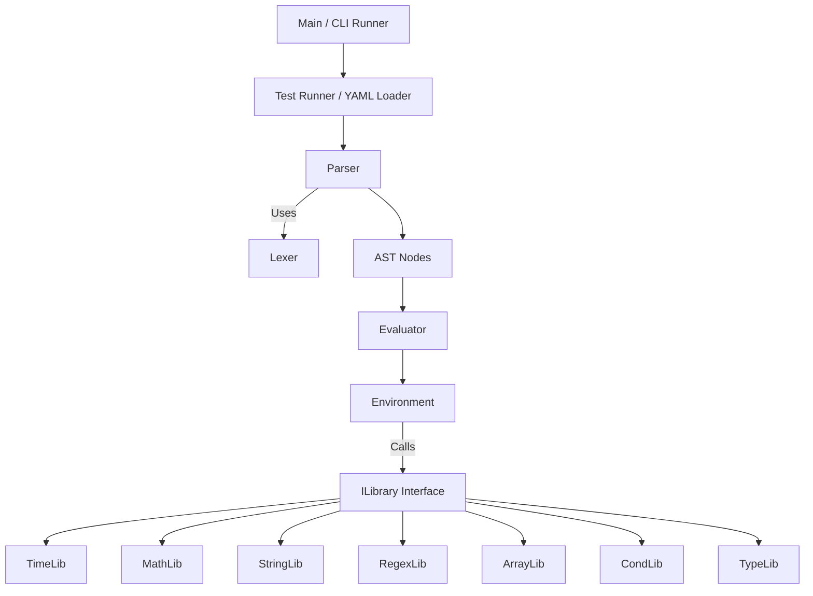

# Logical Query Language DSL Specification

This document defines a minimal core grammar and a comprehensive set of namespaced library functions for constructing logical queries over JSON‑like data. The DSL is designed to be concise, strongly typed at runtime, and highly extensible. Every implementation of this DSL **MUST** follow the detailed rules and syntax described herein. No detail is left unspecified, and explicit conversion or error conditions are required for every operation.

> **Undocumented Internal Behaviors:**  
> In addition to the publicly documented features, the DSL engine implements several internal behaviors that are now formally documented:
> - The lexer accepts Unicode escape sequences (`\uXXXX`) in strings.
> - Error messages include ANSI color‑coding when enabled.
> - Multiple color palettes are supported for syntax highlighting via the `COLOR_PALETTE` environment variable.
> - Type conversion functions automatically return zero‑values when given `null`.
> - Compiled bytecode includes an RSA signature block whose verification errors are clearly reported.
> - The AST produced by the parser is immutable and thread‑safe for concurrent reuse.
> - Optional array indexing with `?[ ]` returns `null` when the index is out‑of‑bounds.
> - Custom libraries may be registered dynamically under unique namespaces.
> - The DSL compiler uses a compact, fixed‑format bytecode encoding.
>
> (Note: Reflection‑based error position extraction is an internal implementation detail that is not included here.)

---

## 1. Introduction

### 1.1 Scope and Goals

1. **Target Use Case:**  
   The DSL is intended to filter or query JSON‑like documents. Its design emphasizes:
    - **Clarity:** The syntax and semantics are unambiguous.
    - **Runtime Type Safety:** All operations are strongly typed, with explicit type conversion functions provided.
    - **Deterministic Behavior:** Every operator and function has well‑defined input types, return types, and error conditions.

2. **Core Principle:**
    - **Primitive Operations:** The DSL natively supports numbers, strings, booleans, and `null`.
    - **Complex Data Types:** Data types such as time, arrays, and objects are either handled via library functions or by using explicit inline literal syntax (e.g., using `{ ... }` for objects and `[ ... ]` for arrays) to avoid any ambiguity.
    - **Explicit Conversion:** No implicit conversion is allowed between numeric types (int and float) or between other types. Every conversion between types (including numeric to string, or float to int) **MUST** be done via explicit functions provided in the type library.

3. **Extensibility:**
    - Additional operators, function libraries, or DSL constructs **MUST** be introduced in a namespaced manner (e.g., `customLibrary.myFunction(...)`).
    - **Pluggable Libraries:** The engine supports dynamic registration of custom libraries under distinct namespaces without affecting the core DSL.

4. **Cross‑Language Consistency (Time and Numeric Types):**
    - All implementations (Go, Java, PHP, JavaScript, C#, Ruby, C++, etc.) **MUST** treat time and numeric values uniformly.
    - **Time Values:** Internally, every Time value **MUST** be stored as a 64‑bit integer (`epochMillis`), representing the number of milliseconds since the Unix epoch (1970‑01‑01T00:00:00Z). Conversions between this internal representation and any textual or numeric forms **MUST** be performed only through the `time` library.
    - **Numeric Values:** Two distinct numeric types are supported:
        - **int:** Literal examples such as `123`, `0`, `-42` are interpreted as 64‑bit integers (int64).
        - **float:** Literal examples such as `45.67`, `-0.5`, `1e10`, `3.14E-2`, `-2E+3` are interpreted as 64‑bit floating‑point numbers (float64).
    - **No Implicit Conversions:** Arithmetic operators do not perform any implicit conversion between int and float. If an operation involves mixed numeric types, explicit conversion functions (see the Type Library) **MUST** be used.

---

## 2. Terminology, Conventions, and Error Handling

### 2.1 Data Types

#### 2.1.1 Primitive Types

1. **Numbers:**
    - **int:**
        - Literals like `123`, `0`, or `-42` are interpreted as integers.
        - Internally, they **MUST** be stored as 64‑bit integers (int64).
        - A leading `+` sign is allowed but not required.
    - **float:**
        - Literals like `45.67`, `-0.5`, `1e10`, `3.14E-2`, or `-2E+3` are interpreted as floating‑point numbers.
        - Internally, they **MUST** be stored as 64‑bit floating‑point numbers (float64).
    - **Rules:**
        - Any numeric literal fitting into the appropriate 64‑bit type **MUST** be accepted.
        - **Important Clarification on Negative Numeric Literals and Unary Minus:**  
          A minus sign (`-`) may appear before a numeric literal in any valid expression context (e.g., function arguments, within parentheses, or after a comparison operator). When a minus sign immediately precedes a numeric literal, the DSL lexer **MUST** treat it as a single literal token (e.g., `-42` or `-0.5`).  
          **However,** when a minus sign is used before an expression that is not a literal (for example, in an expression such as `-(a + b)`), it **MUST** be parsed as a unary minus operator. This operator requires that its operand evaluate to a numeric type; if not, a semantic error **MUST** be produced.
        - Arithmetic operators (`+`, `-`, `*`, `/`) are defined only for numeric values.  
          **Note:** No implicit conversion between int and float is performed; mixed‑type operations require explicit conversion via the type library functions.

2. **String:**
    - String literals **MUST** be enclosed in matching quotes—either single (`'`) or double (`"`).
    - Typical JSON‑like escape sequences (e.g., `\"`, `\'`, `\\`, including the Unicode escape sequence `\uXXXX`) **SHOULD** be supported.
      > **Undocumented Note:** The lexer accepts `\uXXXX` escapes where exactly four hexadecimal digits follow `\u`, converting them into the corresponding Unicode character.
    - Inline object literal keys that are not valid identifiers **MUST** be enclosed in quotes.

3. **Boolean:**
    - The only allowed boolean literals are the lowercase tokens `true` and `false`.
    - **Any token resembling a boolean literal with incorrect casing (for example, `TRUE`) is not recognized as a boolean literal. Instead, it is interpreted as a bare identifier. Since bare identifiers are disallowed outside of valid contexts (such as context references, library namespaces, or object literal keys), their appearance in isolation **MUST** trigger a syntax error.

4. **Null:**
    - Represented solely as the lowercase literal `null`.

5. **Relational Operators on Primitive Types:**
    - `<`, `>`, `<=`, `>=` are allowed only for numeric or string data.
    - `==` and `!=` are defined for numeric, string, boolean, or null values.
    - Using `<` or `>` with booleans or `null` **MUST** produce a semantic error.
    - **Time values:**
        - Time values **MUST** be handled exclusively via the `time` library and are treated as opaque.
        - **Direct use of relational operators on Time values is forbidden.** If either operand of a relational operator is of Time type, the DSL **MUST** trigger a semantic error instructing the user to use the appropriate time library function (e.g., `time.isBefore` or `time.isAfter`).

6. **Numeric Literal Overflow:**
    - Every numeric literal MUST be checked to ensure it fits within a 64‑bit integer (for int literals) or a 64‑bit floating‑point number (for float literals). If a numeric literal exceeds the range of the designated 64‑bit type, the DSL engine MUST raise a lexical error with a message such as “Numeric literal overflow” indicating the line and column of the offending literal.

#### 2.1.2 Complex Types

1. **Objects:**
    - **Representation and Syntax:**  
      Object literals are written in a JSON‑like syntax using curly braces.
        - **Unquoted Keys:** Keys may be provided as bare identifiers (e.g., `{ key: 1 }`) if they conform to the identifier rules (letters, digits, underscores, not starting with a digit).
        - **Quoted Keys:** Keys that include special characters or do not match the identifier pattern **MUST** be enclosed in quotes (e.g., `{ "key-with-hyphen": 1 }`).
    - **Duplicate Keys:**  
      Duplicate keys in an object literal are **NOT** allowed. If a duplicate key is encountered, a semantic error **MUST** be produced.
    - **No Trailing Commas:**  
      Trailing commas after the final key/value pair are **NOT** supported. For example, `{ key: 1, }` is invalid.
    - **Sources:**  
      They may be provided via the evaluation context (e.g., `$user.profile`), by library functions, or constructed inline using object literal syntax.
    - **Invalid Operations:**  
      Direct arithmetic or relational operations (e.g., `<`, `>`) on objects **MUST** yield a semantic error.

2. **Arrays:**
    - **Representation and Syntax:**  
      Array literals are written in a JSON‑like syntax using square brackets.
    - **Element Separation:**  
      Elements in an array must be valid expressions separated by commas.
        - **No Empty Values:** Empty values such as in `[1,,2]` are not allowed.
        - **No Trailing Commas:** A trailing comma after the last element (e.g., `[1, 2,]`) is not allowed.
    - **Sources:**  
      Arrays may be sourced from the context (e.g., `$order.items`), produced by library calls, or constructed inline.
    - **Invalid Operations:**  
      Direct arithmetic or relational operations on arrays **MUST** produce a semantic error.
    - **Optional Array Indexing:**  
      When using optional chaining with bracket notation (i.e. `?[ ]`), if the index is out‑of‑bounds the result **MUST** be `null` rather than triggering a runtime error.

3. **Time:**
    - Time values **MUST** be handled exclusively via the `time` library.
    - They are treated as opaque types and **MUST NOT** be implicitly converted to strings or numeric values.
    - Internally, each Time value **MUST** be represented as a 64‑bit integer (`epochMillis`) that counts the number of milliseconds elapsed since the Unix epoch (1970‑01‑01T00:00:00Z).
    - All time‑related operations (arithmetic, comparisons, parsing, formatting) **MUST** use the functions defined in the `time` library.
    - **Note:** Direct use of relational operators (`<`, `>`, etc.) on Time values is disallowed. Instead, comparisons **MUST** be performed using the time library functions (e.g., `time.isBefore`, `time.isAfter`).

#### 2.1.3 Null or Missing Fields

- JSON data may include `null` values or may omit keys entirely.
- Direct arithmetic or relational operations on `null` (e.g., `null + 5`) **MUST** yield a semantic error.
- A reference to a missing field (e.g., `$user.isActive` when `$user` does not exist) **MUST** trigger a runtime error unless optional access is explicitly used (using `?.` or `?[ ]`) or the expression is wrapped with a function such as `cond.coalesce(...)`.
- A type mismatch (e.g., accessing a field on a value that is numeric rather than an object) **MUST** trigger a runtime error.
- **Implementation Clarification:** There is a difference between a field that is present but set to `null` and a field that is entirely missing. If the field is present but `null`, its value evaluates as `null`. If the field is missing, it triggers a runtime error (unless optional chaining or a function like `cond.coalesce` is used).

---

### 2.2 Case Sensitivity

- **Operators:**  
  The logical operators `AND`, `OR`, `NOT` (and their symbolic forms `&&`, `||`, `!`) **MUST** be case‑sensitive.
- **Literals:**  
  Only the lowercase forms of `true`, `false`, and `null` are recognized as valid boolean and null literals. Any mis‑casing of boolean literals (e.g., `TRUE`) is not recognized as a boolean literal; instead, such tokens are interpreted as bare identifiers and will trigger a syntax error when used outside of valid contexts.
- **Identifiers:**  
  All identifiers are case‑sensitive.
- **Context References:**  
  A context reference **MUST** begin with `$` (e.g., `$user`, `$userName`, or `$["userName"]`). Subsequent member access uses dot notation (e.g., `$user.address.street`) or bracket notation (e.g., `$user["address"]["street"]`).

---

### 2.3 Whitespace, Multi‑line Expressions, and Comments

- **Whitespace:**  
  Spaces, tabs, and newlines are all ignored between tokens.
- **Multi‑line Expressions:**  
  DSL expressions may span multiple lines. Line breaks are treated as whitespace and do not affect the parsing structure.
- **Comments:**  
  Any line starting with `#` (ignoring preceding whitespace) is treated as a comment and ignored until the end of that line.

---

### 2.4 Error Types

Errors in the DSL are classified into four distinct categories:

1. **Lexical Errors (Parse‑time):**  
   Occur when the input contains invalid characters, malformed numeric literals (e.g., `12..3`), unclosed strings, or incorrectly cased literals for null (and—since mis‑cased booleans become bare identifiers—these later trigger syntax errors).

2. **Syntax Errors (Parse‑time):**  
   Occur when tokens are arranged in an order that does not conform to the grammar (e.g., misplaced operators, bare identifiers used where not allowed, or missing closing tokens).

3. **Semantic Errors (Primarily Parse‑time, sometimes Evaluation‑time):**  
   Occur when type rules or operator rules are violated (for example, applying `<` on booleans or using a function with the wrong number of arguments if it can be detected at parse‑time). Some semantic errors can only be detected at runtime when the types of evaluated data are known.

4. **Runtime Errors (Evaluation‑time):**  
   Occur during evaluation when context data is missing, an array index is out‑of‑bounds, or when there is a type mismatch.

---

## 3. Core Features

1. **Boolean Logic:**
    - Supported operators are `AND`, `OR`, and `NOT` (or their symbolic forms `&&`, `||`, `!`).
    - Short‑circuit evaluation **MUST** be performed: `AND` short‑circuits on the first false value, and `OR` on the first true value.

2. **Relational and Equality Operators:**
    - **Relational Operators:** `<`, `<=`, `>`, `>=` are valid only for numeric or string types.
    - **Equality Operators:** `==` and `!=` are valid for numeric, string, boolean, or null values.
    - **Type Constraints:** Using relational operators on unsupported types (including Time values) **MUST** trigger a semantic error.

3. **Arithmetic Operators:**
    - Supported arithmetic operators are `+`, `-`, `*`, and `/`, and are defined only for numeric types (int and float).
    - **No Implicit Conversion:** When an operation involves mixed numeric types, explicit conversion via the type library **MUST** be used.
    - **String Concatenation:** The `+` operator is not defined for string concatenation. String concatenation **MUST** be performed via the `string.concat(...)` function.
    - **Unary Minus Operator:** In addition to its use as a subtraction operator, the `-` symbol is now also defined as a unary operator for negating expressions. When used in unary position (except when immediately attached to a numeric literal, in which case it is parsed as part of the literal), it **MUST** operate only on expressions that evaluate to a numeric type; otherwise, a semantic error **MUST** be raised.

4. **Field and Optional Access:**
    - **Standard Field Access:** Access members using dot notation (e.g., `$object.field`) or bracket notation (e.g., `$object["field"]`).
    - **Optional Chaining:** If there is a possibility of a field being missing or a member access being invalid, the optional chaining operators (`?.` or `?[ ]`) **MUST** be used. When optional chaining is applied and the referenced value is missing or not an object/array, the result **MUST** be `null` rather than throwing a runtime error.
    - **Deeply Nested Optional Chaining:** In expressions with nested optional chaining (for example, `$order?.items?[0]?.price`), if any intermediate member is missing or evaluates to `null`, the entire chain **MUST** short‑circuit to `null`.

5. **Inline Literals:**
    - **Array Literals:** Written using square brackets (e.g., `[1, 2, (3+4)]`).
        - **Updated Syntax for Arrays:**
            - Elements in an array literal **MUST** be valid expressions separated by commas.
            - **Empty values (such as `[1,,2]`) are not allowed.**
            - **Trailing commas are not allowed.**
    - **Object Literals:** Written using curly braces with key/value pairs (e.g., `{ key: 1, anotherKey: (2+3) }`).
        - **Updated Syntax for Objects:**
            - Object literal keys may be provided either as quoted strings or as unquoted identifiers if they match the allowed identifier pattern.
            - **Duplicate keys are prohibited.** If a duplicate key is encountered, a semantic error **MUST** be raised.
            - **Trailing commas are not allowed.**
    - The literal `null` is the only representation for the null value.

6. **Modular Namespaced Libraries:**
    - Standard functionality is provided by built‑in libraries (e.g., `time`, `math`, `string`, `regex`, `array`, `cond`, and `type`).
    - All library functions **MUST** be invoked using their namespace (e.g., `time.now()`, `math.abs(-5)`).
    - **Pluggable Library Registration:**  
      The engine supports dynamically adding custom libraries under distinct namespaces without modifying the core DSL. This capability is now explicitly documented in Section 14.

---

## 4. Lexical Structure

### 4.1 Token Types

The DSL tokenizer **MUST** recognize the following token types. Each token type is defined with examples, a description, the errors that may be triggered if the token is malformed, and its bytecode representation:

| **Token Type**          | **Examples**                              | **Description**                                                                                      | **Potential Errors**                                                            | **Encoding (Hex)**  |
|-------------------------|-------------------------------------------|------------------------------------------------------------------------------------------------------|---------------------------------------------------------------------------------|---------------------|
| **EOF**                 | *N/A*                                     | End of input marker.                                                                                 | –                                                                               | `0x00`              |
| **Illegal**             | Unrecognized characters                   | Represents an unrecognized or illegal token.                                                       | Triggers a lexical error.                                                       | `0x01`              |
| **Ident**               | `userName`, `item_42`, `城市`              | An identifier consisting of letters, digits, or underscores. **MUST NOT** begin with a digit.         | Lexical error if starting with a digit or containing invalid characters.        | `0x02` (followed by 1‑byte length and literal bytes) |
| **Number**              | `123`, `-45.67`, `+1e10`, `3.14E-2`         | A numeric literal. Integers are those without a decimal point or exponent; others are floats.        | Malformed numeric literals trigger a lexical error.                           | `0x03` (followed by 1‑byte length and literal bytes) |
| **String**              | `"hello"`, `'world'`                       | A quoted string literal supporting escape sequences.                                               | Unclosed strings trigger a lexical error.                                       | `0x04` (followed by 1‑byte length and literal bytes) |
| **Bool**                | `true`, `false`                           | Boolean literal (only lowercase allowed).                                                          | Mis‑cased tokens are treated as bare identifiers, triggering a syntax error.      | `0x05` (fixed literal: either “true” or “false”)       |
| **Null**                | `null`                                    | The null literal.                                                                                    | Incorrect casing triggers a lexical error.                                      | `0x06` (fixed literal “null”)        |
| **Plus**                | `+`                                       | Addition operator, defined for numeric types only.                                                 | Applying to non‑numeric types triggers a semantic error.                        | `0x07`              |
| **Minus**               | `-`                                       | Subtraction operator and unary minus.                                                              | Unary minus on non‑numeric triggers a semantic error.                           | `0x08`              |
| **Multiply**            | `*`                                       | Multiplication operator for numeric types.                                                         | –                                                                               | `0x09`              |
| **Divide**              | `/`                                       | Division operator for numeric types.                                                               | Division by zero triggers a runtime error.                                      | `0x0A`              |
| **Lt**                  | `<`                                       | Less‑than operator for numeric and string types.                                                   | Using with unsupported types triggers a semantic error.                        | `0x0B`              |
| **Gt**                  | `>`                                       | Greater‑than operator for numeric and string types.                                                | –                                                                               | `0x0C`              |
| **Lte**                 | `<=`                                      | Less‑than-or‑equal operator for numeric and string types.                                          | –                                                                               | `0x0D`              |
| **Gte**                 | `>=`                                      | Greater‑than-or‑equal operator for numeric and string types.                                       | –                                                                               | `0x0E`              |
| **Eq**                  | `==`                                      | Equality operator for numeric, string, boolean, or null values.                                     | –                                                                               | `0x0F`              |
| **Neq**                 | `!=`                                      | Inequality operator for numeric, string, boolean, or null values.                                   | –                                                                               | `0x10`              |
| **And**                 | `AND`, `&&`                               | Logical AND operator; left‑associative with short‑circuit evaluation.                               | –                                                                               | `0x11`              |
| **Or**                  | `OR`, `||`                                | Logical OR operator; left‑associative with short‑circuit evaluation.                                | –                                                                               | `0x12`              |
| **Not**                 | `NOT`, `!`                                | Logical NOT operator.                                                                              | Non‑boolean operand triggers a semantic error.                                  | `0x13`              |
| **LParen**              | `(`                                       | Left parenthesis.                                                                                  | Mismatched parentheses trigger a syntax error.                                  | `0x14`              |
| **RParen**              | `)`                                       | Right parenthesis.                                                                                 | –                                                                               | `0x15`              |
| **LeftBracket**         | `[`                                       | Left square bracket for arrays.                                                                    | Mismatched brackets trigger a syntax error.                                     | `0x16`              |
| **RightBracket**        | `]`                                       | Right square bracket.                                                                              | –                                                                               | `0x17`              |
| **LeftCurly**           | `{`                                       | Left curly brace for object literals.                                                              | –                                                                               | `0x18`              |
| **RightCurly**          | `}`                                       | Right curly brace.                                                                                 | –                                                                               | `0x19`              |
| **Comma**               | `,`                                       | Comma used to separate elements in arrays or object fields.                                        | –                                                                               | `0x1A`              |
| **Colon**               | `:`                                       | Colon separating keys and values in object literals.                                               | –                                                                               | `0x1B`              |
| **Dot**                 | `.`                                       | Dot operator for member access.                                                                    | Misuse triggers a syntax or semantic error.                                     | `0x1C`              |
| **QuestionDot**         | `?.`                                      | Optional chaining via dot notation.                                                                | –                                                                               | `0x1E`              |
| **QuestionBracket**     | `?[`                                      | Optional chaining via bracket notation.                                                            | –                                                                               | `0x1F`              |
| **Dollar**              | `$`                                       | Introduces a context reference.                                                                    | –                                                                               | `0x20`              |

**Important Note on Bare Identifiers:**  
Bare usage of an identifier (e.g. an unprefixed name) as a standalone expression **without** a `$` prefix, library namespace, or function call context is disallowed. This rule is enforced during lexical analysis and in the production rules for context references and function calls.

---

### 4.2 Lexical Errors

- **Unknown Characters:**  
  Any character not recognized as part of the DSL’s valid set **MUST** be reported as an illegal token.

- **Malformed Numeric Literals:**  
  For example, a literal such as `12..3` or a literal missing digits in its exponent **MUST** trigger a lexical error.

- **Unclosed String Literals:**  
  A string that is started but not terminated with a matching quote **MUST** trigger a lexical error. This is always reported as a lexical error and never re‑classified as a syntax error.

- **Invalid Boolean or Null Literals:**  
  For boolean literals, any casing other than lowercase (e.g., `TRUE`) **MUST NOT** be specially recognized as booleans. Instead, such tokens are treated as bare identifiers and will trigger a syntax error if used where a literal is required. For null, only the lowercase literal `null` is allowed; incorrect casing (e.g., `NULL`) **MUST** trigger a lexical error.

---

## 5. Grammar

The following production rules (written in an extended BNF style) define the DSL’s syntax. Every rule is explicit, and operator precedence and associativity are fully determined by the grammar.

> **Note on Bare Identifiers in the Grammar:**  
> Standalone bare identifiers (i.e., those not prefixed by `$` or not part of a namespaced function call or object literal key) are disallowed. This rule is enforced in the lexical analysis and reflected in the production rules for context references and function calls.

#### 5.1 High‑Level Expression

```
<Expression> ::= <OrExpression>
```

#### 5.2 Boolean Logic

**OR Expression:**
```
<OrExpression> ::= <AndExpression>
                 { ("OR" | "||") <AndExpression> }
```
- *Associativity & Evaluation:* The OR operator is left‑associative. Short‑circuit evaluation **MUST** be performed (evaluation stops at the first operand that is true).

**AND Expression:**
```
<AndExpression> ::= <EqualityExpression>
                  { ("AND" | "&&") <EqualityExpression> }
```
- *Associativity & Evaluation:* The AND operator is left‑associative. Short‑circuit evaluation **MUST** be performed (evaluation stops at the first operand that is false).

#### 5.3 Equality and Relational Expressions

```
<EqualityExpression> ::= <RelationalExpression>
                       { ("==" | "!=") <RelationalExpression> }
```

```
<RelationalExpression> ::= <AdditiveExpression>
                         { ( ">" | "<" | ">=" | "<=" ) <AdditiveExpression> }
```
- *Constraints:*
    - `==` and `!=` are defined for numeric, string, boolean, and null values.
    - `<`, `>`, `>=`, and `<=` are defined only for numeric and string types.
    - Use of relational operators on unsupported types (including Time values) **MUST** trigger a semantic error.

#### 5.4 Arithmetic Expressions

```
<AdditiveExpression> ::= <MultiplicativeExpression>
                       { ("+" | "-") <MultiplicativeExpression> }
```

```
<MultiplicativeExpression> ::= <UnaryExpression>
                             { ("*" | "/") <UnaryExpression> }
```
- *Note:* Arithmetic operators apply only to numeric values (int and float). No implicit conversion is performed; mixed‑type operations **MUST** use explicit conversion functions.
- Negative numeric literals (e.g., `-42`) are parsed as a single token. When a minus (`-`) is encountered before a non‑literal expression, it is parsed as a unary operator (see Section 5.5).

#### 5.5 Unary Operators

```
<UnaryExpression> ::= { <UnaryOperator> } <MemberAccessChain>
```

```
<UnaryOperator> ::= "NOT" | "!" | "-"
```
- *Semantics:*
    - The `NOT` (or `!`) operator is for boolean negation only; applying it to a non‑boolean **MUST** trigger a semantic error.
    - The unary minus (`-`) operator negates its operand and **MUST** be applied only to numeric expressions; otherwise, a semantic error **MUST** be raised.
- *Implementation Clarification:* A minus immediately attached to a numeric literal (e.g., `-42`) is part of that literal token; elsewhere, it functions as a unary operator.

#### 5.6 Member Access and Primary Expressions

```
<MemberAccessChain> ::=
    <PrimaryExpression>
    { ( "." <Identifier>
      | "?." <Identifier>
      | "[" <Expression> "]"
      | "?[" <Expression> "]"
      )
    }
```

```
<PrimaryExpression> ::=
      "(" <Expression> ")"
    | <NamespacedFunctionCall>
    | <ArrayLiteral>
    | <ObjectLiteral>
    | <Literal>
    | <ContextRef>
```

**Literals:**
```
<Literal> ::= <Number>
           | <String>
           | <Bool>
           | "null"
```

**Context Reference:**
```
<ContextRef> ::= "$" <Identifier>
              | "$"
              | "$" "[" <Expression> "]"
```
- *Details:* A standalone `$` represents the root of the context. When accessing a field, the `$` is followed immediately by an identifier (or a quoted string inside brackets).

**Namespaced Function Call:**
```
<NamespacedFunctionCall> ::= <NamespaceParts> "(" [ <ArgumentList> ] ")"
```

```
<NamespaceParts> ::= <Identifier> "." <Identifier>
```

```
<ArgumentList> ::= <Expression> { "," <Expression> }
```
- *Examples:*
    - `time.parse("2025-01-01T12:00:00Z", "iso8601")`
    - `myLib.subspace.func(123)`
- *Chaining:* A function call result may be further accessed via dot or bracket notation (e.g., `array.find($obj, "name", "Ryan").age`).

**Array Literal:**
```
<ArrayLiteral> ::= "[" [ <Expression> { "," <Expression> } ] "]"
```
- *Result:* Produces an array value.
- *Constraints:*
    - Every comma **MUST** be followed by a valid `<Expression>`.
    - **Trailing commas are not allowed.**

**Object Literal:**
```
<ObjectLiteral> ::= "{" [ <ObjectField> { "," <ObjectField> } ] "}"
```

```
<ObjectField> ::= ( <Identifier> | <String> ) ":" <Expression>
```
- *Result:* Produces an object value.
- *Constraints:*
    - Unquoted keys **MUST** conform to the allowed identifier pattern; otherwise, keys **MUST** be quoted.
    - **Duplicate keys are prohibited.**
    - **Trailing commas are not allowed.**

---

## 6. Standard Libraries

Each standard library function is defined with its method signature, return type, error conditions, and example usages. Every library function **MUST** be invoked with its namespace.

> **Additional Internal Capabilities:**
> - The DSL supports dynamic registration of custom libraries under unique namespaces (see Pluggable Namespaced Library Registration in Section 14).
> - All time‑related functions operate on Time objects that are internally stored as 64‑bit integers representing epochMillis.
> - For numeric types, no implicit conversion is performed; mixed‑type arithmetic triggers semantic errors unless explicit conversion functions (documented below) are used.

### 6.1 Time Library

The `time` library provides functions to handle date/time values. Direct relational comparisons (e.g., `<` or `>`) on Time objects are disallowed; all operations on Time values **MUST** be performed via the library functions.

**Internal Representation of Time Values:**  
Time objects **MUST** be stored internally as a 64‑bit integer (`epochMillis`) representing milliseconds elapsed since 1970‑01‑01T00:00:00Z. Conversions between this internal form and textual or numeric representations **MUST** be done only using explicit DSL function calls.

#### 6.1.1 `time.now()`
- **Signature:** `time.now()`
- **Return Type:** Time
- **Arguments:** None
- **Potential Errors:**
    - Implementation‑specific errors (e.g., if the system clock is unavailable) may be raised, but no DSL‑level error is defined.
- **Behavior:**  
  Returns the current system time as a Time object (internally stored as epochMillis).

**Example:**
```sql
time.now()
```

---

#### 6.1.2 `time.parse(inputString, format[, formatDetails])`
- **Signature:** `time.parse(string, string [, string])`
- **Return Type:** Time
- **Arguments:**
    - `inputString`: A string representing the time.
    - `format`: A string indicating the expected format.
    - `formatDetails` (optional): Required if `format` is `"custom"`.
- **Potential Errors:**
    - **Semantic/Runtime Error** if `format` is invalid or if `inputString` does not match the expected format.
- **Supported Formats:**
    1. **`"iso8601"`:**
        - Expects a canonical ISO8601 extended format:  
          `YYYY-MM-DDTHH:mm:ss.sssZ` (e.g., `"2025-01-01T12:00:00.000Z"`).
    2. **`"dateOnly"`:**
        - Expects a date in `YYYY-MM-DD` format (e.g., `"2025-01-01"`). The time is assumed to be midnight UTC.
    3. **`"epochMillis"`:**
        - Expects a numeric string representing the milliseconds since the Unix epoch (e.g., `"1675939293000"`).
        - The numeric string **MUST** be parsed into a 64‑bit integer.
    4. **`"rfc2822"`:**
        - Expects a string such as `"Wed, 13 Feb 2025 10:00:00 -0000"`.
    5. **`"custom"`:**
        - When using `"custom"`, a third argument `formatDetails` **MUST** be provided.
        - The `formatDetails` parameter follows patterns similar to Java’s `SimpleDateFormat` or C#’s `DateTime.ParseExact`.
- **Example (Custom Format):**
```sql
time.parse("2025-02-13 10:00:00", "custom", "yyyy-MM-dd HH:mm:ss")
```

---

#### 6.1.3 `time.add(timeVal, durationVal)`
- **Signature:** `time.add(Time, numeric)`
- **Return Type:** Time
- **Arguments:**
    - `timeVal`: A Time object.
    - `durationVal`: A numeric value representing a duration in milliseconds.
- **Potential Errors:**
    - **Runtime Error** if `timeVal` is not a Time object or if `durationVal` is not a valid numeric duration.

**Example:**
```sql
time.add(time.parse("2025-01-01", "dateOnly"), 86400000)
```

---

#### 6.1.4 `time.subtract(timeVal, durationVal)`
- **Signature:** `time.subtract(Time, numeric)`
- **Return Type:** Time
- **Arguments:**
    - Same as for `time.add`.
- **Potential Errors:**
    - Same as for `time.add`.

---

#### 6.1.5 `time.diff(timeVal1, timeVal2)`
- **Signature:** `time.diff(Time, Time)`
- **Return Type:** numeric (duration in milliseconds)
- **Potential Errors:**
    - **Runtime Error** if either argument is not a Time object.

**Example:**
```sql
time.diff(time.parse("2025-02-01", "dateOnly"), time.parse("2025-02-13", "dateOnly"))
```

---

#### 6.1.6 `time.isBefore(timeValA, timeValB)`
- **Signature:** `time.isBefore(Time, Time)`
- **Return Type:** boolean
- **Potential Errors:**
    - **Runtime Error** if either argument is not a Time object.

---

#### 6.1.7 `time.isAfter(timeValA, timeValB)`
- **Signature:** `time.isAfter(Time, Time)`
- **Return Type:** boolean
- **Potential Errors:**
    - Same as for `time.isBefore`.

---

#### 6.1.8 `time.isEqual(timeValA, timeValB)`
- **Signature:** `time.isEqual(Time, Time)`
- **Return Type:** boolean
- **Potential Errors:**
    - Same as for `time.isBefore`.

---

#### 6.1.9 `time.format(timeVal, formatString)`
- **Signature:** `time.format(Time, string)`
- **Return Type:** string
- **Arguments:**
    - `timeVal`: A Time object.
    - `formatString`: A format pattern that specifies the output representation.
- **Potential Errors:**
    - **Runtime Error** if `timeVal` is not a Time object.
    - **Semantic/Runtime Error** if `formatString` is invalid or unsupported.
- **Behavior:**  
  When no alternative format is specified, the output **MUST** conform to the canonical ISO8601 extended format. The conversion from epochMillis to text **MUST** be done solely using this function.

---

#### 6.1.10 `time.toEpochMillis(timeVal)`
- **Signature:** `time.toEpochMillis(Time)`
- **Return Type:** numeric
- **Potential Errors:**
    - **Runtime Error** if `timeVal` is not a Time object.

---

#### 6.1.11 Additional Time Functions
Functions such as `time.getYear(timeVal)`, `time.getMonth(timeVal)`, `time.getDay(timeVal)`, `time.startOfDay(timeVal)`, `time.endOfDay(timeVal)`, and `time.withZone(timeVal, zoneName)` **MUST** be provided. Their signatures, error conditions, and examples follow the patterns established above.

---

#### 6.1.12 Time Object Serialization

- Time objects **MUST** be treated as opaque types and **MUST NOT** be automatically converted to strings or numbers.
- Serialization or conversion **MUST** occur only via explicit functions such as:
    - `time.format(timeVal, formatString)`
    - `time.toEpochMillis(timeVal)`

---

### 6.2 Math Library

#### 6.2.1 Basic Numeric Functions

1. **`math.abs(x)`**
    - **Signature:** `math.abs(numeric)`
    - **Return Type:** numeric
    - **Potential Errors:**
        - **Runtime Error** if `x` is not numeric.

   **Example:**
   ```sql
   math.abs(-42)
   ```

2. **`math.floor(x)`**
    - **Signature:** `math.floor(numeric)`
    - **Return Type:** numeric

3. **`math.sqrt(x)`**
    - **Signature:** `math.sqrt(numeric)`
    - **Return Type:** numeric
    - **Potential Errors:**
        - **Runtime Error** if `x` is not numeric or if `x < 0`.

4. **`math.pow(x, y)`**
    - **Signature:** `math.pow(numeric, numeric)`
    - **Return Type:** numeric

5. **`math.round(x)`**
    - **Signature:** `math.round(numeric)`
    - **Return Type:** numeric

6. **`math.ceil(x)`**
    - **Signature:** `math.ceil(numeric)`
    - **Return Type:** numeric

---

#### 6.2.2 Aggregation Functions

1. **`math.sum(arr[, subfield, defaultVal])`**
    - **Signature:** `math.sum(array, [string, numeric])`
    - **Return Type:** numeric

2. **`math.min(arr[, subfield, defaultVal])`**
    - **Signature:** `math.min(array, [string, numeric])`
    - **Return Type:** numeric

3. **`math.max(arr[, subfield, defaultVal])`**
    - **Signature:** `math.max(array, [string, numeric])`
    - **Return Type:** numeric

4. **`math.avg(arr[, subfield, defaultVal])`**
    - **Signature:** `math.avg(array, [string, numeric])`
    - **Return Type:** numeric

_(All potential errors as described in the core spec apply.)_

---

### 6.3 String Library

1. **`string.toLower(s)`** – Converts a string to lowercase.
2. **`string.toUpper(s)`** – Converts a string to uppercase.
3. **`string.trim(s)`** – Trims whitespace from a string.
4. **`string.startsWith(s, prefix)`**, **`string.endsWith(s, suffix)`**, **`string.contains(s, substring)`** – Boolean tests on strings.
5. **`string.replace(s, old, new[, limit])`** – Replaces occurrences of a substring using regex–style replacements with capturing groups.
6. **`string.split(s, delim)`** – Splits a string into an array of strings.
7. **`string.join(arrOfStrings, sep)`** – Joins an array of strings into a single string.
8. **`string.substring(s, startIndex, length)`** – Extracts a substring.
9. **`string.indexOf(s, sub[, fromIndex])`** – Finds the index of a substring.
10. **`string.concat(str1, str2, ... )`** – Concatenates strings.
    > **Internal Detail:** Unlike many languages that allow the `+` operator for strings, this DSL mandates use of `string.concat(...)` for string concatenation.

---

### 6.4 Regex Library

1. **`regex.match(pattern, s)`** – Returns `true` if any substring of `s` matches `pattern`.
2. **`regex.replace(s, pattern, replacement)`** – Replaces all occurrences of the regex `pattern` in `s` with `replacement`, supporting capturing groups.
3. **`regex.find(pattern, s)`** – Returns the first matching substring from `s` for the given pattern.

---

### 6.5 Array Library

1. **`array.contains(collection, value)`** – Checks if an array contains a specified value.
2. **`array.find(collection, subfield, matchVal[, defaultObj])`** – Searches an array of objects for the first element whose given subfield equals `matchVal`.
3. **`array.first(arr[, defaultVal])`** and **`array.last(arr[, defaultVal])`** – Returns the first or last element of an array.
4. **`array.extract(collection, subfield[, defaultVal])`** – Extracts a new array composed of a specific subfield from each object in the collection.
5. **`array.sort(arr[, ascending])`** – Sorts an array in ascending (or descending) order.
6. **`array.filter(collection[, subfield[, matchVal]])`** – Filters an array based on a subfield’s presence or value.
7. **`array.flatten(arr)`** – Flattens one level of nested arrays.

_(Errors and behaviors are as described in the core spec. In addition, optional bracket‑notation for array access with `?[ ]` returns `null` if the index is out‑of‑bounds.)_

---

### 6.6 Cond Library

1. **`cond.ifExpr(condition, thenVal, elseVal)`** – Evaluates and returns one of two values based on a boolean condition.
2. **`cond.coalesce(expr1, expr2, ...)`** – Returns the first non‑null argument.
3. **`cond.isFieldPresent(object, fieldPath)`** – Returns `true` if a specified field exists in an object.

---

### 6.7 Type Library

The type library provides functions for type inspection and conversion.

1. **Type Predicates:**
    - `type.isNumber(x)`, `type.isString(x)`, `type.isBoolean(x)`, `type.isArray(x)`, `type.isObject(x)`, `type.isNull(x)`
    - These functions return a boolean indicating whether the argument is of the specified type.

2. **Conversion Functions:**
    - **`type.string(x)`** – Converts any input to its string representation.
        - **Zero‑Value Enforcement:** When given `null`, it returns the empty string.
    - **`type.int(x)`** – Converts input to a 64‑bit integer.
        - Returns `0` for `null` inputs.
    - **`type.float(x)`** – Converts input to a 64‑bit floating‑point number.
        - Returns `0.0` for `null` inputs.
    - **`type.intArray(value)`**, **`type.floatArray(value)`**, **`type.stringArray(value)`** – Convert an array’s elements uniformly to the target type.
        - If the input is not an array or an element cannot be converted, a runtime error **MUST** be raised.

> **Internal Detail:** The conversion functions strictly enforce returning the “zero value” for the target type when encountering `null`, ensuring consistent behavior.

---

## 7. Error Reporting Format (Updated)

All errors produced by the DSL engine MUST include the following fields:

- **errorType:** One of: `LexicalError`, `SyntaxError`, `SemanticError`, `RuntimeError`, `TypeError`, `DivideByZeroError`, `ReferenceError`, `UnknownIdentifierError`, `UnknownOperatorError`, `FunctionCallError`, `ParameterError`, or `ArrayOutOfBoundsError`.
- **message:** A descriptive message explaining the error.
- **line:** The source line number where the error was detected.
- **column:** The column number in the source where the error was detected.
- **snippet:** A snippet of the source code showing the relevant line with an arrow (`^`) under the offending token.

### Format

Each error message MUST be formatted as follows:

```
<ErrorType>: <message> at line <line>, column <column>
    <source line>
    <pointer line with a caret (^) indicating the error location>
```

For example:
```
LexicalError: Unclosed string literal at line 1, column 16
    $user.name == "Alice
                ^
```

If ANSI colors are enabled (see Section 4 for details on dynamic colorization), parts of the message and snippet may be decorated with color codes.

---

## 8. DSL Evaluation Library

The DSL evaluation library defines how expressions are parsed, stored, and evaluated against a given context.

### 8.1 Parsing and Reuse

- A single parse operation **MUST** yield an Abstract Syntax Tree (AST) or an error.
- The resulting AST **MUST** be immutable and is safe for reuse across multiple evaluations and threads.
- This immutability supports caching and concurrent evaluation.

### 8.2 Typed Evaluation Methods

Implementations **MUST** provide evaluation functions that return a value of a specified type and raise a runtime error upon type mismatches, out‑of‑bounds access, or missing fields. Examples include:
- `EvaluateBoolean(expr, context) -> bool`
- `EvaluateString(expr, context) -> string`
- `EvaluateObject(expr, context) -> map[string]any`
- `EvaluateNumber(expr, context) -> float64`
- `EvaluateInt(expr, context) -> int`

### 8.3 Context Resolution

- A context reference such as `$user` looks up the key `user` in the provided context.
- If a referenced key is missing (and optional chaining is not used), a runtime error **MUST** occur.
- Invalid member accesses (e.g., dot notation on a non‑object) **MUST** trigger runtime errors.

---

## 9. YAML Test Case Format and CLI Runner

To ensure consistency, the DSL supports a YAML‑based test case format. Each test case **MUST** include the following fields:

1. **description** (string): A human‑readable description.
2. **context** (object): A JSON‑like object for input context data.
3. **expression** (string): The DSL expression to evaluate.
4. **expectedError** (string): If an error is expected, its type (e.g., "RuntimeError").
5. **expectedErrorMessage** (string): The expected error message text (excluding the error type).
6. **expectedResult** (any type): The expected evaluation result (omitted if an error is expected).
7. **skip** (boolean): If true, the test case is skipped.
8. **focus** (boolean): If true, only focused tests are executed.

### 9.1 YAML Test Case Example

```yaml
- description: "Simple addition"
  context:
    sensor:
      reading: 100
  expression: "$sensor.reading + 1"
  expectedResult: 101

- description: "Unclosed string literal"
  context: {}
  expression: "$user.name == \"Alice"
  expectedError: "LexicalError"
  expectedErrorMessage: "Unclosed string literal at line 1, column 16"

- description: "Missing field triggers runtime error"
  context: {}
  expression: "$user.isActive"
  expectedError: "RuntimeError"
  expectedErrorMessage: "field 'user' not found at line 1, column 1"

- description: "String comparison"
  context:
    user:
      name: "Alice"
  expression: "$user.name == 'Alice'"
  expectedResult: true
  focus: true

- description: "Regex partial match"
  context:
    ticket:
      code: "ABC-123"
  expression: "regex.match('\\\\d+', $ticket.code)"
  expectedResult: true

- description: "Skipped test example"
  context:
    data:
      value: 10
  expression: "$data.value * 2"
  expectedResult: 20
  skip: true
```

### 9.2 Command‑Line Test Runner

All implementations **MUST** support a CLI for executing YAML test cases:

```
lqltest [$TESTFILE] --fail-fast --verbose
```

- **$TESTFILE:** Optional path to the YAML test file (defaults to `testcases.yml`).
- **--fail-fast:** If present, stops on the first test failure.
- **--verbose:** Controls output verbosity (if false, only failing tests are printed).

Test cases with `skip: true` are skipped, and if any test case is marked with `focus: true`, only those tests run.

The test runner **MUST** exit with code 0 if all tests pass, and 1 if any test fails.

### 9.3 Sample Test Runner Output

#### Without Focus
```
Running DSL Tests from testcases.yml...

[Test #1] Simple addition
    Expression: $sensor.reading + 1
    Context: { sensor: { reading: 100 } }
    Expected Result: 101
    Actual Result: 101
    Status: PASSED

...
==============================================
Test Suite Completed in 0.045 seconds
  PASSED: 5
  SKIPPED: 1
  FAILED: 0
  TOTAL: 6
==============================================
```

#### With Focus
```
Running DSL Tests from testcases.yml... (Focus Mode Active)

[FOCUSED][Test #4] String comparison
    Expression: $user.name == 'Alice'
    Context: { user: { name: 'Alice' } }
    Expected Result: true
    Actual Result: true
    Status: PASSED

...
==============================================
Test Suite Completed in 0.045 seconds
  PASSED: 1
  SKIPPED: 5
  FAILED: 0
  TOTAL: 6
==============================================
```

---

## 10. Expression Formatting / Linting Guidelines

### 10.1 Spacing Conventions

1. **Binary Operators:**  
   Exactly one space must be placed on each side of operators such as `+`, `-`, `*`, `/`, `==`, `!=`, `<`, `>`, `<=`, `>=`, `AND`, `OR`, `&&`, `||`.
2. **Unary Operators:**  
   No space between the operator and its operand.
3. **Parentheses:**  
   No extra space immediately after `(` or before `)`.
4. **Commas:**  
   No space before, one space after.
5. **Dot and Bracket Access:**  
   No extra spaces around `.` or around `[` and `]`.
6. **Object and Array Literals:**
    - Arrays: `[1, 2, 3]`
    - Objects: `{ key: 1, sub: (2 + 3) }` with consistent indentation for multiline literals.

### 10.2 Linted Examples

| **Original**              | **Linted / Standardized**        |
|---------------------------|-----------------------------------|
| `($b== -1 )`              | `($b == -1)`                      |
| `$user.age>=18&&$user.country=="US"` | `$user.age >= 18 && $user.country == "US"` |
| `time.parse ( "2025-01-01","dateOnly" )` | `time.parse("2025-01-01", "dateOnly")` |
| `NOT  $flag`              | `NOT $flag`                       |
| `- ( $val +1 )`           | `-($val + 1)`                     |
| `string.concat("Hi","there","!")` | `string.concat("Hi", "there", "!")` |
| `[1,2, (3+4)]`            | `[1, 2, (3 + 4)]`                 |
| `{key:1,sub:(2+3)}`       | `{ key: 1, sub: (2 + 3) }`         |

---

## 11. Bytecode Serialization Format

Implementations **MUST** provide the ability to compile DSL expressions into a compact binary “bytecode” representation for efficient storage, transmission, and execution.

### 11.1 Overall Structure

A bytecode file consists of four parts concatenated in order:

1. **Header Magic:**  
   A fixed 4‑byte ASCII sequence (e.g., `"STOK"`).

2. **Length Field:**  
   A 4‑byte little‑endian unsigned integer specifying the length of the following token stream.

3. **Token Stream:**  
   A sequence of tokens representing the DSL expression, encoded as described below.

4. **Optional Signature Block:**  
   If signing is enabled, an RSA signature (of fixed length, e.g. 256 bytes for a 2048‑bit key) is appended.
   > **Internal Note:** Signature generation and verification use RSA keys loaded from PEM‑formatted files. If verification fails, an error message starting with “invalid signature:” is produced.

### 11.2 Token Encoding

- Each token is encoded by a single byte indicating its type.
- For tokens that contain variable text (identifiers, numbers, strings), a 1‑byte length field is appended followed by the UTF‑8 encoded literal.
- Tokens with fixed representations (e.g., punctuation, operators, boolean literals, `null`) are encoded solely by their type code.

### 11.3 Compact Fixed‑Format Encoding

> **Internal Detail:**  
> The DSL compiler uses a fixed‑format encoding (one byte per token type, with additional length bytes for variable tokens) to produce an extremely compact binary representation. This detail is an internal design choice that benefits rapid loading and transmission but is not exposed to end users.

---

## 12. Parser Implementation

The DSL parser **MUST** be implemented as a recursive descent parser in a top‑down, LL(1) style.

- Each nonterminal (e.g., `parseExpression`, `parseOrExpression`, `parseAdditiveExpression`) is implemented as a separate function.
- Operator precedence is handled by a series of functions corresponding to each level.
- The resulting AST is immutable and thread‑safe (see Section 8.1).

---

## 13. Component Interfaces and Architecture

This section describes the modular design of the DSL engine, detailing the interfaces and interactions between the lexer, parser, AST nodes, environment, and libraries.

### 13.1 Token and Lexer Interfaces

```go
type TokenType LANGUAGE-DEPENDENT

type Token struct {
    Type    TokenType
    Literal string
    Line    int
    Column  int
}

type ILexer interface {
    NextToken() Token
}
```

### 13.2 Parser Interfaces

```go
type IParser interface {
    ParseExpression() (IExpression, error)
}
```

### 13.3 AST / Expression Interfaces

```go
type IExpression interface {
    Eval(ctx map[string]interface{}, env IEnvironment) (interface{}, error)
    Pos() (line, column int)
}
```

All concrete expression types (LiteralExpr, IdentifierExpr, ContextExpr, BinaryExpr, UnaryExpr, FunctionCallExpr, MemberAccessExpr, ArrayLiteralExpr, ObjectLiteralExpr) implement this interface.

### 13.4 Environment and Library Interfaces

```go
type IEnvironment interface {
    GetLibrary(name string) (ILibrary, bool)
}

type ILibrary interface {
    Call(functionName string, args []interface{}, line, column int) (interface{}, error)
}
```

> **Internal Feature – Pluggable Namespaced Library Registration:**  
> The environment supports dynamic registration of custom libraries under distinct namespaces without altering the core DSL. This pluggability is part of the ILibrary interface design.

### 13.5 Integration Diagram



---

## 14. AST and Expression Types

Below is the complete list of concrete expression types used in the DSL. Each type implements the common evaluation interface and forms the nodes of the AST.

### Literal Expression

```go
type LiteralExpr struct {
    Value  interface{}
    Line   int
    Column int
}
```

### Identifier Expression

```go
type IdentifierExpr struct {
    Name   string
    Line   int
    Column int
}
```

### Context Expression

```go
type ContextExpr struct {
    Ident     *IdentifierExpr
    Subscript Expression
    Line      int
    Column    int
}
```

### Binary Expression

```go
type BinaryExpr struct {
    Left     Expression
    Operator TokenType
    Right    Expression
    Line     int
    Column   int
}
```

### Unary Expression

```go
type UnaryExpr struct {
    Operator TokenType
    Expr     Expression
    Line     int
    Column   int
}
```

### Function Call Expression

```go
type FunctionCallExpr struct {
    Namespace []string
    Args      []Expression
    Line      int
    Column    int
}
```

### Member Access Expression

```go
type MemberAccessExpr struct {
    Target      Expression
    AccessParts []MemberPart
}
```

#### MemberPart

```go
type MemberPart struct {
    Optional bool
    IsIndex  bool
    Key      string
    Expr     Expression
    Line     int
    Column   int
}
```

### Array Literal Expression

```go
type ArrayLiteralExpr struct {
    Elements []Expression
    Line     int
    Column   int
}
```

### Object Literal Expression

```go
type ObjectLiteralExpr struct {
    Fields map[string]Expression
    Line   int
    Column int
}
```

---

## 15. DSL Implementation Test Cases

Test cases are organized into several categories: Lexical, Syntax, Semantic, Runtime, Core Feature, Library Function, Combined Expressions, and Optional Chaining tests. (Refer to Section 9 for YAML test case format and examples.)

---

## 16. Expression Formatting / Linting Guidelines

### 16.1 Spacing Conventions

- **Binary Operators:** One space on each side.
- **Unary Operators:** No space between operator and operand.
- **Parentheses:** No extra spaces immediately inside.
- **Commas:** No space before, one space after.
- **Dot and Bracket Access:** No extra spaces around.
- **Object and Array Literals:** Follow consistent spacing as shown in examples.

### 16.2 Linted Examples

(See Section 10.2 above for examples.)

---

## 17. Bytecode Serialization Format

Implementations **MUST** provide compilation of DSL expressions into a compact binary bytecode format for efficient storage and transmission.

### 17.1 Overall Structure

A bytecode file consists of:

1. **Header Magic:**  
   A fixed 4‑byte sequence (e.g. `"STOK"`).

2. **Length Field:**  
   A 4‑byte little‑endian unsigned integer specifying the length of the token stream.

3. **Token Stream:**  
   A sequence of tokens encoded as described below.

4. **Optional Signature Block:**  
   When signing is enabled (e.g. via a `-signed` flag), an RSA signature (of fixed length, such as 256 bytes for a 2048‑bit key) is appended.
   > **Internal Detail – Signature Verification Error Reporting:**  
   > At runtime, if the RSA signature does not verify, an error is raised with a message beginning “invalid signature:” followed by verification details.

### 17.2 Token Encoding

- Each token is encoded with a single byte indicating its type.
- Tokens with variable text (identifiers, numbers, strings) are followed by a 1‑byte length field and the literal’s UTF‑8 bytes.
- Fixed tokens (operators, punctuation, booleans, `null`) are encoded solely by their type code.

> **Internal Detail – Compact Fixed‑Format Encoding:**  
> The DSL compiler uses a fixed‑format encoding (one byte per token type, with extra length bytes only for variable tokens) to produce a highly compact binary representation. This design choice is an internal implementation detail.

---

## 18. Additional Internal Behaviors

The following internal features have now been formally documented within the DSL specification:

1. **Unicode Escape Sequences in Strings:**  
   The lexer supports `\uXXXX` escapes (exactly four hexadecimal digits) to represent Unicode characters. This is handled during the string literal scanning process in Section 4.

2. **Colorized Error Context via ANSI Codes:**  
   When enabled via `ENABLE_COLORS`, error messages and source snippets are automatically decorated with ANSI color codes (including a pointer line with colored dashes and caret). See Sections 4 and 9 for details.

3. **Dynamic Palette Switching for Syntax Highlighting:**  
   Multiple color palettes—“mild,” “vivid,” “dracula,” and “solarized”—are supported and selected at runtime via the `COLOR_PALETTE` environment variable. This feature governs how tokens and errors are color‑printed (see Section 4 and the architecture diagram in Section 13).

4. **Strict Enforcement of Zero‑Value Defaults in Type Conversion:**  
   In the type library, functions such as `type.string()`, `type.int()`, and `type.float()` return the respective zero value (empty string, 0, or 0.0) when provided with `null`. This guarantees consistent behavior and is described in Section 6.7.

5. **Signature Verification Error Reporting:**  
   The bytecode compilation and execution process includes RSA signature verification. If verification fails, the engine reports an error message that begins with “invalid signature:” along with relevant details. See Section 17.1.

6. **Immutable, Thread‑Safe AST Reuse:**  
   The AST generated by the parser is immutable and can be safely reused across multiple evaluations and threads. This design is documented in Sections 8 and 13.

7. **Optional Array Indexing Returning Null:**  
   When optional bracket access (`?[ ]`) is used on an array and the index is out‑of‑bounds, the result is `null` rather than a runtime error. This behavior is detailed in Sections 5.6 and 6.5.

8. **Pluggable Namespaced Library Registration:**  
   The DSL engine supports dynamic registration of additional libraries under unique namespaces without modifying the core engine. This extensibility is part of the design of the environment interface in Section 13.4.

9. **Compact Fixed‑Format Bytecode Encoding:**  
   The DSL compiler’s use of a fixed‑format bytecode encoding (with one byte per token type, plus additional length bytes for variable tokens) results in a very compact binary representation. This internal design choice is explained in Section 17.2.

